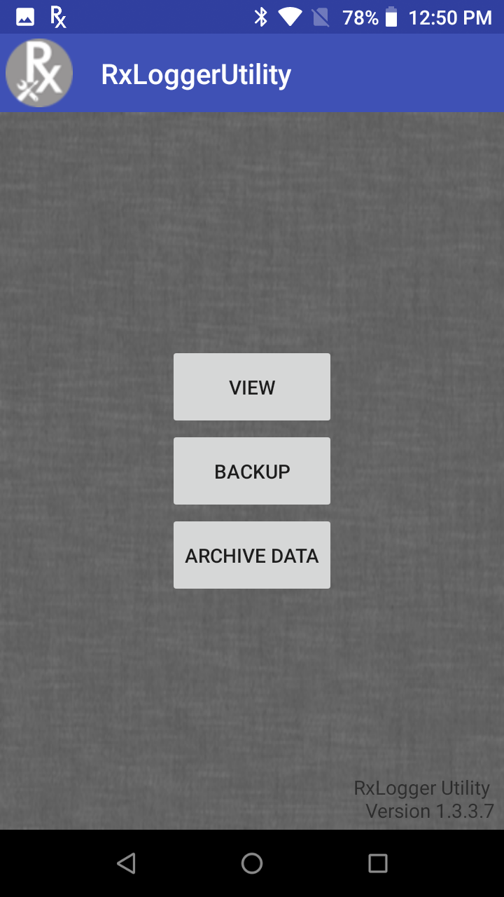
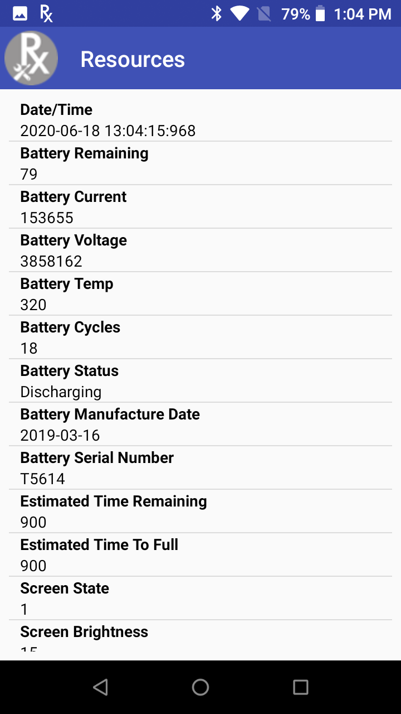
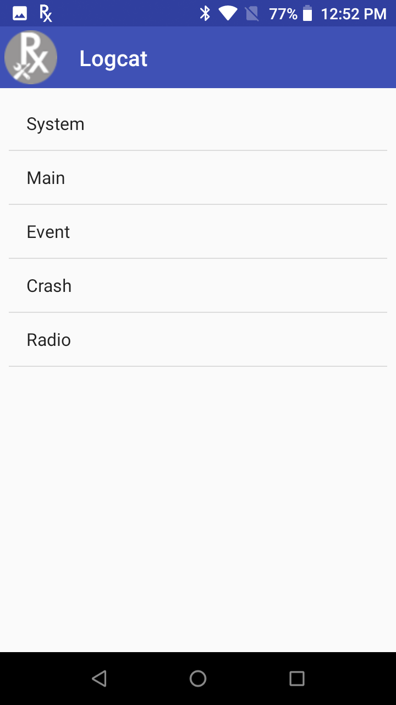
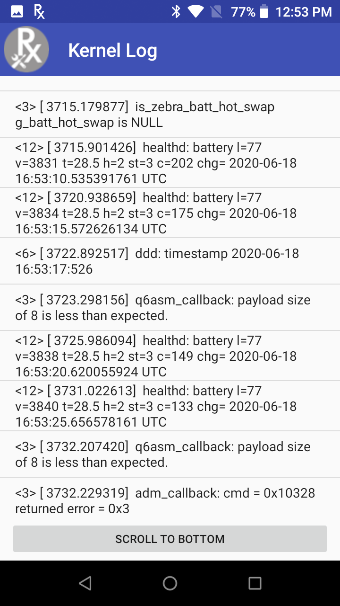
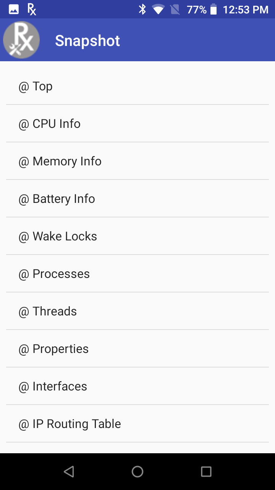
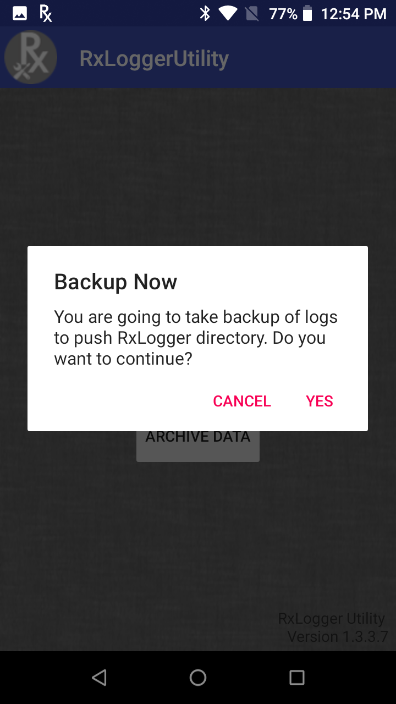

## Overview

RxLogger Utility is a tool used to view RxLogger logs in realtime. RxLogger Utility v1.3 is available by default on Zebra devices with Android 8 Oreo or earlier. RxLogger is available out-of-the-box on Zebra devices.

## Using RxLogger Utility

Open RxLogger Utility from the apps menu. The main screen appears.
 

<i>RxLogger Utility main screen</i>
 
Four modules are listed in the Diagnostic screen of RxLogger Utility, each providing access to the related realtime logs described in the subsequent sections: 

* **Resource -** displays system resource information such as battery, CPU, memory, radio, etc. 
* **Logcat -** captures logs from Android's Logcat logging tool
* **Kernel -** logs kernel messages
* **Snapshot -** provides detailed logs that capture comprehensive system information at a single point in time
 

Note: After tapping on a module or submodule to display information, it may take a few moments for the information to be seen.

## Resource
The Resource module displays various information such as battery, screen, CPU temperature, physical memory, WAN details, BSSID details, Bluetooth details, ambient light etc. 

<i>Resource screen</i>
 

## Logcat

Logcat captures logs from Android's Logcat logging tool, where events captured are categorized into separate modules.

<i>Logcat screen</i>
 

Logcat modules:
* **System –** Logcat “system” buffer. Constains messages from system services (power manager, battery, package manager etc.).
* **Main –** Logcat “main” buffer. Mainly used for application/framework logs. Good place to start to get a general idea of what the system is doing at a given time.
* **Event –** Logcat “event” buffer. Contains messages regarding creating/destroying of activities and services. Helpful for troubleshooting application/service crashes.
* **Crash –** Logcat “crash” buffer. Contains messages related to system crashes.
* **Radio –** Logcat “radio” buffer. Contains messages from the RIL and other cellular components.

## Kernel Log
Kernel Log displays realtime kernel messages. 

<i>Kernel Log</i>
 

## Snapshot

Snapshots are detailed logs of system resources, network, file system, power, usage statistics, etc. Snapshots are intended to provide a second level analysis based on information obtained from Logcat. They are recorded once every 30 minutes by default, but the logging frequency can be configured through RxLogger settings. 

The snapshot screen lists multiple submodules. Tap on the submodule to view the realtime log corresponding with the submodule.

<i>Snapshot screen</i>
 

Snapshot submodules:
* **Top -** Shows the running processes that consume the most system resources
* **CPU info -** Lists the CPU information per process
* **Memory info -** Lists the complete memory usage
* **Battery Info -** Displays battery information
* **Wake Locks -** Displays sys/fs wake_lock information
* **Time in State -** Displays sys/fs CPU frequency for each core
* **Processes -** Displays a list of all the processes and PID
* **Threads -** Displays a list of all the thread details with PID and context
* **Properties -** Lists all the properties in the system
* **Interfaces -** Lists all the network interfaces
* **IP Routing Table -** Displays IP addresses and routing table information
* **Connectivity -** Displays all network connectivity related information
* **Wifi -** Displays all WiFi related information
* **File Systems -** Displays all available file systems, paths and available use percentage
* **Usage Stats -** Displays usage statistics using dumpsys usagestats command
  

## Backup

RxLogger Utility allows the user to generate a backup of the RxLogger folder on the device as a .zip file. From the main RxLoggerUtility tap on **Backup**. 

<i>Backup screen</i>
 

<!-- -->
-----

## Related Links
* [RxLogger Settings](../settings) - How to configure data collection module parameters
* [RxLogger Modules](../modules) - Explains data collection module parameters and settings
* [Intent APIs](../apis) - Used to start and stop RxLogger and back up all data  

