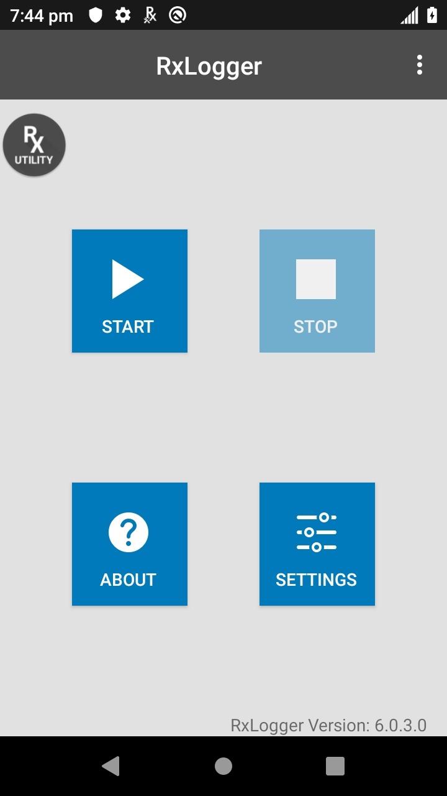
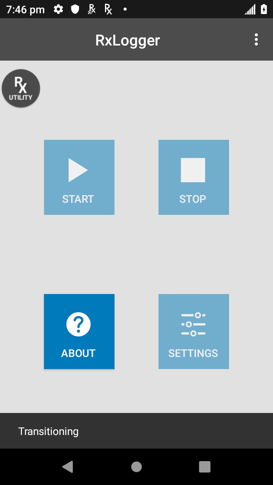

## Overview

RxLogger is a software utility included with every Zebra device that provides centralized control of application and system logging, and can easily customize output metrics for targeted diagnostics purposes. At the core of RxLogger is `diagdaemon`, a Zebra-built logging service that collects data and event logs from the Android kernel, logcat and other system components, and stores them in a single location where they can be filtered and displayed. Through an easy-to-use GUI interface, RxLogger also can change the type and frequency of data collection and control how much data is stored on the device.

> <b>Note:</b> The appearance of sample app screens displayed throughout this guide can vary by RxLogger version, Android version, and screen size.
<!-- -->
-----
## New in RxLogger 6.0
* New option to [save logs to internal SD card](../settings/#settingsgui) even when an external SD card exists.
* For [Qxdm module](../modules/#qxdmmodule), added: 
&nbsp;&nbsp;&nbsp;• New **default filter** option for the log filter 
&nbsp;&nbsp;&nbsp;• New option to **Choose logging limit type** and specify the maximum number of log files for custom logs.
* New module support added:  
&nbsp;&nbsp;&nbsp;• **[BTSnooplog Module](../modules/#btsnooplogmodule) -** captures Bluetooth HCI snoop logs from the device 
&nbsp;&nbsp;&nbsp;• **[Recovery Module](../modules/#recoverymodule) -** captures recovery/OSupdate logsfrom the device 
* Change in [external storage path](../settings/#settingsfile).

<!-- -->
-----

## Screens and States

The startup screen of RxLogger contains four simple buttons that change in appearance depending on its state. RxLogger's title bar also reflects the state, and its version number is visible in the lower-right corner.

### Stopped 

Initial state of RxLogger upon launch: 

 

### Transitioning
State immediately following a press of the Start or Stop buttons:

 

### Running
RxLogger is collecting data:

 

<!--   Comment: Removed since does not exist in v6.0 [Jira BSPA-145258]
### Unknown 
RxLogger has lost connection to the `diagdaemon`:

 
-->

### Buttons 
* **Start button -** starts the `diagdaemon` service and begins data collection.

* **Stop button -** stops the `diagdaemon` service and halts data collection.

* **About button -** displays version information for `diagdaemon`, RxLogger and data collection modules.

* **Settings button -** displays a panel for configuring RxLogger and `diagdaemon` settings.

## Usage Notes

* When the device is in Multi-User mode, only the primary user is supported.

<!-- -->
-----

## Related Links
* [RxLogger Settings](../settings) - How to configure data collection module parameters
* [RxLogger Modules](../modules) - Explains data collection module parameters and settings
* [Intent APIs](../apis) - Used to start and stop RxLogger and back up all data  
* [RxLogger Utility](../settings) - Log viewer to view logs in realtime

