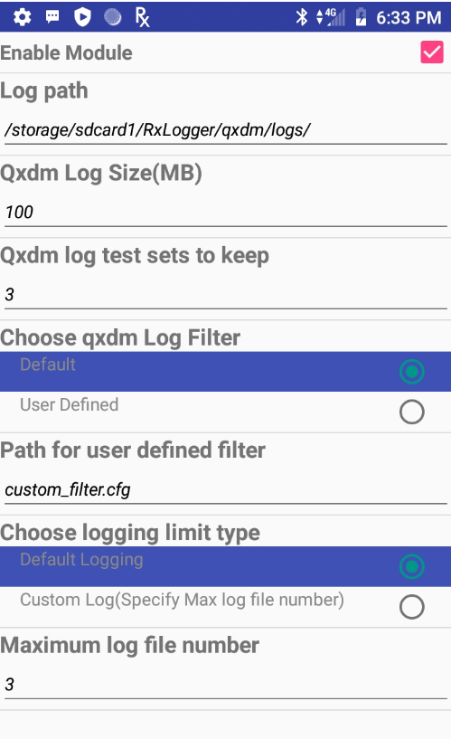

## Overview
RxLogger settings are configured through the RxLogger user interface or by pushing a configuration file to the device. All settings are stored in a single `.json` file that can be exported and mass-deployed to devices across an enterprise. 

### Settings Data Types 

* **Integer -** used to store numerical data such as the number of files to store. Allowable integers range from 0 - 2,147,483,647 (max int). For fields such as file size that do not allow a value of 0, a 1 is substituted at runtime. For integer fields, the UI accepts only numerical input.  

* **String -** used to store text such as file names and storage paths. The UI accepts any alphanumeric input and symbols as permitted by the file system. 

* **Boolean -** used to store true/false information such as to enable/disable a module; represented in the UI as a checkbox.

* **List -** used to select one value from a list of pre-assigned values; represented in the UI as a group of radio buttons. 

<!-- -->
-----

### Settings GUI

#### To configure general log settings through the GUI: 

1. Tap the **Settings button** to display a list of configurable modules currently loaded by `diagdaemon`: 

 
2. Tap **RxLogger Settings** to display a list of general configurations.

 
3. Enable/disable the desired settings: 
&nbsp;&nbsp;&nbsp;• **Enable notifications -** If enabled, RxLogger icon is seen in the notification bar when running. This is helpful to determine whether RxLogger is running in the background. By default, this option is _enabled_. 
&nbsp;&nbsp;&nbsp;• **Enable debug logs -** If enabled, the debug logs from RxLogger and Diagdaemon are collected in the location specified in the [Settings File](#settingsfile) section. <i>After enabling/disabling debug logs, tap the back button, tap <b>Save</b> and then reboot the device for the change to take into effect.</i> By default, this option is _disabled_. 
&nbsp;&nbsp;&nbsp;• **Enable internal sdcard only -** If enabled, logs are saved to the internal SD card even when an external SD card is inserted into the device. By default, logs are saved tot he external SD card if present. 
  

 

#### To configure module settings through the GUI: 

1. Tap the **Settings** button to display a list of configurable modules currently loaded by `diagdaemon`: 

 
2. Tap the **module to be edited** to display a list of its parameters: 

 
3. Edit settings as required. Tap the **BACK** button when done. 

 
4. **Repeat Steps 2 and 3** until all modules are edited as desired. 
5. On the modules listing screen, tap **SAVE** to preserve all changes.  

 

See the [Modules page](../modules) for settings information. 

<!-- -->
----

### Settings File

All RxLogger settings are stored in a file on the device, permitting remote configuration and mass deployment of these files using an enterprise mobile management (EMM) system. When a new settings file is pushed to the device, RxLogger restarts all affected modules and applies the new settings immediately.
 

* **File name -** `config.json`:  
        1. Zebra recommends using the same config.json file across devices with the same Android platform version. Use of the same file across multiple Android platform versions may lead to unexpected behavior. 
        2. A config.json file from a WWAN device cannot be used interchangeably on a WLAN device, and vice versa. WWAN related modules, such as qxdm, are not available on WLAN and can result to unexpected behavior.

* **Internal storage folder:** `/sdcard/RxLogger` 
* **External storage folder:** `/storage/sdcard1/RxLogger`

>**Important**: Zebra recommends modifying RxLogger settings only through the RxLogger UI, otherwise unexpected behavior can occur if modified manually. 

<!-- -->
-----

## Related Links
* [RxLogger Modules](../modules) - Explains data collection module parameters and settings
* [Intent APIs](../apis) - Used to start and stop RxLogger and back up all data  
* [RxLogger Utility](../utility) - View RxLogger logs in realtime
