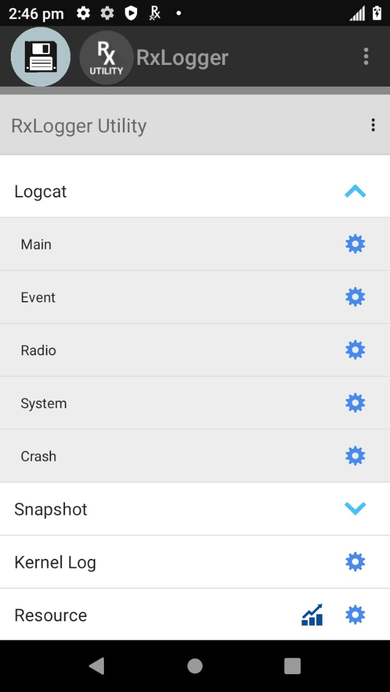
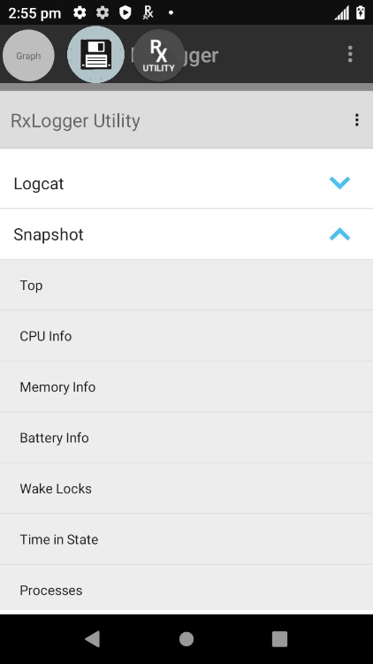
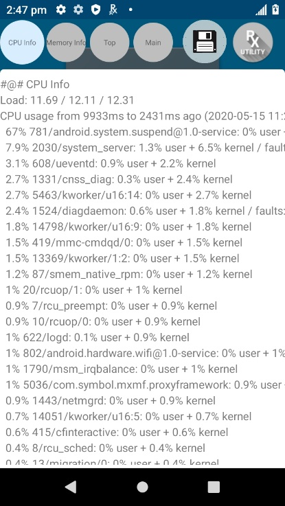
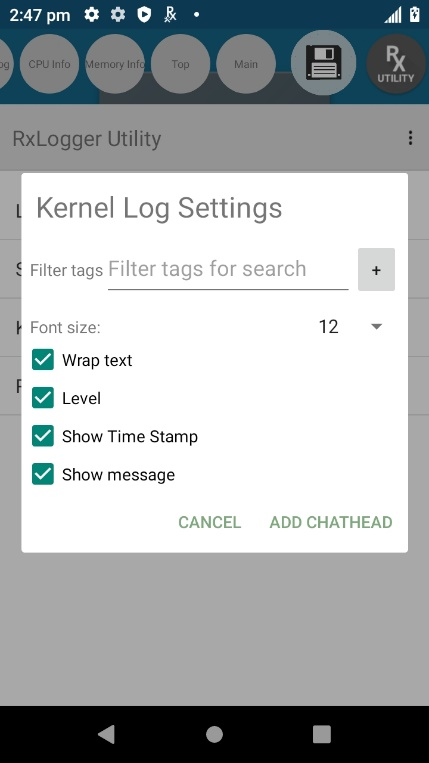

## Overview

RxLogger Utility is a tool used to view RxLogger logs in realtime. RxLogger Utility v2.0 is part of RxLogger on Zebra devices with Android 9 Pie or higher. RxLogger is available out-of-the-box on Zebra devices.

## Using RxLogger Utility

To launch RxLogger Utility, open RxLogger. Tap the top right menu and select **Toggle Chat Head**.  

<i>Select Toggle Chat Head</i>
 
A round floating icon, or chat head, named RxUtility is displayed on the screen. 

<i>RxUtility floating icon</i>
 
Tap the RxUtility floating icon to display the RxLogger Utility main screen. 

<i>RxLogger Utility main screen</i>
  
Four modules are listed in the main screen of RxLogger Utility, each providing access to the related realtime logs described in the subsequent sections: 

* **Logcat -** captures logs from Android's Logcat logging tool
* **Snapshot -** provides detailed logs that capture comprehensive system information at a single point in time
* **Kernel -** logs kernel messages
* **Resource -** displays system resource information such as battery, CPU, memory, radio, etc.  

Usage notes:

* After tapping on a module or submodule to display information, it may take a few moments for the information to be seen.
* The round save icon creates a backup .zip file of the logs generated by RxLogger at that point in time when the save icon is tapped. 
* Tapping on the round RxUtility icon navigates back to the main RxLogger Utility screen.
* To delete a chat head, long press the chat head and drag down to the "x".
* Other round chat head icons may appear at the top depending on how many modules/submodules are opened, allowing for navigation between each.

## Logcat

Logcat captures logs from Android's Logcat logging tool. The Logcat module expands to reveal multiple submodules. Upon tapping **Main**, active main logs captured by RxLogger are displayed. Similarly, when tapping on submodules Event, Radio, System or Crash, the respective log is displayed.

The round save icon creates a backup of the 

<table>
  <tr>
   <td>
        
   </td> 
   <td>&nbsp;&nbsp;&nbsp;&nbsp;&nbsp;&nbsp;&nbsp;&nbsp;&nbsp;&nbsp;</td>
   <td>
        
   </td>
  </tr>
  <tr>
   <td>
        <i>Logcat screen</i>
   </td>
   <td>&nbsp;&nbsp;&nbsp;&nbsp;&nbsp;&nbsp;&nbsp;&nbsp;&nbsp;&nbsp;</td>
   <td>
        <i>Logcat realtime active log</i>
   </td>
  </tr>
</table>
 

Logcat submodules:
* **Main –** Logcat “main” buffer. Mainly used for application/framework logs. Good place to start to get a general idea of what the system is doing at a given time.
* **Event –** Logcat “event” buffer. Contains messages regarding creating/destroying of activities and services. Helpful for troubleshooting application/service crashes.
* **Radio –** Logcat “radio” buffer. Contains messages from the RIL and other cellular components.
* **System –** Logcat “system” buffer. Constains messages from system services (power manager, battery, package manager etc.).
* **Crash –** Logcat “crash” buffer. Contains messages related to system crashes.

## Snapshot

Snapshots are detailed logs of system resources, network, file system, power, usage statistics, etc. Snapshots are intended to provide a second level analysis based on information obtained from Logcat. They are recorded once every 30 minutes by default, but the logging frequency can be configured through RxLogger settings. The Snapshot module expands to reveal multiple submodules. Once expanded, tap on the submodule to view the realtime log corresponding with the submodule.

<table>
  <tr>
   <td>
        
   </td> 
   <td>&nbsp;&nbsp;&nbsp;&nbsp;&nbsp;&nbsp;&nbsp;&nbsp;&nbsp;&nbsp;</td>
   <td>
        
   </td>
  </tr>
  <tr>
   <td>
        <i>Snapshot screen</i>
   </td>
   <td>&nbsp;&nbsp;&nbsp;&nbsp;&nbsp;&nbsp;&nbsp;&nbsp;&nbsp;&nbsp;</td>
   <td>
        <i>Snapshot of CPU Info</i>
   </td>
  </tr>
</table>
 

Snapshot submodules:
* **Top -** Shows the running processes that consume the most system resources
* **CPU info -** Lists the CPU information per process
* **Memory info -** Lists the complete memory usage
* **Battery Info -** Displays battery information
* **Wakelocks -** Displays sys/fs wake_lock information
* **Time in State -** Displays sys/fs CPU frequency for each core
* **Processes -** Displays a list of all the processes and PID
* **Threads -** Displays a list of all the thread details with PID and context
* **Properties -** Lists all the properties in the system
* **Interfaces -** Lists all the network interfaces
* **IP Routing Table -** Displays IP addresses and routing table information
* **Connectivity -** Displays all network connectivity related information
* **Wifi -** Displays all WiFi related information
* **File Systems -** Displays all available file systems, paths and available use percentage
* **Usage Stats -** Displays usage statistics using dumpsys usagestats command
  

## Kernel Log
Kernel Log displays realtime kernel messages. Logging can be configured and filtered through the Kernel Log Settings screen.

<table>
  <tr>
   <td>
        
   </td> 
   <td>&nbsp;&nbsp;&nbsp;&nbsp;&nbsp;&nbsp;&nbsp;&nbsp;&nbsp;&nbsp;</td>
   <td>
        
   </td>
  </tr>
  <tr>
   <td>
        <i>Tap Kernel Settings icon</i>
   </td>
   <td>&nbsp;&nbsp;&nbsp;&nbsp;&nbsp;&nbsp;&nbsp;&nbsp;&nbsp;&nbsp;</td>
   <td>
        <i>Kernel Log Settings</i>
   </td>
  </tr>
</table>
 

## Resource
The Resource module displays various information such as battery, screen, CPU temperature, physical memory, WAN details, BSSID details, Bluetooth details, ambient light etc. This information can be filtered through the Resource settings screen.

<table>
  <tr>
   <td>
        
   </td> 
   <td>&nbsp;&nbsp;&nbsp;&nbsp;&nbsp;&nbsp;&nbsp;&nbsp;&nbsp;&nbsp;</td>
   <td>
        
   </td>
  </tr>
  <tr>
   <td>
        <i>Tap Resource Settings icon</i>
   </td>
   <td>&nbsp;&nbsp;&nbsp;&nbsp;&nbsp;&nbsp;&nbsp;&nbsp;&nbsp;&nbsp;</td>
   <td>
        <i>Kernel Log Settings</i>
   </td>
  </tr>
</table>
 
A visualization of the Resource data is available in graph form to easily view data trends. Graph settings configure the axis preference and filter the data to display. 
<table>
  <tr>
   <td>
        
   </td> 
   <td>&nbsp;&nbsp;&nbsp;&nbsp;&nbsp;&nbsp;&nbsp;&nbsp;&nbsp;&nbsp;</td>
   <td>
        
   </td> 
   <td>&nbsp;&nbsp;&nbsp;&nbsp;&nbsp;&nbsp;&nbsp;&nbsp;&nbsp;&nbsp;</td>
   <td>
        
   </td>
  </tr>
  <tr>
   <td>
        <i>Resource Graph Access</i>
   </td>
   <td>&nbsp;&nbsp;&nbsp;&nbsp;&nbsp;&nbsp;&nbsp;&nbsp;&nbsp;&nbsp;</td>
   <td>
        <i>Resource Graph Settings</i>
   </td>
   <td>&nbsp;&nbsp;&nbsp;&nbsp;&nbsp;&nbsp;&nbsp;&nbsp;&nbsp;&nbsp;</td>
   <td>
        <i>Resource Graph</i>
   </td>
  </tr>
</table>
 

## Backup

RxLogger Utility allows the user to generate a backup of the RxLogger folder on the device as a .zip file. Another method to perform the backup is with **Backup Now** from the main screen of RxLogger, accessible from the top right menu. 

<table>
  <tr>
   <td>
     
   </td>
   <td> &nbsp; &nbsp; &nbsp;&nbsp; &nbsp; &nbsp;
   </td>
   <td>
     
   </td>
  </tr>
</table>
<i>Backup via RxUtility main screen (left) or RxLogger main screen (right)</i>
 
Note: The round save icon, or chat head, cannot be deleted with a long press. 
<!-- -->
-----

## Related Links
* [RxLogger Settings](../settings) - How to configure data collection module parameters
* [RxLogger Modules](../modules) - Explains data collection module parameters and settings
* [Intent APIs](../apis) - Used to start and stop RxLogger and back up all data  

