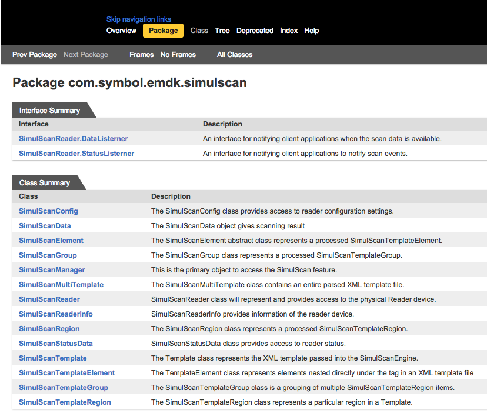

## Overview
SimulScan APIs (depicted below) are accessed from within [EMDK for Android](../../../../emdk-for-android), Zebra's development environment for building Android applications. **Click on the image below to <u>leave SimulScan docs</u> and** [open EMDK's SimulScan APIs](http://zebra-stage.github.io/emdk-for-android/6-0/api/reference/com/symbol/emdk/simulscan/package-summary.html).

*A [License](../guide/license) is required for each device using one or more apps that access SimulScan through its APIs*. 

