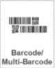
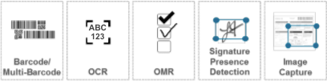

## Overview
Zebra's SimulScan is a set of productivity tools that can optimize the efficiency of data-capture workflow by enabling workers to acquire multiple points of data in a single step. When integrated with SimulScan APIs, captured data can be parsed directly into an organization's native applications. 

**SimulScan Can Help Optimize Workflow If...** 

* **Scanning is frequent** in the organization, and...
* **Forms have one or more barcodes of the same of differing symbologies**.

####or...

* **Scanning is frequent** in the organization, and...
* **Scanned forms are of a fixed layout** and
* **Forms have well-defined borders**.

----

#### SimulScan offers two modes of operation:  

<!--  -->
[Multi-barcode](../setup/#unstructuredtemplates) captures an unlimited number of 1D/2D barcodes of the same or differing symbologies from a single scan target, even if the target changes from one scan to another. 
 

[Mixed Data-type](../setup/#structuredtemplates) includes the features of Multi-barcode and can also capture alphanumeric characters and images, and determine the presence of check marks and signatures in a single scan. This mode requires scan targets with a fixed layout.
 

-----

### Requirements
* **A Zebra TC55, TC70, TC75, TC8000 device** running Android.
* **Camera or 2D imager** (included on most devices; [see table](#supporteddevices)).
* **An app (or [DataWedge](../../../../datawedge)) set to access SimulScan** on the device.
* **A per-device [license](../license)** if using OCR or OMR.

-----

## How it Works
SimulScan works through Templates, which define "Form Regions of interest" on Documents to be scanned, "Field Regions of interest" within forms, and the types of data (barcode, text, etc.) to be extracted from each Field. **SimulScan can be accessed** either by selecting it as an Input Plug-in using Zebra's free [DataWedge](../../../../datawedge) service, or directly from within an Android app using the [SimulScan APIs](../../api). SimulScan features also can be explored using the [SimulScan Demo App](../demo), which exposes all features and functions except the ability to save acquired data. The Demo App also can be used to test custom Templates.

**SimulScan is free** when used with DataWedge or from a custom app to scan only barcodes. A per-device license is required access to OCR or OMR. For licensing details, please see the [Licensing guide](../license). 

See the [SimulScan Glossary](../templatebuilder/#glossary) for a complete list of terms. 

<!--

In addition, some Fields are designated as "Anchor Elements," which help SimulScan to identify a form and also set a reference for other Fields to compensate for changes in the orientation of the Document or the scanning device. 
-->

-----

## Supported Devices

<table cellspacing="0" cellpadding="0" class="table table-striped">
 <tbody><tr>
  <th width="25%" align="center" valign="middle" class="clsSyntaxHeadings">------------Device----------</th>
  <th width="25%" align="center" valign="middle" class="clsSyntaxHeadings">------------Model---------</th>
  <th width="25%" align="center" valign="middle" class="clsSyntaxHeadings">-----------Camera---------</th>
  <th width="25%" align="center" valign="middle" class="clsSyntaxHeadings">-----------2D Imager--------</th>
 </tr>
 <tr>
  <td width="25%" align="center" valign="middle" class="clsSyntaxCells clsOddRow"></td>
  <td width="25%" align="center" valign="middle" class="clsSyntaxCells clsOddRow"><b>TC55</b></td>
  <td width="25%" align="center" valign="middle" class="clsSyntaxCells clsOddRow">√</td>
  <td width="25%" align="center" valign="middle" class="clsSyntaxCells clsOddRow">√</td>
 </tr>
 <tr>
  <td width="25%" valign="middle" class="clsSyntaxCells clsOddRow"></td>
  <td width="25%" align="center" valign="middle" class="clsSyntaxCells clsOddRow"><b>TC70</b></td>
  <td width="25%" align="center" valign="middle" class="clsSyntaxCells clsOddRow">√</td>
  <td width="25%" align="center" valign="middle" class="clsSyntaxCells clsOddRow">GA2 devices only</td>
 </tr>
 <tr>
  <td width="25%" valign="middle" class="clsSyntaxCells clsOddRow"></td>
  <td width="25%" align="center" valign="middle" class="clsSyntaxCells clsOddRow"><b>TC75</b></td>
  <td width="25%" align="center" valign="middle" class="clsSyntaxCells clsOddRow">√</td>
  <td width="25%" align="center" valign="middle" class="clsSyntaxCells clsOddRow">√</td>
 </tr>
 <tr>
  <td width="25%" valign="middle" class="clsSyntaxCells clsOddRow"></td>
  <td width="25%" align="center" valign="middle" class="clsSyntaxCells clsOddRow"><b>TC8000</b></td>
  <td width="25%" align="center" valign="middle" class="clsSyntaxCells clsOddRow">√</td>
  <td width="25%" align="center" valign="middle" class="clsSyntaxCells clsOddRow">√(*)</td>
 </tr>
 <tr>
</tbody></table>
_(*)The TC8000 Extended Range Imager (ERI) configuration is not supported_. 

<!--
### SimulScan Benefits

* **Decodes multiple barcodes** with a single scan, even those of differing symbologies
* **Automates text and numerical data entry** using optical character recognition (OCR)
* **Supports English, French, German, Spanish and Portuguese**
* **Reduces workflow exceptions** by using optical mark recognition (OMR) to detect the presence of checkmarks and signatures
* **Improves overall worker efficiency** and accuracy of input

**Simultaneously capture**: 

* **Barcodes** (single or multiple symbologies)
* **Text** (name and address, product names, etc.)
* **Numbers** (phone, invoice, tracking and stock numbers, etc.)
* **Images** (logos, ID photos, etc.)
* **Signatures** (captured as an image)
* **Checkboxes** (captured as yes/no)

#### SimulScan can be used through: 

* **[DataWedge](../../../../datawedge)**, which is covered in [SimulScan Setup](../setup) guide
* **A custom Android app**, which is covered in the [SimulScan API guide](../../api)
* **The [SimulScan Demo App](../demo)**, which exposes all features except the ability to save acquired data

#### Quick Start

SimulScan is activated simply by selecting it as an [Input Plug-in](../setup/#activatesimulscan) from within DataWedge, an app that comes with every Zebra device. Those already familiar with the Template-based operation of SimulScan can **get started immediately by skipping to the [SimulScan Setup guide](../setup/#accessthroughdatawedge)**. Otherwise, please read this page and the [Template intro](../setup/#intrototemplates) on the Setup guide before proceeding.  

-->

-----

<!--
Forms can include barcodes, multiple lines of text, phone numbers, images, signatures, even checkboxes, and SimulScan can capture them all simultaneously. Once acquired, data can be instantly used to populate business forms, be further processed according to simple or complex rules, or simply stored for later retrieval. Incorporating SimulScan into the workflow can increase process automation and worker proficiency, improve data accuracy and reduce process-cycle times.
-->

<!-- 
**Using a [Multi-barcode Template](../setup/#multibarcodemode)**, SimulScan can capture an unlimited number of barcodes from a single form. These barcodes can be of the same or differing symbologies and found on structured forms or those that might change from one scan to another. 

**With a [Mixed Data-type Template](../setup/#mixeddatamode)**, the tool can capture multiple data types (barcodes, alphanumeric characters and a signature, for example) from a single form, but its layout must always be the same (see Structured and Unstructured Targets in the [Template Builder Glossary](../templatebuilder/#glossary)). 
-->

<!--

-->

<!-- commented our from orig. [DocumentBodyStart:46152d05-7ceb-43ba-ab72-2acee060ee0c] -->

<!-- 

<table border="1" class="jiveBorder" jive-data-cell="{&quot;color&quot;:&quot;#3D3D3D&quot;,&quot;textAlign&quot;:&quot;center&quot;,&quot;padding&quot;:&quot;6&quot;,&quot;backgroundColor&quot;:&quot;transparent&quot;,&quot;fontFamily&quot;:&quot;Helvetica Neue,Helvetica,Arial,Lucida Grande,sans-serif&quot;,&quot;verticalAlign&quot;:&quot;baseline&quot;}" jive-data-header="
{&quot;color&quot;:&quot;#505050&quot;,&quot;backgroundColor&quot;:&quot;#FFFFFF&quot;,&quot;textAlign&quot;:&quot;center&quot;,&quot;padding&quot;:&quot;6&quot;,&quot;fontFamily&quot;:&quot;Helvetica Neue,Helvetica,Arial,Lucida Grande,sans-serif&quot;,&quot;verticalAlign&quot;:&quot;baseline&quot;}" style="border: 1px solid #c6c6c6; width: 100%;">

<thead>
<tr>
<th style="border:1px solid black;border: 1px solid #c6c6c6;width: 40%;vertical-align: middle;text-align: center;font-family: 'Helvetica Neue', Helvetica, Arial, 'Lucida Grande', sans-serif;padding: 6px;color: #505050;background-color: #ffffff;" valign="middle">
<h3><strong> </strong>
</h3>
Feature Support
</th>

<th style="border:1px solid black;border: 1px solid #c6c6c6;width: 5%;vertical-align: middle;text-align: center;font-family: 'Helvetica Neue', Helvetica, Arial, 'Lucida Grande', sans-serif;padding: 6px;color: #505050;background-color: #ffffff;" valign="middle">
<h3><strong>
<a class="jive-link-external-small" href="https://www.zebra.com/us/en/products/mobile-computers/handheld/TC55.html" rel="nofollow">TC55</a> </strong></h3></th><th style="border:1px solid black;border: 1px solid #c6c6c6;width: 15%;vertical-align: middle;text-align: center;font-family: 'Helvetica Neue', Helvetica, Arial, 'Lucida Grande', sans-serif;padding: 6px;color: #505050;background-color: #ffffff;" valign="middle">
<h3>
<strong>
<a class="jive-link-external-small" href="https://www.zebra.com/us/en/products/mobile-computers/handheld/tc7x-touch-computer-series.html" rel="nofollow">TC70</a><a class="jive-link-external-small" href="https://www.zebra.com/content/dam/zebra_new_ia/en-us/solutions-verticals/product/Mobile_Computers/Hand-Held%20Computers/Symbol%20TC70%20Touch%20Computer/spec%20sheet/tc70-product-spec-sheet-en-us.pdf" rel="nofollow"> 
</a>
</strong>
</h3>
</th>

<th style="border:1px solid black;border: 1px solid #c6c6c6;width: 15%;vertical-align: middle;text-align: center;font-family: 'Helvetica Neue', Helvetica, Arial, 'Lucida Grande', sans-serif;padding: 6px;color: #505050;background-color: #ffffff;" valign="middle"><h3><strong><a class="jive-link-external-small" href="https://www.zebra.com/us/en/products/mobile-computers/handheld/tc7x-touch-computer-series.html" rel="nofollow">TC75</a> </strong></h3></th><th style="border:1px solid black;border: 1px solid #c6c6c6;width: 15%;vertical-align: middle;text-align: center;font-family: 'Helvetica Neue', Helvetica, Arial, 'Lucida Grande', sans-serif;padding: 6px;color: #505050;background-color: #ffffff;" valign="middle"><h3><strong><a class="jive-link-external-small" href="https://www.zebra.com/us/en/products/mobile-computers/handheld/tc8000.html" rel="nofollow">TC8000</a></strong></h3>
SE4750

</th>
</tr>
</thead>
<tbody><tr><td style="border:1px solid black;border: 1px solid #c6c6c6;"></td><td style="border:1px solid black;border: 1px solid #c6c6c6;vertical-align: middle;text-align: center;padding: 0px;"></td><td style="border:1px solid black;border: 1px solid #c6c6c6;vertical-align: middle;text-align: center;padding: 0px;"></td><td style="border:1px solid black;border: 1px solid #c6c6c6;padding: 0px;vertical-align: middle;text-align: center;"></td><td style="border:1px solid black;border: 1px solid #c6c6c6;vertical-align: middle;text-align: center;padding: 0px;"></td></tr><tr style="height: 47px;"><td style="border:1px solid black;border: 1px solid #c6c6c6;vertical-align: middle;font-family: 'Helvetica Neue', Helvetica, Arial, 'Lucida Grande', sans-serif;background-color: transparent;padding: 6px;text-align: right;color: #3d3d3d;">
<em>Camera</em>

</td>
<td style="border:1px solid black;border: 1px solid #c6c6c6;vertical-align: middle;text-align: center;padding: 0px;font-family: 'Helvetica Neue', Helvetica, Arial, 'Lucida Grande', sans-serif;background-color: transparent;color: #3d3d3d;">
<em></em>
</td><td style="border:1px solid black;border: 1px solid #c6c6c6;vertical-align: middle;text-align: center;padding: 0px;font-family: 'Helvetica Neue', Helvetica, Arial, 'Lucida Grande', sans-serif;background-color: transparent;color: #3d3d3d;">
<em>

</em>
</td>
<td style="border:1px solid black;border: 1px solid #c6c6c6;padding: 0px;vertical-align: middle;text-align: center;font-family: 'Helvetica Neue', Helvetica, Arial, 'Lucida Grande', sans-serif;background-color: transparent;color: #3d3d3d;">
<em>

</em>
</td>
<td style="border:1px solid black;border: 1px solid #c6c6c6;vertical-align: middle;text-align: center;padding: 0px;font-family: 'Helvetica Neue', Helvetica, Arial, 'Lucida Grande', sans-serif;background-color: transparent;color: #3d3d3d;">
<em>

</em>
</td>
</tr>
<tr style="height: 47px;"><td style="border:1px solid black;border: 1px solid #c6c6c6;vertical-align: middle;font-family: 'Helvetica Neue', Helvetica, Arial, 'Lucida Grande', sans-serif;background-color: transparent;padding: 6px;text-align: right;color: #3d3d3d;">
<em>2D Imager</em>

</td>
<td style="border:1px solid black;border: 1px solid #c6c6c6;vertical-align: middle;text-align: center;padding: 0px;font-family: 'Helvetica Neue', Helvetica, Arial, 'Lucida Grande', sans-serif;background-color: transparent;color: #3d3d3d;">

</td>
<td style="border:1px solid black;border: 1px solid #c6c6c6;vertical-align: middle;text-align: center;padding: 0px;font-family: 'Helvetica Neue', Helvetica, Arial, 'Lucida Grande', sans-serif;background-color: transparent;color: #3d3d3d;">

&#160; 

</td>
<td style="border:1px solid black;border: 1px solid #c6c6c6;padding: 0px;vertical-align: middle;text-align: center;font-family: 'Helvetica Neue', Helvetica, Arial, 'Lucida Grande', sans-serif;background-color: transparent;color: #3d3d3d;">

</td><td style="border:1px solid black;border: 1px solid #c6c6c6;vertical-align: middle;text-align: center;padding: 0px;font-family: 'Helvetica Neue', Helvetica, Arial, 'Lucida Grande', sans-serif;background-color: transparent;color: #3d3d3d;">

</td></tr></tbody></table>

-->
<!-- commented out of orig [DocumentBodyEnd:46152d05-7ceb-43ba-ab72-2acee060ee0c] -->
<!-- 

-->

