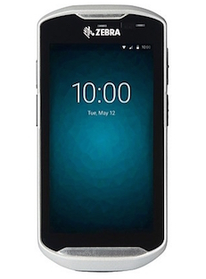
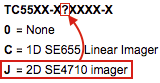
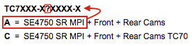
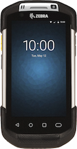
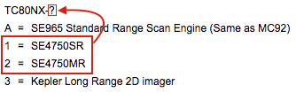

## Overview
Zebra's SimulScan is a set of productivity tools that can optimize the efficiency of data-capture workflow by enabling workers to acquire multiple points of data in a single step. When integrated with SimulScan APIs, captured data can be parsed directly into an organization's native Android applications. 

<iframe width="560" height="315" src="https://www.youtube.com/embed/PQ8gPtY7Z3M" frameborder="0" allowfullscreen></iframe>
[More SimulScan videos](https://www.youtube.com/playlist?list=PLce6-npz5dKf_5mTtakWU1ostOIaeGXzz)
 

-----

**SimulScan Can Help Optimize Work-flows If...** 

* **Scanning is frequent** in the organization, and...
* **Forms have one or more barcodes of the same of differing symbologies**.

Such scenarios are well-suited to SimulScan [Multi-barcode mode](../templatebuilder/#unstructuredtemplates).

Alternatively, SimulScan [Document Capture](../templatebuilder/#structuredtemplates) mode is suited to data-capture scenarios in which...

* **Multiple data types are to be acquired**, and... 
* **Scanned forms are of a** [fixed layout](../glossary), and...
* **Forms have well-defined borders**.

-----

### Requirements

* A Zebra TC51/TC56, TC55, TC70/TC75, TC70x/TC75x, TC8000 device running Android
* Camera or supported 2D imager ([see table](#supporteddevices), below)
* An app (or [DataWedge](../../../../datawedge)) configured to access SimulScan
* A per-device [license](../license) if using [advanced features](../license)

**Note**: SimulScan features also can be explored using the [SimulScan Demo App](../demo), which exposes all features and functions except the ability to save acquired data. The Demo App is included on all supported devices.  

-----

## How it Works
Most acquisition tasks involve capturing data from printed documents. These "target" documents often vary in size, shape and layout, and present a challenge for accurate data acquisition. Templates solve this problem by "teaching" SimulScan about the documents it will encounter, and defining how to scan and process data for each instance of that target document. 

### Document Capture Mode
[Document Capture mode](../templatebuilder/#structuredtemplates) captures a snapshot of the document and extracts 1D/2D barcode data, alpha/numeric characters and images, and can detect the presence of check marks and signatures as defined in the document's Template. 

These so-called "Structured" Templates define "Form Regions* of interest" on Documents to be scanned, "Field Regions of interest" within those forms, the types of data (barcode, text, etc.) to be extracted, and how it will be processed. **Scan targets must be of a fixed layout and a Template must be created for each target encountered by the organization**.  

_A sample document on which Document Capture would be employed_.

### Multi-barcode Mode
[Multi-barcode mode](../templatebuilder/#unstructuredtemplates) is designed to capture one or more 1D/2D barcodes of the same or differing symbologies from a single scan target. The target layout can be fixed or varied from one scan to another, and the Templates when used here are referred to as "Unstructured." Templates are optional for Multi-barcode mode, and are generally required only when it's necessary to specifically include certain barcodes and ignore others. **This mode also supports barcode prefixes, which can be parsed to provide processing information for the data being acquired from each barcode**. 

_A Multi-barcode mode Template can specify barcodes to include and which to ignore_.

-----

### Using SimulScan
**SimulScan is free for many scanning scenarios**, including when used with DataWedge and its default Templates or from a custom app to scan only barcodes and/or for certain types of OCR acquisition. A per-device license is required for advanced SimulScan features. For licensing details, please see the [Licensing guide](../license). 

**SimulScan can be accessed either by**: 

1. Selecting SimulScan as an Input Plug-in using Zebra's free [DataWedge](../../../../datawedge) service, **or** 
2. Calling it directly from within an Android app using the [SimulScan APIs](../../api)

SimulScan features also can be explored using the [SimulScan Demo App](../demo), which exposes all features and functions except the ability to save acquired data. The Demo App also can be used to test custom Templates.

See the [SimulScan Glossary](../glossary) for a complete list of terms. 

<!--

In addition, some Fields are designated as "Anchor Elements," which help SimulScan to identify a form and also set a reference for other Fields to compensate for changes in the orientation of the Document or the scanning device. 
-->

-----

## Supported Devices
SimulScan works with all device cameras, and **on devices with a supported 2D imager; 1D imagers are not supported**. To identify the imager installed on a device, see **About Device > Hardware Configuration** in the device Settings panel or refer to the table below for a supported device model code in place of the "?" character as indicated.

<table cellspacing="0" cellpadding="0" class="table table-striped">
 <tbody><tr>
  <th width="15%" align="left" valign="middle" class="clsSyntaxHeadings">Zebra Device</th>
  <th width="15%" align="left" valign="middle" class="clsSyntaxHeadings">Model</th>
  <th width="15%" align="left" valign="middle" class="clsSyntaxHeadings">Camera</th>
  <th width="55%" align="left" valign="middle" class="clsSyntaxHeadings">Model code(s) with 2D imager support</th>
 </tr>
 <tr>
  <td width="15%" align="left" valign="middle" class="clsSyntaxCells clsOddRow"></td>
  <td width="15%" align="left" valign="middle" class="clsSyntaxCells clsOddRow"><b>TC51/TC56 M</b></td>
  <td width="15%" align="left" valign="middle" class="clsSyntaxCells clsOddRow">  √</td>
  <td width="55%" align="left" valign="middle" class="clsSyntaxCells clsOddRow"> •<i>All models support SimulScan</i> •<i>Must have BSP 19-xx or later</i></td>
 </tr>
 <tr>
  <td width="15%" align="left" valign="middle" class="clsSyntaxCells clsOddRow"></td>
  <td width="15%" align="left" valign="middle" class="clsSyntaxCells clsOddRow"><b>TC55 KK</b></td>
  <td width="15%" align="left" valign="middle" class="clsSyntaxCells clsOddRow">  √</td>
  <td width="55%" align="left" valign="middle" class="clsSyntaxCells clsOddRow">•<i>SE4710 2D imager supported ("J" in code)</i> •<i>SE655 1D imager not supported ("C" in code)</i></td>
 </tr>
 <tr>
  <td width="15%" align="left" valign="middle" class="clsSyntaxCells clsOddRow"></td>
  <td width="15%" align="left" valign="middle" class="clsSyntaxCells clsOddRow"><b>TC70 KK, L</b></td>
  <td width="15%" align="left" valign="middle" class="clsSyntaxCells clsOddRow">  √</td>
  <td width="55%" align="left" valign="middle" class="clsSyntaxCells clsOddRow">•<i>SimulScan supported on GA2 devices only</i> •<i>Model code must contain an "A" where indicated</i> •<i>Decoded imagers not supported</i></td>
 </tr>
 <tr>
  <td width="15%" align="left" valign="middle" class="clsSyntaxCells clsOddRow"></td>
  <td width="15%" align="left" valign="middle" class="clsSyntaxCells clsOddRow"><b>TC70X/TC75X M</b></td>
  <td width="15%" align="left" valign="middle" class="clsSyntaxCells clsOddRow">  √</td>
  <td width="55%" align="left" valign="middle" class="clsSyntaxCells clsOddRow"> •<i>All models support SimulScan</i> •<i>Must have BSP 19-xx or later</i></td>
 </tr>
 <tr>
  <td width="15%" align="left" valign="middle" class="clsSyntaxCells clsOddRow"></td>
  <td width="15%" align="left" valign="middle" class="clsSyntaxCells clsOddRow"><b>TC75 KK, L</b></td>
  <td width="15%" align="left" valign="middle" class="clsSyntaxCells clsOddRow">  √</td>
  <td width="55%" align="left" valign="middle" class="clsSyntaxCells clsOddRow"> •<i>All models support SimulScan</i></td>
 </tr>
 <tr>
  <td width="15%" align="left" valign="middle" class="clsSyntaxCells clsOddRow"></td>
  <td width="15%" align="left" valign="middle" class="clsSyntaxCells clsOddRow"><b>TC8000 KK, L</b></td>
  <td width="15%" align="left" valign="middle" class="clsSyntaxCells clsOddRow">  √</td>
  <td width="55%" align="left" valign="middle" class="clsSyntaxCells clsOddRow">•<i>Only codes "1" and "2" are supported</i>
</td>
 </tr>
 <tr>
</tbody></table>

<!-- 

• Model code must contain an 'J'

• SimulScan supported on GA2 devices only
• Model code must contain an 'A'
• Decoded imagers not supported

• Model code suffix must be '-1' or '-2' (i.e. TC8000<b>-2</b>) 
• Devices with a suffix of '-3' or '-A' are not supported 
• The Extended Range Imager (ERI) is not supported for use with SimulScan

### Device Support Notes
If support issues arise, check the model code of the device in use. The following codes indicate devices that contain a scanner or imager that supports SimulScan.

**TC55** 

**TC70**

**TC75**

**TC8000**

### SimulScan Benefits

* **Decodes multiple barcodes** with a single scan, even those of differing symbologies
* **Automates text and numerical data entry** using optical character recognition (OCR)
* **Supports English, French, German, Spanish and Portuguese**
* **Reduces workflow exceptions** by using optical mark recognition (OMR) to detect the presence of checkmarks and signatures
* **Improves overall worker efficiency** and accuracy of input

**Simultaneously capture**: 

* **Barcodes** (single or multiple symbologies)
* **Text** (name and address, product names, etc.)
* **Numbers** (phone, invoice, tracking and stock numbers, etc.)
* **Images** (logos, ID photos, etc.)
* **Signatures** (captured as an image)
* **Checkboxes** (captured as yes/no)

#### SimulScan can be used through: 

* **[DataWedge](../../../../datawedge)**, which is covered in [SimulScan Setup](../setup) guide
* **A custom Android app**, which is covered in the [SimulScan API guide](../../api)
* **The [SimulScan Demo App](../demo)**, which exposes all features except the ability to save acquired data

#### Quick Start

SimulScan is activated simply by selecting it as an [Input Plug-in](../setup/#activatesimulscan) from within DataWedge, an app that comes with every Zebra device. Those already familiar with the Template-based operation of SimulScan can **get started immediately by skipping to the [SimulScan Setup guide](../setup/#accessthroughdatawedge)**. Otherwise, please read this page and the [Template intro](../setup/#intrototemplates) on the Setup guide before proceeding.  

-->

-----

<!--
Forms can include barcodes, multiple lines of text, phone numbers, images, signatures, even checkboxes, and SimulScan can capture them all simultaneously. Once acquired, data can be instantly used to populate business forms, be further processed according to simple or complex rules, or simply stored for later retrieval. Incorporating SimulScan into the workflow can increase process automation and worker proficiency, improve data accuracy and reduce process-cycle times.
-->

<!-- 
**Using a [Multi-barcode Template](../setup/#multibarcodemode)**, SimulScan can capture an unlimited number of barcodes from a single form. These barcodes can be of the same or differing symbologies and found on structured forms or those that might change from one scan to another. 

**With a [Mixed Data-type Template](../setup/#mixeddatamode)**, the tool can capture multiple data types (barcodes, alphanumeric characters and a signature, for example) from a single form, but its layout must always be the same (see Structured and Unstructured Targets in the [Template Builder Glossary](../templatebuilder/#glossary)). 
-->

<!--

-->

<!-- commented our from orig. [DocumentBodyStart:46152d05-7ceb-43ba-ab72-2acee060ee0c] -->

<!-- 

<table border="1" class="jiveBorder" jive-data-cell="{&quot;color&quot;:&quot;#3D3D3D&quot;,&quot;textAlign&quot;:&quot;center&quot;,&quot;padding&quot;:&quot;6&quot;,&quot;backgroundColor&quot;:&quot;transparent&quot;,&quot;fontFamily&quot;:&quot;Helvetica Neue,Helvetica,Arial,Lucida Grande,sans-serif&quot;,&quot;verticalAlign&quot;:&quot;baseline&quot;}" jive-data-header="
{&quot;color&quot;:&quot;#505050&quot;,&quot;backgroundColor&quot;:&quot;#FFFFFF&quot;,&quot;textAlign&quot;:&quot;center&quot;,&quot;padding&quot;:&quot;6&quot;,&quot;fontFamily&quot;:&quot;Helvetica Neue,Helvetica,Arial,Lucida Grande,sans-serif&quot;,&quot;verticalAlign&quot;:&quot;baseline&quot;}" style="border: 1px solid #c6c6c6; width: 100%;">

<thead>
<tr>
<th style="border:1px solid black;border: 1px solid #c6c6c6;width: 40%;vertical-align: middle;text-align: center;font-family: 'Helvetica Neue', Helvetica, Arial, 'Lucida Grande', sans-serif;padding: 6px;color: #505050;background-color: #ffffff;" valign="middle">
<h3><strong> </strong>
</h3>
Feature Support
</th>

<th style="border:1px solid black;border: 1px solid #c6c6c6;width: 5%;vertical-align: middle;text-align: center;font-family: 'Helvetica Neue', Helvetica, Arial, 'Lucida Grande', sans-serif;padding: 6px;color: #505050;background-color: #ffffff;" valign="middle">
<h3><strong>
<a class="jive-link-external-small" href="https://www.zebra.com/us/en/products/mobile-computers/handheld/TC55.html" rel="nofollow">TC55</a> </strong></h3></th><th style="border:1px solid black;border: 1px solid #c6c6c6;width: 15%;vertical-align: middle;text-align: center;font-family: 'Helvetica Neue', Helvetica, Arial, 'Lucida Grande', sans-serif;padding: 6px;color: #505050;background-color: #ffffff;" valign="middle">
<h3>
<strong>
<a class="jive-link-external-small" href="https://www.zebra.com/us/en/products/mobile-computers/handheld/tc7x-touch-computer-series.html" rel="nofollow">TC70</a><a class="jive-link-external-small" href="https://www.zebra.com/content/dam/zebra_new_ia/en-us/solutions-verticals/product/Mobile_Computers/Hand-Held%20Computers/Symbol%20TC70%20Touch%20Computer/spec%20sheet/tc70-product-spec-sheet-en-us.pdf" rel="nofollow"> 
</a>
</strong>
</h3>
</th>

<th style="border:1px solid black;border: 1px solid #c6c6c6;width: 15%;vertical-align: middle;text-align: center;font-family: 'Helvetica Neue', Helvetica, Arial, 'Lucida Grande', sans-serif;padding: 6px;color: #505050;background-color: #ffffff;" valign="middle"><h3><strong><a class="jive-link-external-small" href="https://www.zebra.com/us/en/products/mobile-computers/handheld/tc7x-touch-computer-series.html" rel="nofollow">TC75</a> </strong></h3></th><th style="border:1px solid black;border: 1px solid #c6c6c6;width: 15%;vertical-align: middle;text-align: center;font-family: 'Helvetica Neue', Helvetica, Arial, 'Lucida Grande', sans-serif;padding: 6px;color: #505050;background-color: #ffffff;" valign="middle"><h3><strong><a class="jive-link-external-small" href="https://www.zebra.com/us/en/products/mobile-computers/handheld/tc8000.html" rel="nofollow">TC8000</a></strong></h3>
SE4750

</th>
</tr>
</thead>
<tbody><tr><td style="border:1px solid black;border: 1px solid #c6c6c6;"></td><td style="border:1px solid black;border: 1px solid #c6c6c6;vertical-align: middle;text-align: center;padding: 0px;"></td><td style="border:1px solid black;border: 1px solid #c6c6c6;vertical-align: middle;text-align: center;padding: 0px;"></td><td style="border:1px solid black;border: 1px solid #c6c6c6;padding: 0px;vertical-align: middle;text-align: center;"></td><td style="border:1px solid black;border: 1px solid #c6c6c6;vertical-align: middle;text-align: center;padding: 0px;"></td></tr><tr style="height: 47px;"><td style="border:1px solid black;border: 1px solid #c6c6c6;vertical-align: middle;font-family: 'Helvetica Neue', Helvetica, Arial, 'Lucida Grande', sans-serif;background-color: transparent;padding: 6px;text-align: right;color: #3d3d3d;">
<em>Camera</em>

</td>
<td style="border:1px solid black;border: 1px solid #c6c6c6;vertical-align: middle;text-align: center;padding: 0px;font-family: 'Helvetica Neue', Helvetica, Arial, 'Lucida Grande', sans-serif;background-color: transparent;color: #3d3d3d;">
<em></em>
</td><td style="border:1px solid black;border: 1px solid #c6c6c6;vertical-align: middle;text-align: center;padding: 0px;font-family: 'Helvetica Neue', Helvetica, Arial, 'Lucida Grande', sans-serif;background-color: transparent;color: #3d3d3d;">
<em>

</em>
</td>
<td style="border:1px solid black;border: 1px solid #c6c6c6;padding: 0px;vertical-align: middle;text-align: center;font-family: 'Helvetica Neue', Helvetica, Arial, 'Lucida Grande', sans-serif;background-color: transparent;color: #3d3d3d;">
<em>

</em>
</td>
<td style="border:1px solid black;border: 1px solid #c6c6c6;vertical-align: middle;text-align: center;padding: 0px;font-family: 'Helvetica Neue', Helvetica, Arial, 'Lucida Grande', sans-serif;background-color: transparent;color: #3d3d3d;">
<em>

</em>
</td>
</tr>
<tr style="height: 47px;"><td style="border:1px solid black;border: 1px solid #c6c6c6;vertical-align: middle;font-family: 'Helvetica Neue', Helvetica, Arial, 'Lucida Grande', sans-serif;background-color: transparent;padding: 6px;text-align: right;color: #3d3d3d;">
<em>2D Imager</em>

</td>
<td style="border:1px solid black;border: 1px solid #c6c6c6;vertical-align: middle;text-align: center;padding: 0px;font-family: 'Helvetica Neue', Helvetica, Arial, 'Lucida Grande', sans-serif;background-color: transparent;color: #3d3d3d;">

</td>
<td style="border:1px solid black;border: 1px solid #c6c6c6;vertical-align: middle;text-align: center;padding: 0px;font-family: 'Helvetica Neue', Helvetica, Arial, 'Lucida Grande', sans-serif;background-color: transparent;color: #3d3d3d;">

&#160; 

</td>
<td style="border:1px solid black;border: 1px solid #c6c6c6;padding: 0px;vertical-align: middle;text-align: center;font-family: 'Helvetica Neue', Helvetica, Arial, 'Lucida Grande', sans-serif;background-color: transparent;color: #3d3d3d;">

</td><td style="border:1px solid black;border: 1px solid #c6c6c6;vertical-align: middle;text-align: center;padding: 0px;font-family: 'Helvetica Neue', Helvetica, Arial, 'Lucida Grande', sans-serif;background-color: transparent;color: #3d3d3d;">

</td></tr></tbody></table>

-->
<!-- commented out of orig [DocumentBodyEnd:46152d05-7ceb-43ba-ab72-2acee060ee0c] -->
<!-- 

-->

