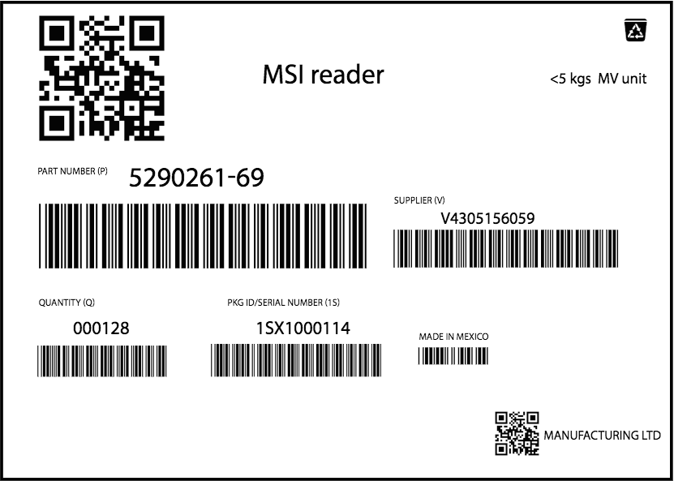

##Overview
SimulScan is an end-to-end data capture solution for developers building apps for Zebra Android devices intended to capture data with the device scanner. It contains powerful image capture technology that can acquire of the contents of an entire form in a single scan. Forms can include bar codes, text fields, phone numbers, images, signatures, even checkboxes; SimulScan can capture them all simultaneously. Once acquired, data can be instantly used to populate business forms, be further processed according to simple or complex rules, or simply stored for later retrieval. Incorporating SimulScan into the workflow can increase process automation and worker proficiency, improve data accuracy and reduce process-cycle times.

###Benefits

* **Decodes multiple barcodes** with a single scan (Multi-barcode Mode)
* **Automates data entry** with optical character recognition (OCR)
* **Simplifies workflow exceptions** with optical mark recognition (OMR) and Signature presence detection
* **Improves overall worker efficiency** and accuracy

**Simultaneous capture can include**: 

* **Barcodes** (single or multiple symbologies)
* **Text** (name and address, product names, etc.)
* **Numbers** (phone, invoice, tracking and stock numbers, etc.)
* **Images** (logos, ID photos, etc.)
* **Signatures** (captured as an image)
* **Checkboxes** (captured as yes/no)

###Requirements
* **A Zebra TC55, TC70, TC75, TC8000 device** running Android
* **Camera or 2D imager** (camera only on some TC70 devices)
* **An app (or DataWedge) set to access SimulScan** on the device
* **A per-device License** if capturing 10+ barcodes per form or using OCR, OMR or SimulScan APIs

## How it Works
Templates are the key to controlling the power of SimulScan and directing its capabilities as needed. In **Multi-barcode Mode**, SimulScan can capture an unlimited number of barcodes (of the same or different symbologies) from a single form. In **Mixed-data Mode**, the tool can capture multiple data types (barcodes, alphanumeric characters and a signature, for example) from a single, structured form. Both modes employ Templates, which are used to identify the type of data to be extracted from each region of a form. The location of each region is identified relative to an "Anchor Barcode," which maintains those locations in case the device or form change orientation. 

SimulScan can be accessed in one of two ways. It can be selected as an Input Plug-in using [DataWedge](../../../../datawedge), or accessed from within an Android app using the [SimulScan APIs](http://zebra-stage.github.io/emdk-for-android/6-0/api/reference/com/symbol/emdk/simulscan/package-frame.html). SimulScan features also can be explored using the [SimulScan Demo App](../demo), which exposes all feature and functions except the ability to save acquired data. The Demo App also can be used to test user-created Templates.

### Multi-barcode Mode
**By far the most common usage scenario is Multi-barcode Mode**, which is designed for use on forms from which only barcode data will be acquired. In theory, there's no limit to the number of barcodes and symbologies that can be captured at one time. The unlicensed version of SimulScan permits a maximum of nine (9) barcodes to be captured from a form without [Licensing](../license). **The 2D imager is the most effective device for this mode**. 

*A typical barcode-only form, SimulScan's most common and effective use case*.
 

<!-- --> 

<!-- When the data to be captured is of one type (i.e. barcodes) or contained in a single field (i.e. an address), SimulScan can be used to acquire the data regardless of whether it is presented on a structured form. In such instances, it is often the case that data must be captured only from a small portion of a form, and the remaining form data can be ignored.

Some data-acquisition scenarios call for creation of a type-specific Template, for example to capture all the barcodes on the form, or to use (OCR) to capture only an address (not shown). For another example application, a Template might be created to capture only the machine-readable zone (MRZ) data from travel documents. -->

### Mixed-data Mode  
**A less common usage scenario is Mixed-data Mode**, which  captures multiple data types from mixed sources. The form below contains a barcode, account numbers and other numerical shipper information, company names and addresses for the shipper and receiver, checkboxes with various values, and a signature and date. This otherwise time-consuming and error-prone data-capture task can be performed with SimulScan and a carefully crafted Template created in advance and designed specifically for this form. 

_Click on image to enlarge_
 

Templates work on the principle that the _**location**_ and _**type**_ of data in each field of a form (i.e. barcodes, alphanumeric characters, signatures, etc.) will remain consistent whenever this form is used, and that only the data itself will change for each new instance of the form. By creating a SimulScan Template to uniquely identify each region and data type, the developer can map data from each region of the form to specific fields in an application. 

For example, in the upper-right corner of the sample form above will always be located a barcode identifying the waybill number. The lower-right corner will always contain the signature and date. Data from those fields can then be used to automatically populate a receiving record with each incoming shipment that's accompanied by this form. **The camera is the most effective device for this mode**. 

## Supported Devices

<table cellspacing="0" cellpadding="0" class="table table-striped">
 <tbody><tr>
  <th class="clsSyntaxHeadings">Device</th>
  <th class="clsSyntaxHeadings">Model</th>
  <th class="clsSyntaxHeadings">Camera Support</th>
  <th class="clsSyntaxHeadings">2D Imager Support</th>
 </tr>
 <tr>
  <td width="25%" valign="middle" class="clsSyntaxCells clsOddRow"></td>
  <td width="25%" align="center" valign="middle" class="clsSyntaxCells clsOddRow"><b>TC55</b></td>
  <td width="25%" align="center" valign="middle" class="clsSyntaxCells clsOddRow">√</td>
  <td width="25%" align="center" valign="middle" class="clsSyntaxCells clsOddRow">√</td>
 </tr>
 <tr>
  <td width="25%" valign="middle" class="clsSyntaxCells clsOddRow"></td>
  <td width="25%" align="center" valign="middle" class="clsSyntaxCells clsOddRow"><b>TC70</b></td>
  <td width="25%" align="center" valign="middle" class="clsSyntaxCells clsOddRow">√</td>
  <td width="25%" align="center" valign="middle" class="clsSyntaxCells clsOddRow"></td>
 </tr>
 <tr>
  <td width="25%" valign="middle" class="clsSyntaxCells clsOddRow"></td>
  <td width="25%" align="center" valign="middle" class="clsSyntaxCells clsOddRow"><b>TC75</b></td>
  <td width="25%" align="center" valign="middle" class="clsSyntaxCells clsOddRow">√</td>
  <td width="25%" align="center" valign="middle" class="clsSyntaxCells clsOddRow">√</td>
 </tr>
 <tr>
  <td width="25%" valign="middle" class="clsSyntaxCells clsOddRow"></td>
  <td width="25%" align="center" valign="middle" class="clsSyntaxCells clsOddRow"><b>TC8000</b></td>
  <td width="25%" align="center" valign="middle" class="clsSyntaxCells clsOddRow">√</td>
  <td width="25%" align="center" valign="middle" class="clsSyntaxCells clsOddRow">√</td>
 </tr>
 <tr>
</tbody></table>

<!--

-->

<!-- commented our from orig. [DocumentBodyStart:46152d05-7ceb-43ba-ab72-2acee060ee0c] -->

<!-- 

<table border="1" class="jiveBorder" jive-data-cell="{&quot;color&quot;:&quot;#3D3D3D&quot;,&quot;textAlign&quot;:&quot;center&quot;,&quot;padding&quot;:&quot;6&quot;,&quot;backgroundColor&quot;:&quot;transparent&quot;,&quot;fontFamily&quot;:&quot;Helvetica Neue,Helvetica,Arial,Lucida Grande,sans-serif&quot;,&quot;verticalAlign&quot;:&quot;baseline&quot;}" jive-data-header="
{&quot;color&quot;:&quot;#505050&quot;,&quot;backgroundColor&quot;:&quot;#FFFFFF&quot;,&quot;textAlign&quot;:&quot;center&quot;,&quot;padding&quot;:&quot;6&quot;,&quot;fontFamily&quot;:&quot;Helvetica Neue,Helvetica,Arial,Lucida Grande,sans-serif&quot;,&quot;verticalAlign&quot;:&quot;baseline&quot;}" style="border: 1px solid #c6c6c6; width: 100%;">

<thead>
<tr>
<th style="border:1px solid black;border: 1px solid #c6c6c6;width: 40%;vertical-align: middle;text-align: center;font-family: 'Helvetica Neue', Helvetica, Arial, 'Lucida Grande', sans-serif;padding: 6px;color: #505050;background-color: #ffffff;" valign="middle">
<h3><strong> </strong>
</h3>
Feature Support
</th>

<th style="border:1px solid black;border: 1px solid #c6c6c6;width: 5%;vertical-align: middle;text-align: center;font-family: 'Helvetica Neue', Helvetica, Arial, 'Lucida Grande', sans-serif;padding: 6px;color: #505050;background-color: #ffffff;" valign="middle">
<h3><strong>
<a class="jive-link-external-small" href="https://www.zebra.com/us/en/products/mobile-computers/handheld/TC55.html" rel="nofollow">TC55</a> </strong></h3></th><th style="border:1px solid black;border: 1px solid #c6c6c6;width: 15%;vertical-align: middle;text-align: center;font-family: 'Helvetica Neue', Helvetica, Arial, 'Lucida Grande', sans-serif;padding: 6px;color: #505050;background-color: #ffffff;" valign="middle">
<h3>
<strong>
<a class="jive-link-external-small" href="https://www.zebra.com/us/en/products/mobile-computers/handheld/tc7x-touch-computer-series.html" rel="nofollow">TC70</a><a class="jive-link-external-small" href="https://www.zebra.com/content/dam/zebra_new_ia/en-us/solutions-verticals/product/Mobile_Computers/Hand-Held%20Computers/Symbol%20TC70%20Touch%20Computer/spec%20sheet/tc70-product-spec-sheet-en-us.pdf" rel="nofollow"> 
</a>
</strong>
</h3>
</th>

<th style="border:1px solid black;border: 1px solid #c6c6c6;width: 15%;vertical-align: middle;text-align: center;font-family: 'Helvetica Neue', Helvetica, Arial, 'Lucida Grande', sans-serif;padding: 6px;color: #505050;background-color: #ffffff;" valign="middle"><h3><strong><a class="jive-link-external-small" href="https://www.zebra.com/us/en/products/mobile-computers/handheld/tc7x-touch-computer-series.html" rel="nofollow">TC75</a> </strong></h3></th><th style="border:1px solid black;border: 1px solid #c6c6c6;width: 15%;vertical-align: middle;text-align: center;font-family: 'Helvetica Neue', Helvetica, Arial, 'Lucida Grande', sans-serif;padding: 6px;color: #505050;background-color: #ffffff;" valign="middle"><h3><strong><a class="jive-link-external-small" href="https://www.zebra.com/us/en/products/mobile-computers/handheld/tc8000.html" rel="nofollow">TC8000</a></strong></h3>
SE4750

</th>
</tr>
</thead>
<tbody><tr><td style="border:1px solid black;border: 1px solid #c6c6c6;"></td><td style="border:1px solid black;border: 1px solid #c6c6c6;vertical-align: middle;text-align: center;padding: 0px;"></td><td style="border:1px solid black;border: 1px solid #c6c6c6;vertical-align: middle;text-align: center;padding: 0px;"></td><td style="border:1px solid black;border: 1px solid #c6c6c6;padding: 0px;vertical-align: middle;text-align: center;"></td><td style="border:1px solid black;border: 1px solid #c6c6c6;vertical-align: middle;text-align: center;padding: 0px;"></td></tr><tr style="height: 47px;"><td style="border:1px solid black;border: 1px solid #c6c6c6;vertical-align: middle;font-family: 'Helvetica Neue', Helvetica, Arial, 'Lucida Grande', sans-serif;background-color: transparent;padding: 6px;text-align: right;color: #3d3d3d;">
<em>Camera</em>

</td>
<td style="border:1px solid black;border: 1px solid #c6c6c6;vertical-align: middle;text-align: center;padding: 0px;font-family: 'Helvetica Neue', Helvetica, Arial, 'Lucida Grande', sans-serif;background-color: transparent;color: #3d3d3d;">
<em></em>
</td><td style="border:1px solid black;border: 1px solid #c6c6c6;vertical-align: middle;text-align: center;padding: 0px;font-family: 'Helvetica Neue', Helvetica, Arial, 'Lucida Grande', sans-serif;background-color: transparent;color: #3d3d3d;">
<em>

</em>
</td>
<td style="border:1px solid black;border: 1px solid #c6c6c6;padding: 0px;vertical-align: middle;text-align: center;font-family: 'Helvetica Neue', Helvetica, Arial, 'Lucida Grande', sans-serif;background-color: transparent;color: #3d3d3d;">
<em>

</em>
</td>
<td style="border:1px solid black;border: 1px solid #c6c6c6;vertical-align: middle;text-align: center;padding: 0px;font-family: 'Helvetica Neue', Helvetica, Arial, 'Lucida Grande', sans-serif;background-color: transparent;color: #3d3d3d;">
<em>

</em>
</td>
</tr>
<tr style="height: 47px;"><td style="border:1px solid black;border: 1px solid #c6c6c6;vertical-align: middle;font-family: 'Helvetica Neue', Helvetica, Arial, 'Lucida Grande', sans-serif;background-color: transparent;padding: 6px;text-align: right;color: #3d3d3d;">
<em>2D Imager</em>

</td>
<td style="border:1px solid black;border: 1px solid #c6c6c6;vertical-align: middle;text-align: center;padding: 0px;font-family: 'Helvetica Neue', Helvetica, Arial, 'Lucida Grande', sans-serif;background-color: transparent;color: #3d3d3d;">

</td>
<td style="border:1px solid black;border: 1px solid #c6c6c6;vertical-align: middle;text-align: center;padding: 0px;font-family: 'Helvetica Neue', Helvetica, Arial, 'Lucida Grande', sans-serif;background-color: transparent;color: #3d3d3d;">

&#160; 

</td>
<td style="border:1px solid black;border: 1px solid #c6c6c6;padding: 0px;vertical-align: middle;text-align: center;font-family: 'Helvetica Neue', Helvetica, Arial, 'Lucida Grande', sans-serif;background-color: transparent;color: #3d3d3d;">

</td><td style="border:1px solid black;border: 1px solid #c6c6c6;vertical-align: middle;text-align: center;padding: 0px;font-family: 'Helvetica Neue', Helvetica, Arial, 'Lucida Grande', sans-serif;background-color: transparent;color: #3d3d3d;">

</td></tr></tbody></table>

-->
<!-- commented out of orig [DocumentBodyEnd:46152d05-7ceb-43ba-ab72-2acee060ee0c] -->
<!-- 

-->

