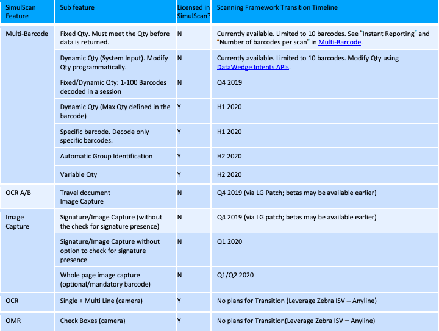

## Overview 

The most important SimulScan capabilities, including multi-barcode scanning and OCR A/B travel documentation capture, are being migrated to the internal scanning framework that runs on all Zebra devices. Once complete, **capabilities formerly available only through SimulScan will be accessible without licensing through DataWedge and Android intent APIs and supported on all Zebra devices with built-in Imager and/or camera running Android 8.x Oreo and higher**. 

**Zebra strongly recommends that customers and partners develop a plan for migrating to DataWedge for all applications that currently use SimulScan**.

### Alert Highlights

* All new SimulScan feature requests will be created in the scanning framework accessible through DataWedge and intent APIs.
* The transitioned SimulScan features will be supported on all Zebra devices with built-in Imager and/or camera running Android 8.x Oreo and higher. SimulScan currently supports only these devices: 
 * MC33
 * TC51/TC51-HC/TC52/TC56/TC57
 * TC55 
 * TC70/TC72/TC75/TC77
 * TC70x/TC75x
 * TC8000 
* Some SimulScan features are already transitioned and available for use (see Transition Roadmap below).
* Zebra strongly recommends that developers use the transitioned SimulScan APIs. Please refer to the Transition Roadmap (below) for the availability of the transitioned features and the relevant APIs.
* The existing SimulScan APIs and the Template Builder will no longer be available as of December 31, 2019. The Template Builder is not required for using transitioned SimulScan APIs.
* SimulScan will continue to be part of the Zebra Mobility DNA.

#### Zebra SKUs effected by SimulScan end-of-life: 

`SIMULSCAN_PERM` and `SIMULSCAN_MB_PERM` will reach end-of-life on Dec. 31, 2019, and all multi-barcode features will be included in TC5x, TC7x, TC8x and MC9x products at no additional cost. 

### Transition Roadmap

-----

### Frequently Asked Questions 

**Q: How do I know which SimulScan features are being transitioned to the Scanning Framework?** 
A: See the Transition Roadmap above for a list of features that are planned for transitioning. The table also includes features that are not being transitioned.

**Q: Do I need rewrite my existing SimulScan application to use the transitioned APIs?**
 
A: Yes. Applications must be rewritten to use the SimulScan APIs available in Scanning Framework. The intent APIs provided by DataWedge will make this transition quick and easy.


**Q: Do I need a license to use transitioned SimulScan features in Scanning Framework?**  

A: No. Licensing is not required for any of the SimulScan features being transitioned into the Scanning Framework and APIs.


**Q: Will the SimulScan transitioned APIs be supported only on DataWedge?** What about Enterprise Browser and EMDK? 
A: The DataWedge and intent API support are the recommended method of programmatically accessing transitioned SimulScan features. Enterprise Browser provides features to access DataWedge. There are currently no plans to implement the transitioned features in EMDK APIs.

**Q: What software do I need for using the transitioned SimulScan features to Scanning Framework?** 
A: None. The Scanning Framework is preloaded on all Zebra devices. No additional software is needed.
 
**Q: Which devices will the transitioned SimulScan features in Scanning Framework support?** 
A: The transitioned SimulScan features will be supported on all Zebra devices with built-in Imager and/or camera running Android 8.x Oreo and higher. Some devices running Oreo and Pie might require application of the latest LifeGuard updates.

**Q: I did not see some of the existing SimulScan features in the Transition Roadmap matrix. Will they ever be supported?**  
A: If an existing SimulScan feature is not listed in the Transition Matrix, currently there is no plan to support it. However, Zebra will consider supporting missing features on a case-by-case basis if a strong business case exists. Please contact your account manager to request support for missing features.

**Q: Since the last date to buy licenses for existing SimulScan implementations is December 31, 2019, can I continue to purchase licenses until then?** 
A: Yes, but Zebra strongly recommends using the SimulScan features transitioned to Scanning Framework for all new development. Consider moving to the Scanning Framework immediately if a feature is already transitioned. 

**Q: What are the advantages of using the transitioned SimulScan features in the Scanning Framework over the existing stand-alone SimulScan?** 
A: Transitioned SmulScan features in the Scanning Framework will support all Oreo and future devices with built-in camera and imagers. Current SimulScan features support only a handful of devices. 

Furthermore, SimulScan was not designed to accommodate new and complex features, nor to massively scale. The Scanning Framework was designed for scaling and can more quickly implement new scanning features. 

Additionally, the transitioned SimulScan will not require a license. 

**Q: Some of the transitioned features in the Scanning Framework are in the roadmap but are not currently not available. How soon can I get a beta?**  
A: Please contact your Zebra sales representative for information about accessing beta features.

**Q: Will the SimulScan Template Builder work with the Transitioned SimulScan?** 
A: No. The Template Builder is not required for using Transitioned SimulScan APIs.


**Q: When will the SimulScan Template Builder become unavailable?** 
A: Access to Template Builder will end on or around December 31, 2019. 

<i> The information contained or referenced in this alert is derived from a variety of sources and may not be accurate, complete or up-to-date. The information is provided "as is." ZEBRA SHALL NOT BE LIABLE FOR TECHNICAL OR EDITORIAL ERRORS OR OMISSIONS, NOR FOR ANY DAMAGES RESULTING FROM THE USE OF INFORMATION CONTAINED IN THIS ALERT. ZEBRA MAKES NO REPRESENTATIONS ABOUT THE SUITABILITY OF ANY PRODUCTS, SERVICES OR INFORMATION CONTAINED IN OR REFERRED TO IN THIS ALERT, FOR ANY PURPOSE. ZEBRA ASSUMES NO RESPONSIBILITY FOR AND DISCLAIMS ALL LIABILITY FOR ANY ERRORS OR OMISSIONS, WARRANTIES AND CONDITIONS WITH REGARD TO THIS ALERT AND/OR THE INFORMATION CONTAINED HEREIN INCLUDING ALL IMPLIED WARRANTIES AND CONDITIONS OF MERCHANTABILITY AND FITNESS FOR A PARTICULAR PURPOSE, TITLE AND NON-INFRINGEMENT. SOME JURISDICTIONS DO NOT ALLOW THE EXCLUSION OF CERTAIN WARRANTIES, SO THE ABOVE EXCLUSION MAY NOT APPLY TO YOU.

The information contained in this alert regarding product compliance with the Trade Agreements Act ("TAA"), or any Federal regulation, law, rule or standard, is provided for informational purposes only and does not constitute a legally binding representation that such product complies therewith. Information contained in this alert (including the Product Specifications) is subject to change with or without prior notice. In no event shall Zebra be held directly or indirectly liable for any damage or loss caused or alleged to have been caused by or in connection with the use of, or reliance upon, the information found in this alert. To confirm whether any particular Zebra product is compliant with any Federal regulation, law, rule or standard, please contact FederalProductQuestions@zebra.com

IN NO EVENT SHALL ZEBRA BE LIABLE FOR ANY SPECIAL, INDIRECT, OR CONSEQUENTIAL DAMAGES WHATSOEVER, RESULTING FROM LOSS OF USE, DATA OR PROFITS, EITHER IN AN ACTION OF CONTRACT, NEGLIGENCE OR OTHER TORTIOUS ACTION, ARISING OUT OF OR IN CONNECTION WITH THE USE OR PERFORMANCE OF INFORMATION AVAILABLE FROM THIS ALERT.</i>

 