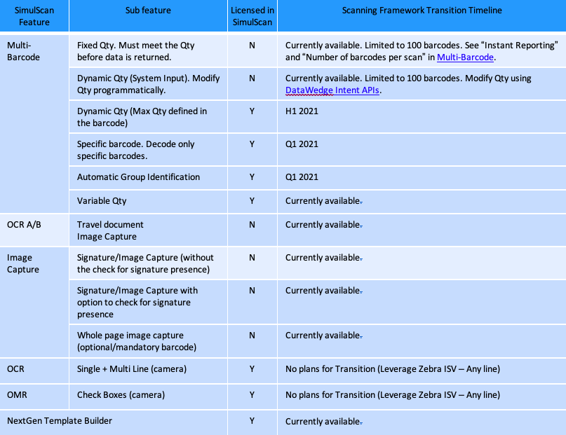

 <button type="button" class="close" data-dismiss="alert" aria-label="Close">×</button> <h4>SimulScan Features Being Integrated</h4> 
<b>The most important SimulScan capabilities, including document capture, multi-barcode scanning and OCR A/B capture for travel documentation, are being migrated to the internal scanning framework that runs on all Zebra devices</b>. Once complete, capabilities formerly available only through <u><b>SimulScan will be known as NextGen SimulScan and be accessible through DataWedge and Android intent APIs</u></b>. 

Zebra strongly recommends that partners develop a migration plan to DataWedge for all applications that currently use SimulScan.

<b>Key migration dates</b>:
    
<ul>
        <li><b>Dec. 31, 2019</b> - Sale of SimulScan licenses ended</li>
        <li><b>Dec. 31, 2020</b> - Support for licensed SimulScan API features ends</li>
        <li><b>Device end-of-life</b> - End of support for non-licensed SimulScan API features</li>
    </ul>

> Zebra strongly recommends that customers and partners develop a plan for migrating to DataWedge using NextGen SimulScan APIs for all applications that currently use SimulScan. **Some SimulScan features are already transitioned and available for use today**.  

#### Migrated features available now:
* **Multi-barcode data acquisition** acquires multiple unique barcodes with a single scan and can deliver the data either immediately or after the specified number of barcodes is reached in the session. Multi-barcode data capture is **supported on devices with DataWedge 6.7 and higher**.
 * **[Enable multi-barcode input](/datawedge/7-5/guide/input/barcode/#readerparams)** through **Reader Params -> Scanning Modes**
 * **[Configure multi-barcode input](/datawedge/7-5/guide/input/barcode/#multibarcodeparams)** for fixed-quantity and instant reporting
* **Document Capture** includes image and signature (as an image) capture, acquisition of text as coded type through optical character recognition (OCR) and full-document capture using the device camera or imager. Document capture is **supported on devices as indicated below**.  
 * **[Enable signature/image capture](/datawedge/7-5/guide/input/barcode/#multibarcodeparams)** (DataWedge 7.3+)
 * **[Configure signature/image capture](/datawedge/7-5/guide/input/barcode/#decodersignature)** (DataWedge 7.3+)
 * **[Configure OCR-A](/datawedge/7-5/guide/input/barcode#ocra)** decoding (DataWedge 7.5+)
 * **[Configure OCR-B](/datawedge/7-5/guide/input/barcode#ocrb)** decoding (DataWedge 7.5+)
 * **[Document capture with anchor barcode](/datawedge/8-0/guide/input/barcode/#documentcapturetemplate)** (DataWedge 8.0+)
 * **Signature presence checking** (to be implemented in DataWedge 8.2+, coming soon)

<!--  removed by eng.
* **[Sample app: Multi-barcode scanning](/emdk-for-android/7-5/samples/multibarcode1/)** (EMDK for Android 6.8+)
 * **[Sample app: Document capture](/emdk-for-android/7-5/samples/simulscan/)** (EMDK for Android 4.0+)
 -->

>**See the [Transition Roadmap](#transitionroadmap) for estimated availability of additional features**.

-----

### More Info
* All new SimulScan feature requests will be created in the Scanning Framework accessible through DataWedge and intent APIs.
* NextGen SimulScan features will be supported on all Zebra devices with built-in Imager and/or camera running Android 8.x Oreo and higher.
* Template Builder for NextGen SimulScan APIs will be available according to the schedule shown in the table below.
* A next-gen version of SimulScan will be part of the Zebra Mobility DNA.
* All multi-barcode features will be included in TC5x, TC7x, TC8x and MC9x devices at no additional cost

<!-- 12/10/19- removed, seemed misleading (as if only these devices were supported)

SimulScan currently supports only these devices: 
 * MC33
 * TC51/TC51-HC/TC52/TC56/TC57
 * TC55 
 * TC70/TC72/TC75/TC77
 * TC70x/TC75x
 * TC8000 

 -->

 -----

### Transition Roadmap

-----

### Frequently Asked Questions 

**Q: How do I know which SimulScan features are being transitioned to the Scanning Framework?** 
A: See the Transition Roadmap above for a list of features that are planned for transitioning. The table also includes features that are not being transitioned.

**Q: Do I need to rewrite my existing SimulScan application to use the transitioned APIs?**
 
A: Yes. Applications must be rewritten to use the SimulScan APIs available in Scanning Framework. The intent APIs provided by DataWedge will make this transition quick and easy.


**Q: Do I need a license to use NextGen SimulScan features in Scanning Framework?**  

A: Maybe. Licensing is not required for any of the SimulScan features being transitioned into the Scanning Framework and APIs for Zebra Enterprise-series devices.
 Professional-series devices require purchase of an MDNA Enterprise License to access some NextGen SimulScan features. [Learn more](/licensing). 

**Q: Will NextGen SimulScan APIs be supported only on DataWedge? What about Enterprise Browser and EMDK**? 
A: DataWedge and intent-API support are the recommended method of programmatically accessing NextGen SimulScan features. Enterprise Browser provides features to access DataWedge. There are currently no plans to implement the transitioned features in EMDK APIs.

**Q: What software do I need for using NextGen SimulScan features to Scanning Framework?** 
A: None. The Scanning Framework is preloaded on all Zebra devices. No additional software is needed. 

**Q: Which devices will NextGen SimulScan features in Scanning Framework support?** 
A: NextGen SimulScan features will be supported on all Zebra devices with built-in Imager and/or camera running Android 8.x Oreo and later. Some devices running Oreo and Pie might require application of the latest [LifeGuard updates](https://www.zebra.com/us/en/support-downloads/lifeguard-security.html).

**Q: I did not see some of the existing SimulScan features in the Transition Roadmap matrix. Will they ever be supported?**  
A: If an existing SimulScan feature is not listed in the Transition Matrix, currently there is no plan to support it. However, Zebra will consider supporting missing features on a case-by-case basis if a strong business case exists. Please contact your account manager to request support for missing features.

**Q: Are there advantages to using NextGen SimulScan features in the Scanning Framework over the existing stand-alone SimulScan?** 
A: Yes. NextGen SimulScan features in the Scanning Framework will support all Oreo-based and future devices with built-in camera and imagers. Current SimulScan features support only a handful of devices. Further, SimulScan was not designed to accommodate new and complex features, nor to massively scale. The Scanning Framework was designed for scaling and allows for faster implementation of new scanning features. 

Additionally, NextGen SimulScan will not require a license for most devices. 

**Q: Some of the transitioned features in the Scanning Framework are in the roadmap but are not currently not available. How soon can I get a beta?**  
A: Please contact your Zebra sales representative for information about accessing early-release software.

**Q: Does the SimulScan Template Builder work with NextGen SimulScan?** 
A: No. The existing Template Builder tool will not work with NextGen SimulScan. A new Template Build compatible with NextGen SimulScan will be available according to the schedule shown in the table above.

**Q: Does the SimulScan Template Builder work with NextGen SimulScan?** 
A: No. The Template Builder is no longer available and is not required for using NextGen SimulScan APIs. 

-----

<i> The information contained or referenced in this alert is derived from a variety of sources and may not be accurate, complete or up-to-date. The information is provided "as is." ZEBRA SHALL NOT BE LIABLE FOR TECHNICAL OR EDITORIAL ERRORS OR OMISSIONS, NOR FOR ANY DAMAGES RESULTING FROM THE USE OF INFORMATION CONTAINED IN THIS ALERT. ZEBRA MAKES NO REPRESENTATIONS ABOUT THE SUITABILITY OF ANY PRODUCTS, SERVICES OR INFORMATION CONTAINED IN OR REFERRED TO IN THIS ALERT, FOR ANY PURPOSE. ZEBRA ASSUMES NO RESPONSIBILITY FOR AND DISCLAIMS ALL LIABILITY FOR ANY ERRORS OR OMISSIONS, WARRANTIES AND CONDITIONS WITH REGARD TO THIS ALERT AND/OR THE INFORMATION CONTAINED HEREIN INCLUDING ALL IMPLIED WARRANTIES AND CONDITIONS OF MERCHANTABILITY AND FITNESS FOR A PARTICULAR PURPOSE, TITLE AND NON-INFRINGEMENT. SOME JURISDICTIONS DO NOT ALLOW THE EXCLUSION OF CERTAIN WARRANTIES, SO THE ABOVE EXCLUSION MAY NOT APPLY TO YOU. The information contained in this alert regarding product compliance with the Trade Agreements Act ("TAA"), or any Federal regulation, law, rule or standard, is provided for informational purposes only and does not constitute a legally binding representation that such product complies therewith. Information contained in this alert (including the Product Specifications) is subject to change with or without prior notice. In no event shall Zebra be held directly or indirectly liable for any damage or loss caused or alleged to have been caused by or in connection with the use of, or reliance upon, the information found in this alert. To confirm whether any particular Zebra product is compliant with any Federal regulation, law, rule or standard, please contact FederalProductQuestions@zebra.com. IN NO EVENT SHALL ZEBRA BE LIABLE FOR ANY SPECIAL, INDIRECT, OR CONSEQUENTIAL DAMAGES WHATSOEVER, RESULTING FROM LOSS OF USE, DATA OR PROFITS, EITHER IN AN ACTION OF CONTRACT, NEGLIGENCE OR OTHER TORTIOUS ACTION, ARISING OUT OF OR IN CONNECTION WITH THE USE OR PERFORMANCE OF INFORMATION AVAILABLE FROM THIS ALERT.</i>

 