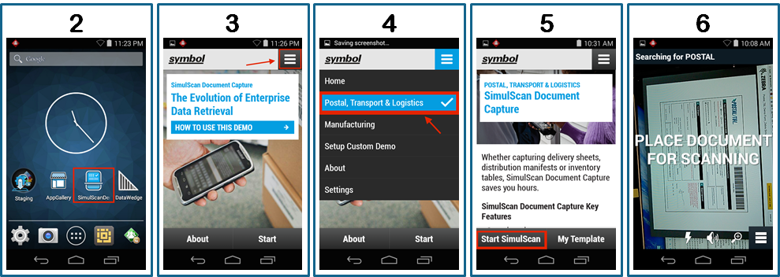
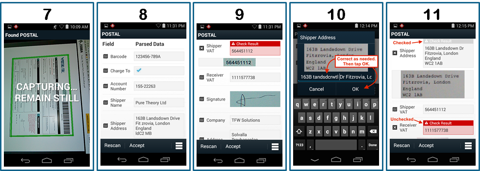

##Overview
A Demo App is included with all [devices that support SimulScan](../about/#supporteddevices) and is intended to quickly demonstrate how SimulScan works and what it can do. The Demo App also provides a means of testing--without a license--custom Templates that implement Multi-barcode, signature capture, OCR, OMR and other advanced SimulScan features.

**Note: The Demo App cannot save acquired data and is not suitable for production environments**. 

### Main Features

* Form identification and data capture
* Scan multiple barcodes and symbologies from a structured or unstructured form
* Single- and multi-line OCR scanning to acquire alphanumeric characters
* Optical Mark Recognition (OMR) for checkboxes
* Machine Readable Zone (MRZ) for passports and other travel documents
* Create Custom Demos
* Download Templates from the Template Builder server 
* Configure audio feedback, timeout interval, auto-capture sensitivity and other Advanced Settings

-----

### How to Use the Demo App

**To use the SimulScan Demo app** for Mixed Data-types:

_**Click image to enlarge**_. 
 

1. **Print the [Transport & Logistics (T&L) Demo Form](https://zebra.box.com/s/gnpxp4w99aks75vu96pjqeg7mzcrewfr)** (shown above). 
2. **Locate and tap the SimulScan Demo App** icon on the scanning device. 
3. **Tap the "hamburger" menu**.
4. **Select the "Postal, Transport & Logistics" Template**. 
5. **Tap "Start SimulScan"** and begin scanning. The data acquisition device (camera or imager) is selected automatically by SimulScan based on type of data to be acquired and/or settings defined in the Template. (The Postal, T&L Template is set to use the camera). A message like the one in Image 6 appears.
6. **Orient the scanning device** so the target Document fills most of the screen. Orientation can be horizontal or vertical (shown). 

 
7. **Hold the scanner still when the green frame appears**. Upon acquisition, parsed data is displayed as in Image 8. See Advanced settings for access to auto-capture and sensitivity settings. 
8. **Verify that acquired data is correct**, scrolling as necessary. *If SimulScan has less than absolute confidence in the correctness of a decoded value, that value will be presented along with an image of the corresponding area from the scanned Document to aid in validation or correction*.
9. **Tap red-highlighted fields** to confirm or correct the captured data. The keyboard appears; correct as needed. 
10. **Press OK** to return to the Parsed Data screen.
11. **Repeat Steps 9 and 10 until all errors are corrected**. SimulScan tracks edited Fields with color coding. 

 

<!-- 
**&#49;. Locate and tap the SimulScan Demo** app icon: 

 
**&#50;. Tap the "hamburger" menu**:

 
**&#51;. Select the "Postal, Transport & Logistics" Template**:

 
**&#52;. Tap "Start SimulScan"** to activate the camera or imager and begin scanning. A message appears similar to the one in Step 5, below.  

 
**Try scanning from the image below** (click to enlarge) or [download the form](https://zebra.box.com/s/gnpxp4w99aks75vu96pjqeg7mzcrewfr) and scan from the screen or a printout. 

_**Click image to enlarge**_. 
 
**&#53;. Orient the scanner** so the target Document fills most of the screen. Orientation can be horizontal or vertical (shown):

 
**&#54;. Stop moving the scanner when the green frame appears**. This indicates that the Document is aligned properly. A screen appears showing the parsed data similar to the image in Step 7. 

 
**&#55;. Verify that acquired data is correct**, scrolling as necessary: 

 

**If SimulScan has less than absolute confidence in the correctless of a decoded value**, that value will be presented along with an image of the corresponding area from the scanned Document to aid in validation or correction. 

**&#56;. Tap any red-highlighted fields** to confirm or correct the captured data:

 
**&#57;. Tapping any field invokes the keyboard**. Correct as needed. **Press OK to return to the Parsed Data screen**.

 
**&#49;&#48;. Repeat Step 9 until all errors are corrected**. SimulScan tracks edited Fields with color coding:  

 
-->

-----

###Test a Custom Template
The SimulScan Demo app exposes all SimulScan features (except the ability to save data), and can be used to test Templates built by an organization. Custom Templates stored on the Template Builder web site can be pulled from within the Demo app. Locally stored Templates must be pushed to the device manually. 

####Before You Begin
Before testing a custom Template, complete the following steps: 

* Create a printed version of the target Document(s) for which the Template(s) were created.  
* If using the Demo App to pull from the server, Template(s) to be tested must be in:
 * `/<accountID>/templates/release/`
* If pushing from a local PC to the device, push Template(s) to: 
 * `/<internal storage>/simulscan/templates/`

For more, see [Deploy Templates](../templatebuilder/#deploytemplates). 

**To open a custom Template**: 

**&#49;. Open SimulScan and press Start**. A screen appears similar to the image below. Notice that the most recently used Template (if any) remains selected (shown is the "Postal, Transport & Logistics" Template from the exercise above). 

**To switch Templates, press the "My Template" button**. A screen appears similar to the image in Step 2. 

 

**&#50;. Tap the appropriate drop-down** to open the Template to be tested: 

 

**Browse external storage -** lists Templates in the `/<internal storage>/simulscan/templates/` folder on the device.

**Default templates -** lists Templates included with SimulScan, which are stored in the `/enterprise/device/settings/datawedge/templates` folder on the device. Custom Templates pushed to this location will be displayed with included ones. 

**Select from server -** lists Templates in the `/<accountID>/templates/release/`
folder on the [Template Builder web site](http://simulscan.zebra.com) after logging into the Template Builder web site. When using this option, a copy of the specified Template is placed in the `/<internal storage>/simulscan/templates/` folder on the device. 

**&#51;. Go to [How to Use the Demo App](#howtousethedemoapp) Step 5**.  

-----

Related guides: 

* [Template Builder](../templatebuilder)
* [DataWedge](../../../../datawedge)