##Overview
A Demo App is included with all [devices that support SimulScan](../about/#supporteddevices) and is intended to quickly demonstrate how SimulScan works and what it can do. The Demo App also provides a means of testing--without a license--custom Templates that implement Multi-barcode, signature capture, OCR, OMR and other advanced SimulScan features.

**The Demo App cannot save acquired data and is not suitable for production environments**. 

### Main Features

* Form identification and data capture
* Scan multiple barcodes and symbologies from a structured or unstructured form
* Single- and multi-line OCR scanning to acquire alphanumeric characters
* Optical Mark Recognition (OMR) for checkboxes
* Machine Readable Zone (MRZ) for passports and other travel documents

-----

### How to Use the Demo App

**To use the SimulScan Demo app**:

**&#49;. Locate and tap the SimulScan Demo** app icon: 
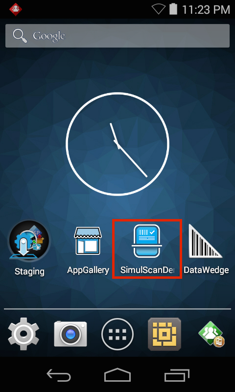
 

**&#50;. Tap the "hamburger" menu**:
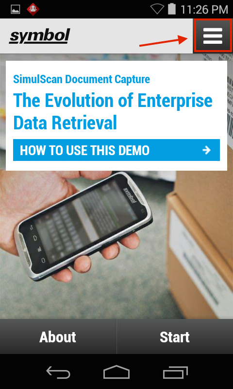
 

**&#51;. Select the "Postal, Transport & Logistics" Template**:
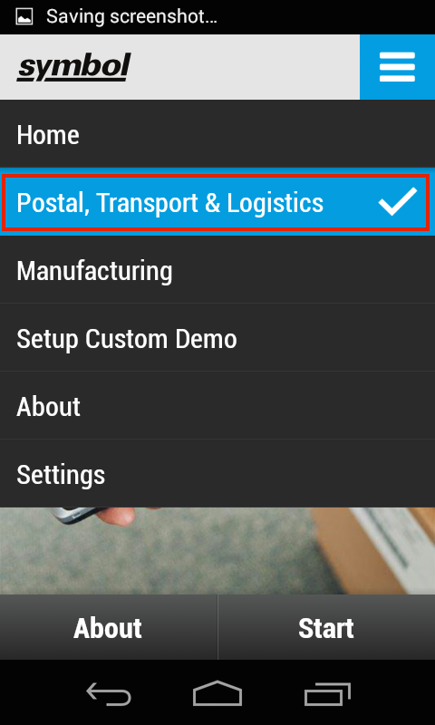
 

**&#52;. Tap "Start SimulScan"** to activate the camera or imager and begin scanning. A message appears similar to the one in Step 5, below.  
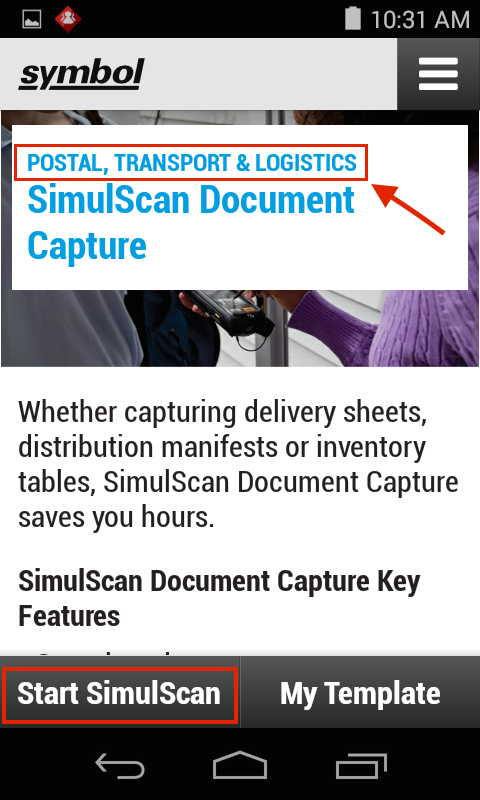
 

**Try scanning from the image below** (click to enlarge) or [download the form](https://zebra.box.com/s/gnpxp4w99aks75vu96pjqeg7mzcrewfr) and scan from the screen or a printout. 

_**Click image to enlarge**_. 
 

**&#53;. Orient the scanner** so the target Document fills most of the screen. Orientation can be horizontal or vertical (shown):
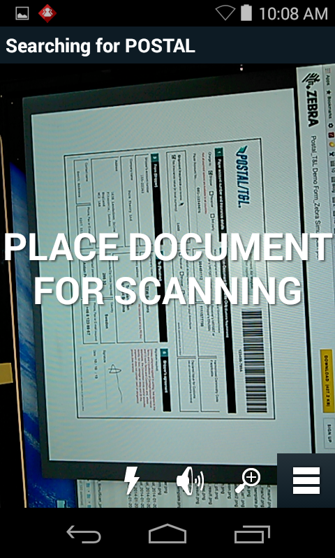
 

**&#54;. Stop moving the scanner when the green frame appears**. This indicates that the Document is aligned properly. A screen appears showing the parsed data similar to the image in Step 7. 
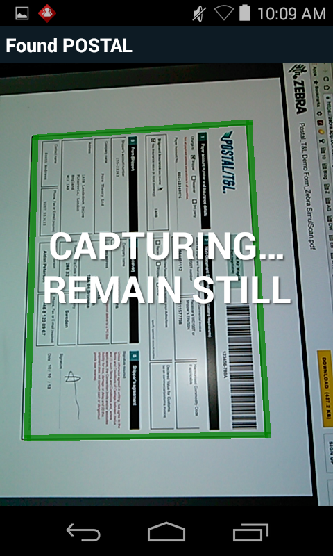
 

**&#55;. Verify that acquired data is correct**, scrolling as necessary: 
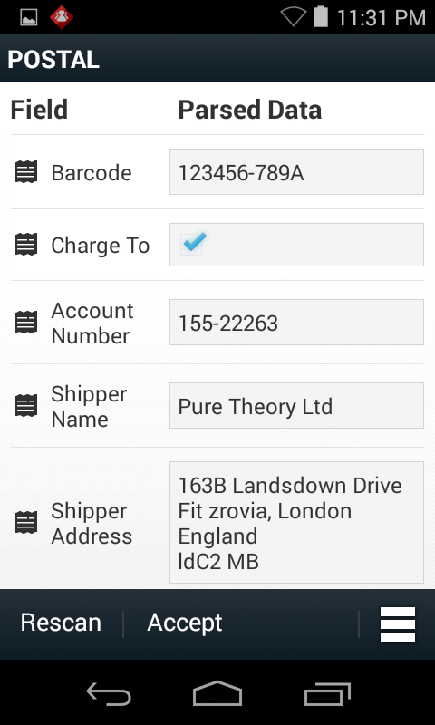
 

**&#56;. Warnings appear with results** that SimulScan considers questionable along with an image of the corresponding area to aid in validation or correction:    
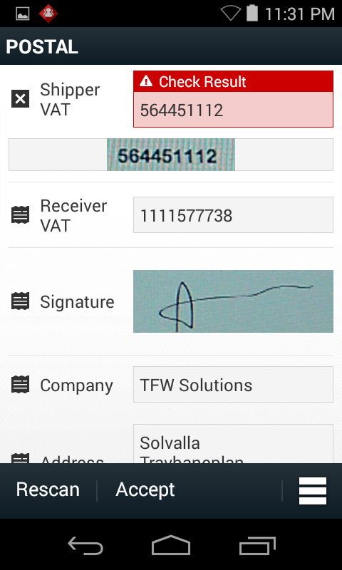
 

**&#57;. Tapping any field invokes the keyboard**. Correct as needed. **Press OK to return to the Parsed Data screen**.
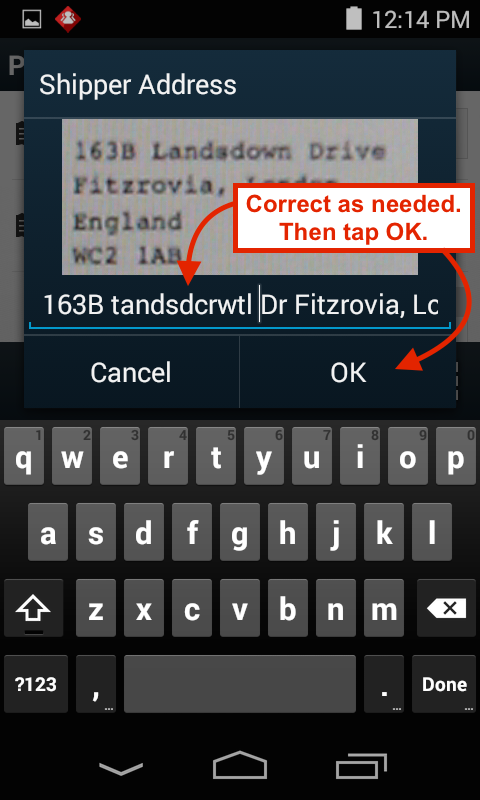
 

**&#49;&#48;. Repeat Step 9 until all errors are corrected**. SimulScan tracks edited Fields with color coding:  
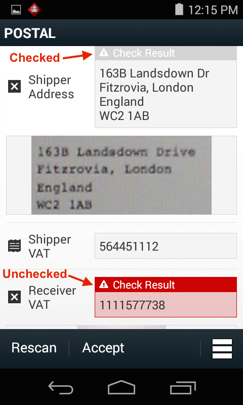
 

-----

###Test a Custom Template
The SimulScan Demo app exposes all SimulScan features (except the ability to save data), and can be used to test Templates built by an organization. Custom Templates stored on the Template Builder web site can be pulled from within the Demo app. Locally stored Templates must be pushed to the device manually. 

####Before You Begin
Before testing a custom Template, complete the following steps: 

* Have on hand a printed version of the target Document(s) for which the Template(s) were created.  
* If pulling from the server, Template(s) must be in:
 * `/<accountID>/templates/release/`
* If pushing to the device, push Template(s) to: 
 * `/<internal storage>/simulscan/templates/`

For more, see [Deploy Templates](../templatebuilder/#deploytemplates). 

**To open a custom Template**: 

**&#49;. Open SimulScan and press Start**. A screen appears similar to the image below. Notice that the most recently used Template (if any) remains selected (shown is the "Postal, Transport & Logistics" Template from the exercise above). 

**To switch Templates, press the "My Template" button**. A screen appears similar to the image in Step 2. 
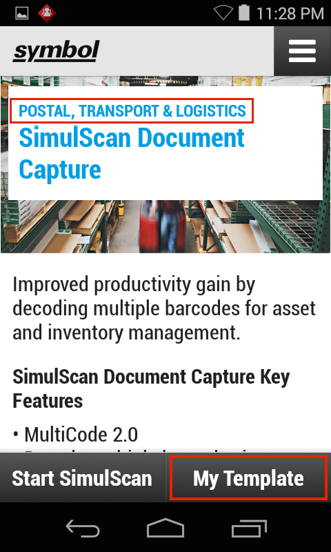
 

**&#50;. Tap the appropriate drop-down** to open the Template to be tested: 
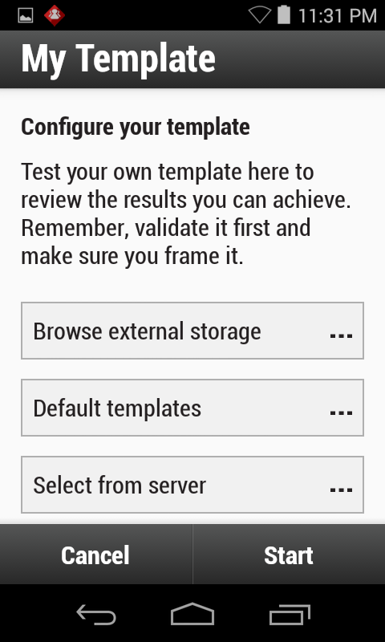
 

**Browse external storage -** lists Templates in the `/sdcard/simulscan/templates/` folder.

**Default templates -** lists Templates included with SimulScan.

**Select from server -** lists Templates in the `/<accountID>/templates/release/`
folder on the [Template Builder web site](http://simulscan.zebra.com). A login prompt appears. Enter credentials for the Template Builder web site. The copy of the specified Template is placed in the `/<internal storage>/simulscan/templates/` folder on the device. 

**&#51;. Go to [How to Use the Demo App](#howtousethedemoapp) Step 5**.  

-----

Related guides: 

* [Template Builder](../templatebuilder)
* [DataWedge](../../../../datawedge)