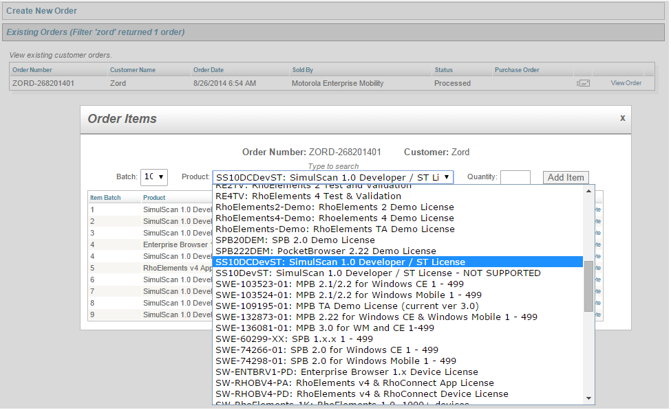
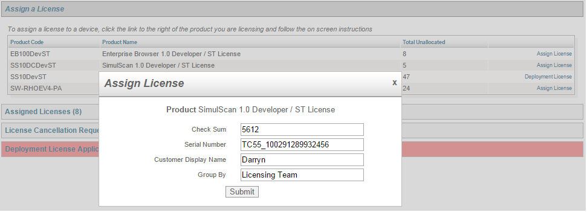
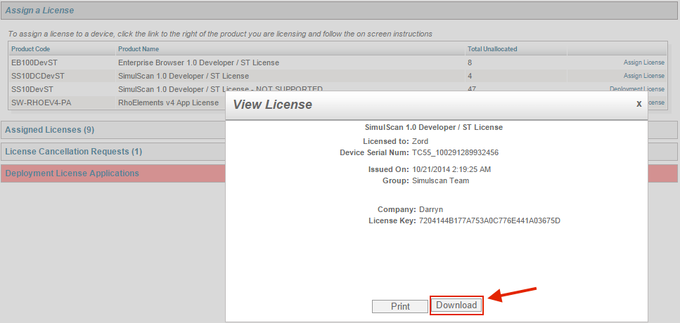

## Overview

**SimulScan is free for many scanning scenarios, including when used with Zebra's [DataWedge](../../../../datawedge) service** and its default Templates, from a custom app to scan only barcodes and/or for certain types of optical character recognition (OCR) acquisition. A per-device license is required for advanced SimulScan features. A complete breakdown is below. 

**SimulScan is free when**: 

* SimulScan is used to scan only barcodes ([Multi-barcode mode](../glossary/#multibarcodemode))
* No more than 10 barcodes are present on any single scan target 
* Text is captured using OCR-A, OCR-B or MRZ barcode symbologies
* DataWedge is used with SimulScan and any of its default Templates

**A SimulScan License is required when**: 

* SimulScan is used to capture an entire Document ([Document Capture mode](../glossary/#documentcapturemode))
* More than 10 (but no more than 20) barcodes (or other fields) are present on any single scan target
* Text is captured using OCR
* Optical mark recognition (OMR) is used to detect the presence of signatures or check marks  
* Using SimulScan with [Enterprise Browser](../../../../enterprise-browser)

**When a License is required, the following general rules apply**:

* **A SimulScan license is required for each device** that will access SimulScan advanced features. 
* **A Device-specific License** is assigned based on a product name and serial number, and will fail if transferred to a different device.
* **A Deployment License** works on all devices in a deployment, and is intended for remote- or mass-deployment scenarios. 
* **The Deployment License Key** is user-generated on the licensing website.
* **Demo licenses are available** for evaluation and early integration. 
* **A license is not required to use the [SimulScan Demo App](../demo)**.
* **A Factory Reset clears the license** from the device; redeployment is required. 

-----

## Obtain a License
SimulScan Licenses are purchased through resellers of Zebra Technologies products. The section below explains the process for Licensing devices for SimulScan use. 

### I. Contact a Reseller 
The first step in obtaining a license is to engage with Zebra directly or with a Zebra reseller. To get started, use one of the following Zebra resources: 

* **[Find a Zebra Partner](https://www.zebra.com/us/en/partners/find-a-zebra-partner.html) -** form for submitting an inquiry via the web
* **[How to Select a Channel Partner](https://www.zebra.com/us/en/partners/find-a-zebra-partner/selecting-the-right-channel-partner.html) -** explains the types of partners that engage with Zebra and some of their technologies and specialties
* **[Partner Interaction Center](https://www.zebra.com/us/en/partners/partner-interaction-center.html) -** info for contacting Zebra's existing global partner network
* **[Zebra Corporate Numbers and Links](https://www.zebra.com/us/en/about-zebra/contact-zebra.html) -** broken down by global region
* **[Global Marketing Contact Center](https://www.zebra.com/us/en/about-zebra/contact-zebra/marketing-contact-center.html) -** broken down by global region and country

-----

### II. Access Licensing System
After a licensing agreement is arranged with Zebra or a Zebra reseller, an email will be sent to the licensing company's representative containing user credentials. 

* **Log into the [Zebra Enterprise Software Licensing system](https://softwarelicensing.zebra.com/) to:** 
	* Place an order for device licenses (see image)
	* View the status of existing orders
	* Assign licenses to devices 
	* Generate Deployment License Keys
	* View current license inventory and assignment(s)

_Options for SimulScan licensing might vary from the image shown_.  
 

-----

### III. Assign License(s)
Once the desired number of license(s) are purchased, they must be assigned to device(s) before being deployed commercially. Licenses can be deployed manually or remotely using [Zebra StageNow](../../../../stagenow) or a compatible mobile device management (MDM) system.

#### Manual Deployment
**&#49;. Enter the device model and serial number** (as shown) and other required information and **Press Submit** when done. 

_Individual licenses must be applied manually at the device. Deployment licenses can be deployed remotely_.
 

**&#50;. Download the** `SDC_License.xml` **file** from the licensing server to a local PC:

_Licenses are tied to the device model and serial number and will fail if transferred to another device_.
 

**&#51;. Push the License file to the device(s)**.

**&#52;. In the Settings panel, select About Phone -> Legal Information -> Symbol Licenses -> Menu -> Install license**.

**&#53;. Navigate to the License file** and select it.

**Manual license deployment is complete**. 

#### Remote deployment

1. **Generate a Deployment Key** on the Licensing website. 
2. **Launch the StageNow wizard** and select "SimulScan mass-deployment."
3. **Input the Deployment Key** when prompted. 
4. **Deploy the Key to devices**.  

Once deployed to the device, SimulScan licenses are installed automatically. For details, please refer to [StageNow documentation](../../../../stagenow). 

-----

## Demo License
Demo licenses are available for companies wishing to evaluate SimulScan or while integrating a custom app using SimulScan APIs. To request a demo license to enable SimulScan advanced features and APIs on a device:

* [Send email to NMV386@zebra.com](mailto:NMV386@zebra.com?Subject=SimulScan%20Demo%20License%20Request) 
* Include **"SimulScan Demo License Request"** in the subject header

A reply will be sent with access credentials for [Zebra's Software Licensing Portal](https://softwarelicensing.zebra.com/), generally on the next business day. 

* **Follow directions** to [assign the license](#iiiassignlicenses). 

<!--
## Device License
SimulScan licenses are purchased through Zebra Technologies product resellers. Licensees receive an email with access credentials for the [Zebra Enterprise Software Licensing system](https://softwarelicensing.zebra.com/), where licenses are allocated to devices by an administrator. The general process is explained below. For additional help, please refer to [Licensing documentation](https://softwarelicensing.zebra.com/documentation/index.html). 

**License types**:
* **Device-specific License -** assigned to a specific device based on the product name and serial number. This License will fail if an attempt is made to apply it to a device other than the device to which it was originally assigned.

* **Deployment License -** works across an entire device deployment. This is useful for remote or mass-deployment scenarios. The Deployment key is generated on the licensing website.

Both license types can be applied using either of the methods below.  

-->