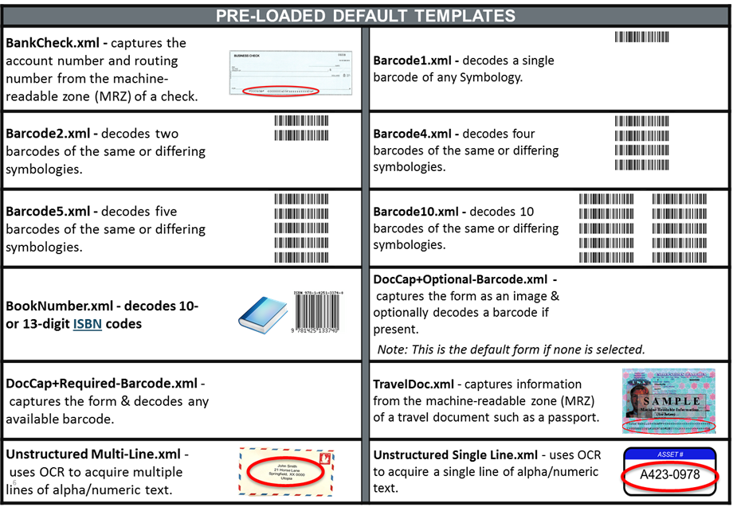
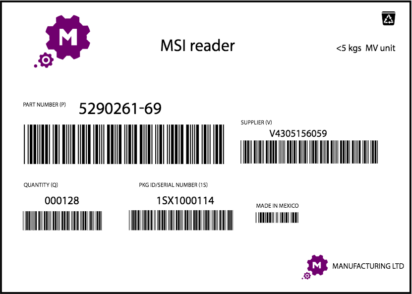

 <button type="button" class="close" data-dismiss="alert" aria-label="Close">×</button> <h4>Important information about SimulScan:</h4> 
<b>The most important SimulScan capabilities, including multi-barcode scanning and OCR A/B capture for travel documentation, are being migrated to the internal scanning framework that runs on all Zebra devices</b>. Once complete, capabilities formerly available only through SimulScan will be accessible through DataWedge and Android intent APIs. Therefore, Zebra strongly recommends that partners develop a migration plan to DataWedge for all applications that currently use SimulScan.

<b>Key migration dates</b>:
    
<ul>
        <li>Dec. 31, 2019 - Final day to buy SimulScan licenses</li>
        <li>Dec. 31, 2020 - End of support for licensed SimulScan API features</li>
        <li>Device end-of-life - End of support for non-licensed SimulScan API features</li>
        <li>For more information, refer to <b>PMB 10281</b> on the Zebra Partner Portal:</li>
    </ul>
     
    <a href="http://partnerportal.zebra.com" class="btn btn-danger">Go to Partner Portal</a>  

## Overview

**SimulScan can be used in three ways**: 

* With [DataWedge](../../../../datawedge), which is covered below
* Through the [SimulScan APIs](../../api) from within a custom Android app 
* By using the [SimulScan Demo App](../demo), which exposes all features except the ability to save acquired data

To [activate SimulScan](/simulscan/1-1/guide/setup/#activatesimulscan), simply select it as an Input Plug-in from within DataWedge, an app that comes with every Zebra device. The exact process is detailed below, beginning with a short introduction to SimulScan concepts. For more information, see the [About SimulScan page](../about). 

-----

### About Templates

**Templates are central to the power of SimulScan**; they are used in all modes to: 

* Define regions of a form from which to capture data
* Control SimulScan's ability to decode and parse data
* Determine how acquired data is consumed by an application

At least one Template must be present and selected within SimulScan before the tool can be used; a number of [generic Templates](#usewithdatawedge) are included. <!--Zebra also provides [industry-specific templates](../templates) for partners to downloaded and modify as needed.-->

For use cases in which generic or pre-built templates are unsuitable, custom Templates can be easily creating using the cloud-based [Template Builder](../templatebuilder) tool. See the Template Builder guide for more information about Templates. 

-----

### Use With DataWedge
SimulScan includes a number of generic Templates to cover common scanning scenarios when SimulScan is selected as the DataWedge Input Plug-in. For more advanced use-cases, custom Templates can be created [Using Template Builder](../templatebuilder/#usingtemplatebuilder) or downloaded from Zebra's library of [Pre-built Templates](../templates). Downloaded Templates can be modified as needed using Template Builder. 

**_Note: The names of all Templates included with SimulScan are preceded by the word "Default" plus a hyphen_**.

<!--

_Templates included with SimulScan_
 
-->

<!--
**Templates included with DataWedge** and the [SimulScan Demo App](../demo):

* **BankCheck.xml -** captures the account number and routing number from the machine-readable zone (MRZ) of a check. 

* **Barcode1.xml -** decodes a single barcode of any symbology. 

* **Barcode2.xml -** decodes two barcodes of the same or differing symbologies. 

* **Barcode4.xml -** decodes four barcodes of the same or differing symbologies. 

* **Barcode5.xml -** decodes five barcodes of the same or differing symbologies. 

* **Barcode10.xml -** decodes 10 barcodes of the same or differing symbologies. 

* **BookNumber.xml -** decodes 10- or 13-digit [ISBN codes](http://www.isbn.org/about_ISBN_standard).

* **DocCap+Optional-Barcode.xml -** captures the form as an image and optionally decodes a barcode if present. This is the default form if none is selected.

* **DocCap+Required-Barcode.xml -** captures the form and decodes any available barcode.

* **TravelDoc.xml -** captures information from the machine-readable zone (MRZ) of a travel document such as a passport.

* **Unstructured Multi-Line.xml -** uses OCR to acquire multiple lines of alpha/numeric text. 

* **Unstructured Single Line.xml -** uses OCR to acquire a single line of alpha/numeric text. 

--> 

-----

#### Create a Template

If using Templates already present on the device, skip to the "Activate SimulScan" section. 

1. **Log in** to the [Template Builder web site](http://simulscan.zebra.com).
2. **Select the Template type** to create. 
3. **Upload an image** of the Document to be scanned (.bmp, .jpg, .png or PDF; 5MB max.).
4. **Identify regions** of the Document and the data types (barcodes, text, etc.) of each.
5. **Validate Template** to confirm that created fields are captured as intended. 
6. **Save, Release and Deploy** the completed Template(s), which can be downloaded to the development host (local PC). 
7. **Copy Template(s) to** `/enterprise/device/settings/datawedge/templates` on the device. 
8. **Activate the Template** from within DataWedge (see below) or other scanning app. 

**Related Links**: 

* [Template Builder guide](../templatebuilder) - access to online tools and details
* [Tutorials](https://developer.zebra.com/community/android/simulscan/template-builder) - visual aids for making Templates

-----

#### Activate SimulScan

When the desired Templates are stored on the device, **activate SimulScan by setting it as the Input source** when configuring an Input Plug-in (see below) in DataWedge. See the [SimulScan Input section](http://techdocs.zebra.com/datawedge/6-0/guide/setup/#simulscaninput) of the DataWedge documentation for full details. 

**&#49;. Open DataWedge** and the Profile that will use SimulScan.

**&#50;. Select "Input Plug-in,"** scrolling as necessary.

**&#51;. Select SimulScan** as the Input Source. A screen appears similar to the image below: 

_SimulScan options within DataWedge_
 

**&#52;. Tap and select the desired options** as needed: 

**Device Selection -** permits selection of the device camera or the default scanning device set by the system (recommended).

**Template selection -** sets a SimulScan Template for the Profile being configured. Custom Templates installed in the `/enterprise/device/settings/datawedge/templates` directory on the device will appear along with the templates included with SimulScan (listed above). **Note: Files and folders within the** `/enterprise` **directory are invisible to Android File Browser by default**; they can be made visible by manually inputting the path. 

**Region separator -** used to configure a separator character for SimulScan text-region data. When multiple text regions exist, the region separator will be inserted between the data strings from each region on the acquisition form. Region separators can be used with the [Keystrokes Output Action key](../../../../datawedge/6-3/guide/output/keystroke) character setting (see below) to dispatch data acquired in SimulScan regions to specific fields of an app.

**Region Separator possible values**:

* **None** (default)
* **Tab**
* **Line feed**
* **Carriage return**

**SimulScan Capture Notes**:

* **Text captured through SimulScan is concatenated** into a single string, and processing is performed on that string.
* **If the Barcode Input Plug-in is enabled** in a Profile, enabling SimulScan in that Profile will cause the Barcode Input Plug-in to be disabled.
* **Barcode, OCR and OMR regions are considered text regions**. When using keystroke output and IP output, only text-region data will be dispatched to the foreground application or the remote server.
* **Picture-region data** can be retrieved only through the Intent Output Plug-in.

**SimulScan is now ready to use**. 

-----

**Related guides**: 

* [DataWedge](../../../../datawedge)
* [Template Builder](../templatebuilder)
* [Enterprise Browser](../../../../enterprise-browser)

<!--
* **Default-One-Barcode.xml -** decodes a single barcode in the form and returns a single data region as the output.

* **Default-Two-Barcodes.xml -** decodes two barcodes in a form and returns the data as two data regions.
-->

<!--

### Multi-barcode Template
**A Multi-barcode Template** is designed for use on forms from which only barcode data will be acquired. In theory, there's no limit to the number of barcodes and symbologies that can be captured at one time. The unlicensed version of SimulScan permits a maximum of nine (9) barcodes to be captured from a form without [licensing](../license).  

*A typical barcode-only form for a common and effective SimulScan use case*.
 

<!-- --> 

<!-- When the data to be captured is of one type (i.e. barcodes) or contained in a single field (i.e. an address), SimulScan can be used to acquire the data regardless of whether it is presented on a structured form. In such instances, it is often the case that data must be captured only from a small portion of a form, and the remaining form data can be ignored.

Some data-acquisition scenarios call for creation of a type-specific Template, for example to capture all the barcodes on the form, or to use (OCR) to capture only an address (not shown). For another example application, a Template might be created to capture only the machine-readable zone (MRZ) data from travel documents.

### Mixed Data-type Template  
**The Mixed Data-type Template** captures multiple data types from a variety of sources. For example, the form below contains a barcode, account numbers and other numerical shipper information, company names and addresses for the shipper and receiver, checkboxes with various values, and a signature and date. Acquiring all of this data separately would be time-consuming and error-prone. But SimulScan can do it in seconds once a Template is made. See this form in action using the [SimulScan Demo App](../demo). 

-->

