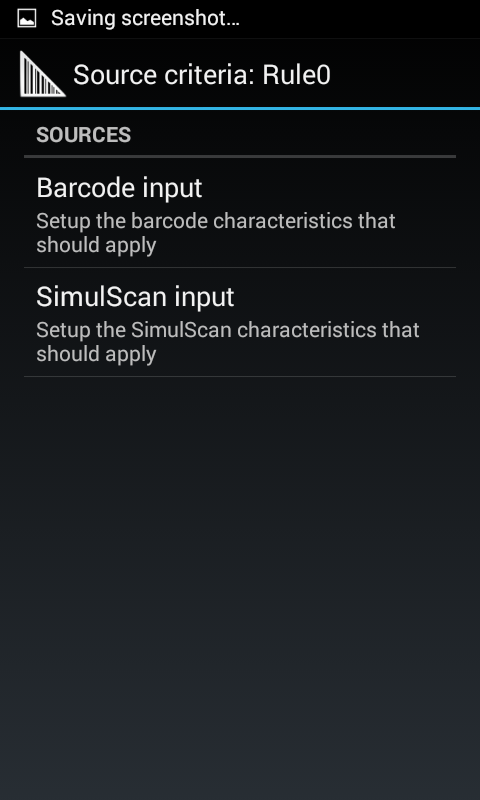

##Overview

SimulScan can be accessed through DataWedge or from within an app using [SimulScan APIs](../../api). 

It can be selected as an Input Plug-in using Zebra's [DataWedge](../../../../datawedge) service, or accessed directly from within an Android app using the [SimulScan APIs](../../api). SimulScan features can be explored using the [SimulScan Demo App](../demo), which exposes all features and functions except the ability to save acquired data. The Demo App also can be used to test user-created Templates.

raw md link:

[SimulScan APIs](../../api)

HTML w/ 350px constriction:

_Launcher icon for DataWedge 6.x_
 

GETTING STARTED
This document assumes the reader has a basic knowledge of what SimulScan is and the features it supports. For those not aware, please visit the SimulScan Overview Page.

Step 1 : Ensure your device has the latest release for the best performance

SimulScan is currently supported and pre-installed on the devices listed here. Since it comes pre-installed on those devices, we recommend that users check the Zebra Support portal to get access to the latest device BSP and SimulScan release.

Step 2 : Open the SimulScan Demo App to see and test functionality

There is an easy to use demo application built into the OS to help you become familiar with and test the SimulScan functionality out of the box on our supported devices. To familiarize yourself with the demo app, you can watch the videos or review the documentation posted here. For your convenience, the demo app includes multiple templates that have already been developed and can be used out of the box with the demo app. Please print the templates to use with the demo app. The two templates are attached below. 

a. Postal_TL.pdf - This form showcases the following SimulScan capabilities: 
- Signature presence detected in forms 
- Automated data entry with character recognition (OCR). English, Spanish, German, French and Portuguese are supported 
- Simplified workflow exceptions with checked mark recognition[OMR]. Check boxes, radio buttons and bubbles are supported 
- Real-time data processing on the device with no backend connectivity required 

b. Manufacturing.pdf - This form showcases the below capabilities of SimulScan: 
- MultiCode2.0 feature supports decoding of up to 6 multiple barcodes in one scan 

All the enterprise grade barcode symbologies are supported. Symbologies and parameters configurable via an intuitive UI in the Template Builder. Please print out the .pdfs attached to this blog and try them out with the Showcase app.

Step 3 : Create your own template

Once you are familiar with the features, the next step is to create a template for a form you would like to capture. Here is a video demonstrating how to use Template Builder to create a template. 

You can log in or sign up by visiting the Template Builder page at https://simulscan.zebra.com. Once you have logged in, you will need to decide what type of template you will create. Next, upload an image of your form to create your own template. Please leverage the Help Doc in the Template Builder by pressing F1. 

Once created, the templates need to be downloaded to your computer in order to (mass) deploy to your device(s). There are two ways to deploy the file to your device. 

Option 1: Side load or push via MDM 
- For use by DataWedge, push the templates to "/enterprise/device/settings/datawedge/templates" folder on the device using either ‘adb push’ or ‘USB sync’ or your preferred staging/MDM tool. 
- For RhoMobile access, the folder is configurable via the "templateDirectory" property. 
- For the Demo App to access the template, place the folder in the external storage folder, SimulScan, Templates folder (with ADB, push via "Environment.getExternalStorageDirectory()/simulscan/templates"). 

Option 2: Over Wifi for use with the Demo app or for programatic access 
- On the TB, copy the template over to the "username\Release" folder. - Launch the Showcase app -> My template -> Select from server -> select the template. This will download the templates to the SimulScan Template folder in the external storage. 
- The "release" folder on the TB is also programmatically accessible via the RhoMobile FetchTemplates() API.

Step 4 : Test your template on the device

You can validate if your template works using the Showcase app -> My Template or Showcase app -> Menu -> Setup Custom Demo options and point to your template.
As the Showcase app shows the results of the template, it can be leveraged to validate your template without writing a single line of code.

Step 5 : Incorporate SimulScan within your application

SimulScan can be leveraged from within your application via the EMDK, DataWedge or Rho API’s. Please refer to the documentation for API integration on this website for further details.
The template validated from Step 4 can be pointed to using DW or Rho and incorporated within your app. The complete operation of bringing up the camera, guiding the end-user through the capture and processing the data is abstracted within the SimulScan software. The UI is the exact same UI as seen in the Showcase App. All the user app needs to do is set the right template using DW or Rho. Once captured and processed, the results are returned to the user-app correspondingly for the next level of processing – ex: form filling, inventory management etc. 
All the processing is additionally performed locally on the device without requiring any online connectivity. It is up to the end-user app on how to handle the returned results as a name-value pair of the various data parsed.

Step 6: Installing your license

If you are using features that require a license, please follow these steps:
- Request and Install a license

