## Overview
Template Builder is a web-based tool for defining the information captured by SimulScan and determining how it will be processed and made available to applications. Templates are the key to controlling SimulScan data-capture features and for processing acquired data as needed. 

Most acquisition tasks involve capturing data from printed documents, which often vary in size, shape and layout and can be a challenge to accuracy. Templates solve this problem by "teaching" SimulScan about the documents it will encounter and defining how to scan and process data for each instance of a "Templated" document. 

*A typical barcode-only form, SimulScan's most common and effective usage scenario*.
 

Templates work on the principle that the _**location**_ and _**type**_ of data in each region of a form (i.e. barcodes, alpha/numeric characters, signatures, etc.) will remain consistent and that _**only the data will change**_ with each new instance of that form. Templates that uniquely identify each region and data type of a particular form allow SimulScan to capture the data quickly and accurately, and permit developers to map the acquired data to specific fields of their application. 

For example, a company that receives regular shipments accompanied with a label like the one above could create a [Multi-barcode](#selecttemplatetype) Template that maps the part number and supplier number from the barcodes in the upper row, and the quantity-received information from the barcode in the lower-left corner to the corresponding fields of an application. 

-----

### In This Guide
This guide provides step-by-step instructions for using the GUI-based Template Builder tool to [create Templates](#usingtemplatebuilder) and deploy them to the devices. A familiarity with SimulScan concepts and terminology is required. If necessary, please read through the [Template Builder Glossary](#glossary) and see the [About SimulScan](../about) page before proceeding. 

-----

### Before You Begin

Before attempting to create a Template, the following assets are required: 

* **Sample(s) of the Document(s)** for which the Template(s) are being created
* **Photos or image scans** of those same documents
* **An account on the [Template Builder web site](http://simulscan.zebra.com)**

-----

### Glossary

**Anchor Element(s) -** one or more unchanging images or other Document attributes (i.e. company logo) that SimulScan can use to determine Document orientation.

**Bounding Box -** an oval, round or square object on the printed form that contains the mark to be acquired. 

**Data Type -** defines the source (barcode, OCR, etc.) of data being acquired from a Region of a Document. 

**Document -** printed form containing data to be acquired (i.e. a shipping receipt). Documents should be associated with no more than one Template. 

**Field -** region of a form associated with a data type and processing method (i.e. a barcode).

**Grouped Regions -** refers to sections of a Document that require Fields (i.e. an address) to be grouped logically as an aid to processing the acquired data. 

**Input Plug-in -** defines in a DataWedge Profile the means by which data is acquired by DataWedge. See [SimulScan Input](../../../../datawedge/6-0/guide/setup/#simulscaninput). 

**Mixed Data-Type (Template) -** captures multiple data types from mixed sources, such as barcodes, alpha/numeric characters, checkboxes and images. 

**Multi-barcode (Template) -** captures barcode data only. 

**Multi-Line -** acquisition using OCR of multiple lines of alpha/numeric characters (i.e. a complete address).

**Multi-Template -** a beta feature that allows multiple Templates to be treated as one to simplify workflow. 

**OCR -** Optical Character Recognition, a processing mode for acquiring alpha/numeric characters. Currently supports English, French, German, Spanish and Portuguese. 

**OMR -** Optical Mark Recognition, a processing mode for acquiring binary (yes/no) data from checkboxes plus an "undecided" state. 

**Picture -** graphical image to be acquired as a file (i.e. `.jpg` file).

**Secure Storage -** the online area accessible only by credentialed user(s) in which Templates are stored. 

**Signature -** generally of the recipient of a shipment (captured as an image).

**Single-Line -** acquisition using OCR of a single line of alpha/numeric characters (i.e. a product number).

**Target, Structured -** a Document with a layout that doesn't change from one instance to another.

**Target, Unstructured -** a Document with no fixed layout, or a Document that has not been defined with a Template.

**Template -** XML document that defines the fields (Regions) of a shipping receipt or other document to be scanned. Templates are always associated with exactly one Document. 

<!-- 
**Template Persistence -** keeps Templates in sync between a development host and the Template Builder host server. 
-->

**Validation -** checks whether the Fields and their properties are correct for a given Document before a Template is deployed to devices. 

-----

## Using Template Builder 
Template Builder is free but registration might be required. Zebra customers, partners and ISVs with access to Partner Central can use their existing credentials for access. Others must register using the instructions below.

**Note**: SimulScan can be used without a License to <u>only scan barcodes through an app using [DataWedge](../../../../datawedge)</u>. A SimulScan License is required for access to OCR and OMR features and/or SimulScan APIs. For more information, please see the [Licensing page](../license).

### Quick Steps  

1. **Log in** to the [Template Builder web site](http://simulscan.zebra.com).
2. **Select the Template type** to create. 
3. **Upload an image** of the Document to be scanned (.bmp, .jpg, .png or PDF; 5 MB max.).
4. **Identify regions** of the Document and the data types (barcodes, text, etc.) of each.
5. **Save and download** the completed Template(s) to the development host (local PC). 
6. **Copy Template(s) to the device** that will be performing the scans. 
7. **Activate the Template** from within DataWedge (see below) or other scanning app. 

<!-- 
### Quick Steps
1. [Create account](#createanaccount) (if necessary). 
2. Log in at [simulscan.zebra.com](https://simulscan.zebra.com) (leave this site now).
3. [Select the Template Type](#selecttemplatetype).
4. Upload an image of the Document to be scanned (.bmp, .jpg, .png or PDF).
5. **File -> Save Template** for the first time. Subsequent changes are saved automatically.
6. [Identify regions](#identifydocumentregions) of the Document and the data types (barcodes, text, etc.) of each.
7. [Configure OCR settings](#configureocrsettings) if OCR is to be used. 
8. [Download and Deploy Template(s)](#deploytemplates) to scanning device(s). 

-->

-----

### Create an Account
**&#49;. Visit the [Zebra SimulScan registration page](https://signup.zebra.com/register.html?appId=SIMS)**, follow prompts to create a free account and enter all requested information. Once an account is created, Zebra administrators will send login information to the registered address. **Zebra recommends planning ahead; this process could take several days**.

 

-----

**&#50;. Point a browser to [simulscan.zebra.com](https://simulscan.zebra.com)** and enter the login credentials. A screen appears similar to the image below: 

 

-----

### Select Template Type

**&#51;. Select the desired Template type**: 

**Structured Targets -** for layouts that **do not** change from one instance to another. Select this option to: 

* Scan barcodes
* Recognize and acquire characters (OCR)
* Recognize check marks (OMR)
* Capture Signature(s) or other images
* Extract other key fields of interest

**Unstructured Targets -** for layouts that change or that **have not** been defined with a Template. Select this option to: 

* Scan multiple barcodes simultaneously 
* Use OCR for a single line of alpha/numeric text 
* Use OCR for a multiple lines of alpha/numeric text 

-----

**&#51;a. To select Structured Targets**:
* An Open... dialog appears
* Select the image (.bmp, .jpg, .png or PDF) of the Document for which to create the Template**
* Minimum image resolution is 640x480 pixels
* Maximum image resolution is 6000x6000 pixels
* Maximum image file size is 5MB
* For a PDF, select page number from the drop-down (if necessary) 

-----

**&#51;b. To select Unstructured Targets**:

 * Select "Multi-barcode" to capture barcodes or "OCR" for alpha/numeric text:
 

 

>>  **If Multi-barcode is selected upload an image of the target**. 

a. **When selecting OCR**, a static image is automatically created (as below). 
b. If Multi-line OCR is required, check the approproate box (arrow). 
c. Configure other settings as required (**see Step 7** for details).  

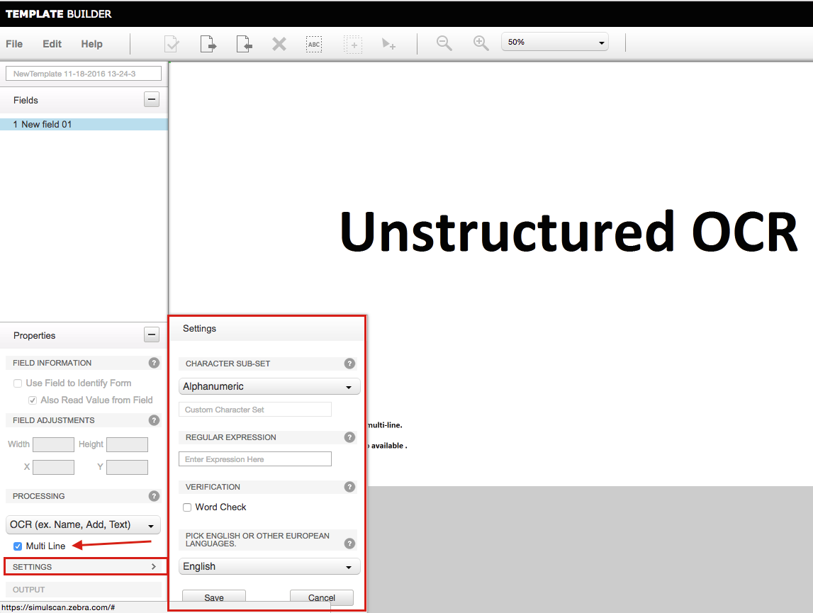
 

> **Save the template and skip to [Step 7](#configureocromrsettings)**. 

-----

**&#52;. Save the Template to proceed**. 

**Note**: The Template name prefix "Default -" is reserved for system use. All other alpha/numeric combinations are accepted. 

 

> **Warning: Do not attempt to modify the Template file by hand**. Templates contain machine-generated XML stored in Base64-encoded files, and are not intended to be edited manually. 

-----

### Identify Document Regions

> **If setting up an Unstructured Target, skip to [Step 7](#configureocromrsettings)**. 

After uploading an image of the target Document...

**&#53;. Confirm that the "AutoCrop" feature (enabled by default) has accurately identified the Document boundaries**:

 

**To adjust, click "Disable AutoCrop" and set Blue bounding box so that it's just outside the borders of the Document. Click "OK" when done. This serves as the base reference for identifying the form and processing its contents**.  

-----

**&#54;. Drag a box <u>from the upper-left corner to the lower-right corner</u> of each Region of the Document that contains data to be acquired**:

 

**Field Region Guidelines**:

* **Barcode Regions** must <u>**include only the bars and spaces**</u>; no surrounding characters should be included.
* **OCR Regions** should include surrounding white space equal to about two characters in width and height.  
* **OMR Regions should be kept tight to Bounding Boxes. A separate OCR Region can be created to capture the description, if needed.  

**Alternative ways to create Fields**:

 * Select **Edit --> Create New Field**, enter a name for the field and draw a box around the corresponding Region.
 * Click the **Add Field** button (arrow, below), enter a name and draw a box around the corresponding Region.

 

Fields not specifically named will be assigned a generic name (as shown). These can be edited later as desired (see [Modify a Template](#modifyatemplate)). 

Provide (or confirm) the following required settings for each Field created: 
 * A name for the field, if desired.
 * Properties (length/width and X-Y coordinates)
 * The required Processing mode (barcode, OCR, etc.) 
 * Processing-mode settings (decoder type, text-type, etc.)
 * Select at least three "Anchor Elements" (explained below) 

> **Save work often!** Unsaved changes could be lost if the screen is dismissed or a session timeout is reached.

### Select Anchor Elements
In addition its use of Document border dimensions, SimulScan uses Fields, company logos or other unique attributes of a Document to positively identify it and determine its orientation relative to the scanner (i.e. whether it's upside down). Optionally, Anchor Elements can contain data to be acquired, such as a barcode or image. Zebra recommends that at least two Anchor Elements be identified in accordance with the guidelines below. 

**Anchor Element Guidelines**:

* Select two or three Fields per document as Anchor Elements. 
* Anchor Elements should be spread across the top, bottom and side(s) of the Document.
* For Structured Targets, static fields such as logos and preprinted content work best.
* For barcode-only targets, barcodes with a fixed location on instances of a label work best.
* For fixed barcodes, select the “Barcode’s location is fixed” option in the Properties panel.
* Anchor Elements need not contain data to be acquired ("Also Read Value from Field" is optional).

 

For example, in the Postal T&L Document above, the logo in the upper-left corner and the barcode in the upper-right would identify this form adequately for SimulScan to activate its template. When using a fixed barcode as an Anchor Element, be sure to **select the “Barcode’s location is fixed” in the Properties panel**, as below: 

_This attribute appears only in "Structured Targets" Templates that use a symbology (see table)_.
 

####Fixed Barcode Supported Symbologies
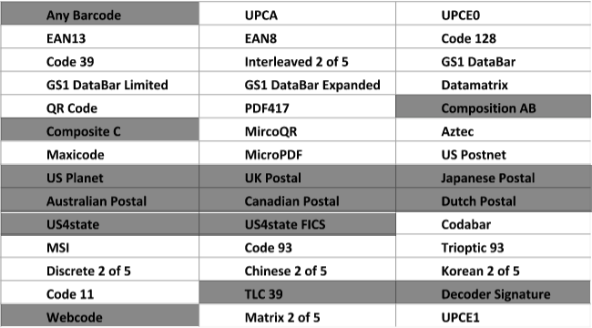
_Symbologies in shaded areas are **NOT** supported for fixed barcodes_. 

-----

### Configure OCR/OMR Settings 
**&#55;. If not using OCR or OMR, skip to [Step 8](#testandvalidatetemplates)**.  

####OCR Settings
To maximize the accuracy of character recognition in OCR regions, it's important to configure OCR parameters according to the expected input.  

**Character subsets -** identifies the type of text that will be acquired:

* **All caps alphabets -** text will contain all uppercase letters
* **All small alphabets -** text will contain all lowercase letters
* **Only Alphabets -** text contain only alpha characters (upper- and lowercase)
* **All digits -** text contain only numbers
* **Alphanumeric (default) -** text contain a combination of letters and numbers
* **Enter custom sub string set here -** enter information about custom characters in the Custom Character Set text box

**Regular Expressions -** data will consistently be presented in a particular pattern (i.e. MM/DD/YYYY). Specify as a Regular Expression according to the table below:  

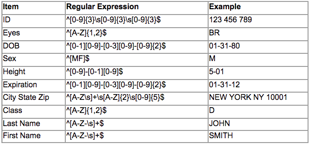
 
**Zebra recommends using this option only if the format defined can be guaranteed for the region**.

SimulScan references the [Perl Compatible Regular Expressions (PCRE)](http://www.pcre.org/) library for regular-expression pattern matching. Setting the character subset is easy but coarse; setting the regular expression is complex but precise. Specifying _**both**_ the  subset _**and**_ the regex greatly narrows the range of possible candidates. Learn more by reading the [Perl RegEx Man Pages](http://perldoc.perl.org/perlre.html). 

**Word Check -** enables a spell-check in the selected language. Use on regions known to contain only words.

**Language -** English is the default. Switching to European will recognize characters typically found in European languages such as the digraph, circumflex and umlaut.

#### OMR Settings
The data type for optical mark recognition (OMR) is binary, resulting in the acquisition of a yes/no condition (i.e. "mark is present" or "mark is not present"). A third "undecided" state results when SimulScan is unable to recognize a mark. Use OCR to acquire the label that describes the mark, if desired. 

**Configure the Bounding Shape** to ensure the most accurate result: 

**Bounding Box Shape -** the shape of the object on the printed form that contains the mark to be acquired. 

 * **Circle -** mark is inside of a circular boundary
 * **Oval -** mark is inside of an oval-shaped boundary
 * **Square -** mark is inside of a square boundary

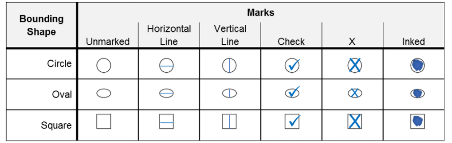
_Acceptable marks when using optical mark recognition_.
 

-----

### Test and Validate Templates
**Zebra recommends testing all Templates before deployment to devices** to ensure proper operation. This can be done using the [SimulScan Demo App](../demo). Template Builder also provides a Validation feature, which verifies template Fields and returns useful information about Field properties and settings. Both are explained below. 

**To test a Template using the Demo App**:

After pushing the Template to a device...

&#56;. Open the SimulScan Demo App, **tap on the "Hamburger" menu, and select Menu -> Setup Custom Demo options**, and navigate to the Template to be tested.

Verify that the Template works as expected. 

** To Validate Template**: 

&#57;. Open the Template to be validated and **select Edit...Validate Template**. 

 

A Validation Summary is displayed with one of more of the following messages:

**Form Decoded**:

* The Template successfully identified the target Document. 
* At least two fields have been designated as Anchor Elements.
* Barcode Field(s) designated as “Use field to identify the form" use a supported symbology and its length is within the supported range.
* The uploaded image of the target Document is clear and its resolution is correct.

**Keyfield(s) identified in template**:

* Required attribute(s) (i.e. name, number, x/y, width, height) found for each marked region. 

**Field setup and data parsing** 

* Fields cover the valid vicinity of all data of interest. 

**Final result**: 

* (√) = "Success!" 
* (X) = "Error!" 

 
#### Validation Preview

Following validation, test results can be reviewed by clicking on “View Preview” button as in the image below. 

 

The image below shows a validation preview. Clicking on any Field in the image area displays in the left-hand column the data that is parsed by that Field. In addition to decoded output, OCR data also shows the accuracy level (high, medium or low) for each line of the region parsed. Regions designated as OMR indicate their status (Checked, UnChecked or Undecided). <!-- Notice also the warning symbol on the Document logo, in this case indicating insufficient surrounding white space?? -->

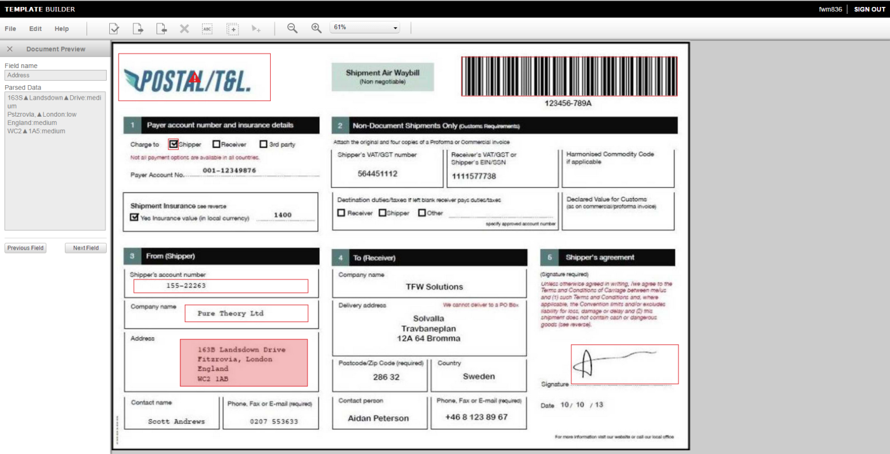
_Click image to enlarge_.

<!-- 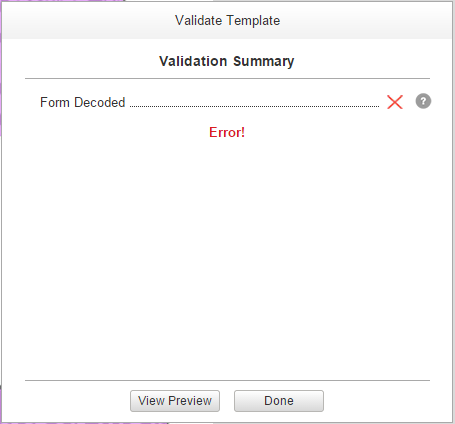
  -->

-----

### Deploy Templates

**&#49;&#48;. After settings are configured and validated, select File -> Download Template** to download a copy to the local development host:

 

**The Template can now be deployed to scanning devices**. 

#### How and Where to Place Files
If using SimulScan through [DataWedge](../../../../datawedge), **Template files must be in the directory shown below**. 

**For DataWedge**:

* `/enterprise/device/settings/datawedge/templates/`

**For the SimulScan Demo App**:

* `/sdcard/simulscan/templates/`

**For a custom app**:

* Any device folder accessible by the app 

**Notes**:

* All files deployed into `/enterprise/` will persist on the device following an Enterprise Reset. 
* If using SimulScan through a custom-built Android app, Template(s) can be deployed to any folder accessible by the app or can remain online (see below). 

**Methods of Template deployment**: 

* **Manually via USB** cable to the device using the Android Debug Bridge (ADB) 
* **Remotely using [StageNow](../../../../stagenow)** and the [UI Manager](/mx/uimgr/) service
* Remotely through a company's own mobile device management (MDM) system (if supported by that system)
* **Programmatically through [EMDK for Android](../../../../emdk-for-android)** development tools

#### Using the "FetchTemplate()" method call
Templates saved to the `/<accountID>/templates/release/` folder on the Template Builder web site can be retrieved programmatically through EMDK APIs using the `FetchTemplate()` method. Use Template Builder to identify the exact path name when calling the method. 

**For example, the path to the server-based Templates folder** from the image below would be: 

* `/myAccount/templates/release/<template name>`

 

**To add a Template to the** `/release` **folder**: 

1. Open the Template
2. Select **Edit --> Release Template**

A copy of the Template is placed in the `/release` folder; the Template also remains in its original location. When the method is called, **the specified Template is copied to the device**. 

-----

### Create a Multi-Template
The Multi-template feature allows as many as six (6) existing Templates to be grouped together and deployed to devices as a single entity. This simplifies deployment and can help boost worker productivity on devices that regularly use two or more Templates by automating Template selection. For example, if workers in a warehouse regularly encounter scan Documents from three specific suppliers, grouping the corresponding three Templates together quickens the selection of the appropriate Template whenever scanning is required. <!--**This feature is currently in beta**.--> 

**To Create a Multi-template**:

After creating the Templates needed for grouping...  

&#49;. Select **File --> Create New...Multi Template**:
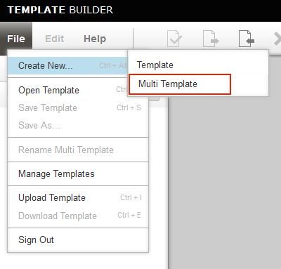
 

&#50;. **Enter a name** for the Multi-template:
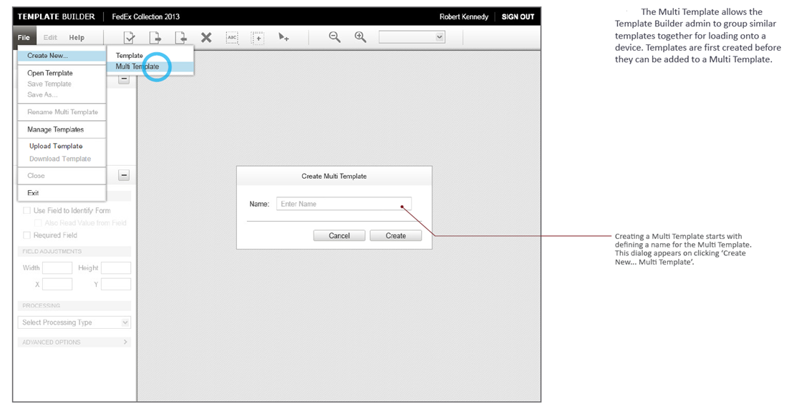
 

&#51;. **Click "+ Add Template" button**. A dialog appears similar to the image in Step 4. 
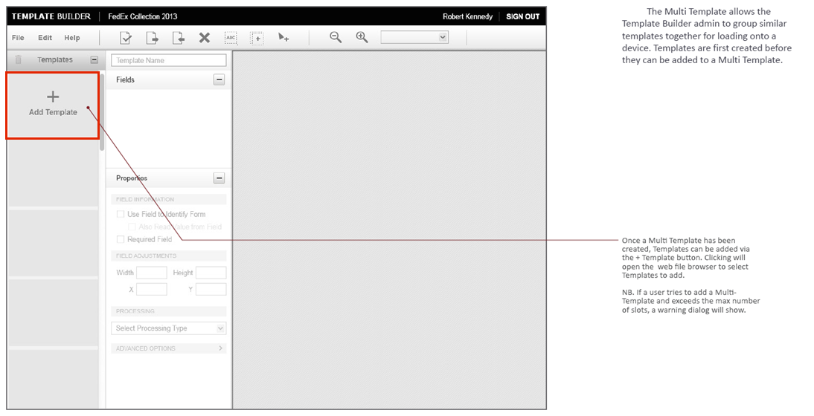
 

&#52;. **Select the location of the Template** to be added: 
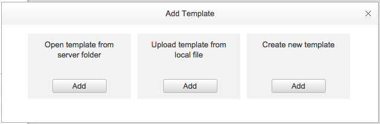
_If a new Template is required, click the "Create new template" button_.  
 

As Templates are added, thumbnails will appear in the far-left column and field names of the selected Template in the center column. Actions taken in this mode will apply to the selected Template.
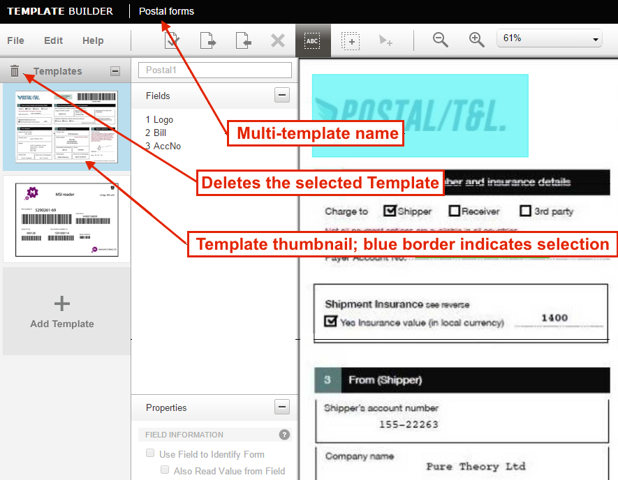
 

&#53;. **Repeat Step 4 until all required templates are added** (max = 6).  

&#54;. **To deploy Multi-template(s), see [Deploy Templates](#deploytemplates)** section, above. 

-----

### Modify a Template
Existing Templates can be modified to address changes that occur to incoming Documents, to allow for workflow changes, to make adjustments to OCR or other settings based on input from the field, or for any other reason. 

1. Log into the [Template Builder web site](https://simulscan.zebra.com). 
2. Open the template to be modified.
3. Edit Template settings as required.
4. Save using **File --> Save Template** >>OR<< save as a new Template using **File --> Save as...**

-----

## Template Settings	
The Template Settings panel is used to configure input source, flash mode, feedback and other settings that apply generally across an entire Template.  

**To access the Template Settings panel**: 

&#49;. Log into the [Template Builder web site](https://simulscan.zebra.com). 
&#50;. Open the Template in need of settings adjustment. 
&#51;. Select **Edit --> Template Settings**. A dialog appears similar to the image in Step 4. 

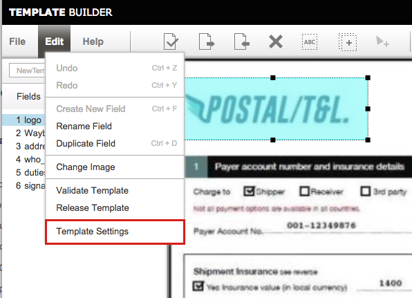
 

&#52;. Adjust settings as needed according to descriptions below: 
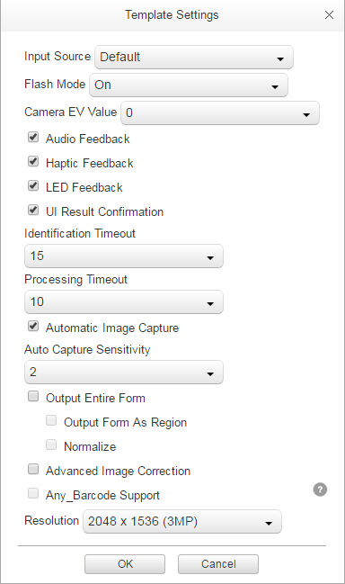
 

### Template Settings Panel

**Input Source –** used to specify the input source (Camera or Imager) to use for the Template. Selecting "Default" allows the system to choose the input source as follows: 
 * **Selects Camera** for Structured and Unstructured targets 
 * **Selects Imager** for Barcode-only targets
 * **If no Imager is present**, the camera is selected for all targets 
 * **If camera is disabled**, Imager is selected for all targets 
 * **If no capture device is available**, an error message is displayed

**Flash Mode –** enables/disables use of the flash during capture.

**Audio Feedback –** plays a sound when data is acquired (enabled by default).

**Haptic Feedback –** operated the vibrator when data is acquired (enabled by default).

**LED Feedback –** lashes the LED  when data is acquired (enabled by default).

**UI Result Confirmation -** forces a user confirmation before sending acquired data to app (disabled by default for Barcode-only targets; enabled by default for Structured and Unstructured targets).

**Identification Timeout –** sets the maximum time allowed to attempt to identify a target Document.

**Processing Timeout –** sets the maximum time allowed to process a target Document after it has been identified.

**Automatic Image Capture –** automatically triggers form processing, once identified. Uncheck to force the user to manually trigger form processing (once identified) by tapping or pressing the trigger button.

**Auto Capture Sensitivity –** sets the sensitivity of the auto capture from 1-10 (most sensitive). Valid only when Automatic Image Capture is enabled.

**Output Entire Form –** outputs an image of the entire form along with the extracted data. Valid only for Structured Targets. Enabling this feature affects scanning performance. 

**Advanced Image Correction –** enables image correction for parsing targets that are slightly curved or crumpled.

-----

### Field Properties Panel
The Field Properties panel is visible in the far-left column, and presents the Properties of the selected Field. Field Properties can be configured as follows:

#### Field Information

**Use Field to Identify Form -** designates the field as an Anchor Element, which SimulScan uses to identify a form, match it with Template and configure its Field properties accordingly. By default, the data in this field is not output for Templates made for Structured Targets.

**Also Read Value from Field -** sets the Template to acquire data from a Field that is designated as an Anchor Element (the “Use Field to Identify Form” is checked). Enabled by default. 

#### Field Adjustments

**Width -** the width of the field, in pixels
**Height -** the height of the field, in pixels
**X -** the horizontal position of the field, in pixels, relative to the left-most edge of the form 
**Y -** the vertical position of the field, in pixels, relative to the top of the form

#### Processing

**Barcode -** captures single or multiple barcodes in the field of view

**OCR -** captures alpha/numeric text

**OMR -** captures check marks and bubbles

**Picture -** captures (as an image file) signatures, photos, entire documents 

**Signature Presence -** determines whether a signature is present in the selected region, displays an error to the user if none is found. Applies only to Picture fields.

**Barcode’s location is fixed -** specifies that a barcode will always be in the same location on the Document being defined by the current Template. Applies when the field processing mode is “Barcode" and the Barcode Type is set to a supported symbology (see table). Symbologies in shaded areas are _**not**_ supported. To improve the accuracy of form identification, **Zebra recommends enabling this feature** whenever possible. 

####Fixed Barcode Supported Symbologies

_Symbologies in shaded areas are **NOT** supported for fixed barcodes_. 

-----

#### Barcode Options
Some barcode options vary based on the symbology selected. For a complete list of options, see the [DataWedge Decoders guide](../../../../datawedge/6-0/guide/decoders/). 

#### Decode Data Options

**Enable Character Checking -** enables the barcode data to assist in the identification of the barcode.

**Starts With / Contains -** Enter character(s) into this field to filter barcode by characters at the beginning or at some index in a String. Leave blank if characters should not be checked. Applies only if Character Checking is enabled. 

**At -** Only enabled if “Enable Character Checking” is checked and “Contains” is chosen. Enter the index at which the character checking will begin. The index is “0” based, staring from Left most character. 

**String Length -** Only enabled if “Enable Character Checking” is checked. Enter the number of characters the barcode data must contain. Leave blank if no length is specified.

Barcode Orientation
Select the direction that the barcode is facing.
0°: Select this if the barcode is upright with respect to the form.
90°: Select this if the barcode is rotated 90 degrees to the left with respect to the form.
180°: Select this if the barcode is upside down with respect to the form.
270°: Select this if the barcode is rotate 270 degrees to the left with respect to the form.

_**Other Field Property settings may appear under certain conditions**_.

-----

**Related Guides**: 

* [DataWedge](../../../../datawedge)
* [SimulScan APIs](../../api)
* [Enterprise Browser](../../../../enterprise-browser)

<!--

Option 1: Side load or push via MDM 
- For use by DataWedge, push the templates to "/enterprise/device/settings/datawedge/templates" folder on the device using either ‘adb push’ or ‘USB sync’ or your preferred staging/MDM tool. 
- For RhoMobile access, the folder is configurable via the "templateDirectory" property. 
- For the Demo App to access the template, place the folder in the external storage folder, SimulScan, Templates folder (with ADB, push via "Environment.getExternalStorageDirectory()/simulscan/templates"). 

Option 2: Over Wi-Fi for use with the Demo app or for programmatic access 
- On the TB, copy the template over to the "username\Release" folder. - Launch the Showcase app -> My template -> Select from server -> select the template. This will download the templates to the SimulScan Template folder in the external storage. 
- The "release" folder on the TB is also programmatically accessible via the RhoMobile FetchTemplates() API.

Step 4 : Test your template on the device

You can validate if your template works using the Showcase app -> My Template or Showcase app -> Menu -> Setup Custom Demo options and point to your template.
As the Showcase app shows the results of the template, it can be leveraged to validate your template without writing a single line of code.

Step 5 : Incorporate SimulScan within your application

SimulScan can be leveraged from within your application via the EMDK, DataWedge or Rho API’s. Please refer to the documentation for API integration on this website for further details.
The template validated from Step 4 can be pointed to using DW or Rho and incorporated within your app. The complete operation of bringing up the camera, guiding the end-user through the capture and processing the data is abstracted within the SimulScan software. The UI is the exact same UI as seen in the Showcase App. All the user app needs to do is set the right template using DW or Rho. Once captured and processed, the results are returned to the user-app correspondingly for the next level of processing – ex: form filling, inventory management etc. 
All the processing is additionally performed locally on the device without requiring any online connectivity. It is up to the end-user app on how to handle the returned results as a name-value pair of the various data parsed.

Step 6: Installing your license

If you are using features that require a license, please follow these steps:
- Request and Install a license

> END GETTING STARTED STUFF

--------

File Menu
The File menu has been updated to distinguish open/save from Upload/Download. Open and Save are actions based to the server-based store for the user. Upload and Download are actions performed on the local computer environment.
NB. AutoSave will background save changes to the Template.
Save As… has been added to allow easy duplication of Templates & Multi-Templates.
Rename Multi Template has been added. Template renaming is handled in the Fields panel.
Manage Template opens the O/S File dialog to enable organization of Templates within the server store.
Create New… menu has two child options. Template & Multi Template creation.

--image--

File Menu Options
Create New (Ctrl+Alt+N) – Create a new Template or Multi Template.
Open Template (Ctrl+O) – Open an existing Template from your space on the server.
Save Template (Ctrl+S) – Saves the current Template to your space on the server.
Save As – Saves the current Template to your space on the server under a different file name.
Rename Multi Template – Change the name of a multi-template to a new name.
Manage Templates – Open up file browser on server to perform various tasks on Templates stored.
Upload Template (Ctrl+I) – Upload Template from local computer to the server.
Download Template (Ctrl+E) – Download Template from server to local computer.
Sign Out – Closes the application (prompting to save if there is still a file in the workspace and it has not been saved).

--image--

Edit Menu Options
Undo (Ctrl+Z) – Undo the previous action.
Redo (Ctrl+Y) – Redo the previous undone action.
Create New Field (Ctrl+F) – create a new field on the Template.
Rename Field – Change the name of the current field. Opens the field name text box.
Duplicate Field (Ctrl+D) – Make a copy of the current field.
Change Image – Remove the current image and replace with a new image.
Validate Template – Perform validation on the Template, ensuring that the created Template will work on a device.
Template Settings – Opens window that allows changing various parameters associated with the Template.

--image--

Settings
Each processing mode has various settings associated with it that can be set.

Barcode 
Barcode Type
Select the Barcode symbology.

--image-- TABLE

Most of the above supported symbologies are Anchors except below barcode types.

composite AB 
composite C 
US Postnet 
US Planet 
UK Postal 
Japanese Postal 
Australian Postal 
Canadian Postal 
Dutch Postal 
US4state 
US4State FICS 
TLC39 
Decoder Signature 
Webcode

OCR 
Character Sub-Set
Set the allowed characters for the OCR region.
All caps alphabets: OCR region contains only alphabets in the upper case All small alphabets: OCR region contains only alphabets in the lower case Only Alphabets: OCR region contains only alphabets
All digits: OCR region contains only digits
Alphanumeric: OCR region contains both digits and alphabets in both cases
Enter custom sub string set here: Enter a user-defined character set here

Regular Expression
Set the regular expression describing the string.

 --- TABLE ---

The PCRE (Perl Compatible Regular Expressions) library is referenced for regular expression pattern matching. 
    http://www.pcre.org/
    http://perldoc.perl.org/perlre.html   (Perl regular expressions man page)
                
 Specifying both the character subset and regex narrow the range of pos

--image-- UNION

Verification
    Word Check: Check this box to indicate that regions contain words in the English dictionary (as opposed to ID numbers, serial numbers, etc.).

Pick English or other European languages
Choose the language that an OCR region is in.
English: OCR region is in English and contains standard characters found in the English language. European: OCR region is in a European language and contains additional characters, such as umlauts, digraphs, etc.

Picture 
Image Adjustments
Brighten Selection: Brightens Picture region.
Sharpen Selection: sharpens Picture region.
Compress Output Image: Reduce size of output region.

Output
This feature facilitates to set information orientation with respect to the form before it is outputted. Here you have to mark the region’s anticlockwise orientation with respect to the form. 

multi-template --image--

other image - --image--

0°: Rotate the region anticlockwise by 0 degrees before output.
90°: Rotate the region anticlockwise by 90 degrees before output.
180°: Rotate the region anticlockwise by 180 degrees before output.
270°: Rotate the region anticlockwise by 270 degrees before output.

Creating a New Template
Creating a New Template

1. Log into https://simulscan-uat.motorolasolutions.com using your PartnerKey credentials or Zebra Core ID and password. If you don’t have one, go to  https://myaccount.motorolasolutions.com/euri/user_registration.xhtml to register and obtain one.

Upon logging in successfully, the below landing page is displayed:

--image--

2 Choose “Open Template” to open a previously created and saved Template and edit it, or choose “Create Template” to create a new Template. Alternatively, if you press “Cancel”, you can choose one of these two options by clicking on File -> Create New -> Template or File -> Open Template.

--image--

3 For the purposes of this help document, we will assume that the user wants to create a Template; thus, the “Create Template” option will be chosen. After clicking on this option, the following screen will appear:

--image--

Choose “Barcodes only” , “Structured Targets” or “Unstructured Targets” depending on the type of your Template you would like to create.

4 Load an image of the document you’d like to describe (BMP and JPEG files are supported) and ensure the size of this image is 1.5 MB or less; higher resolution images may work, but performance may be slower. It is also recommended the image be taken with the document placed flat against a contrasting background, facing perpendicular to the camera, and captured without any shape distortion.

5 In the “Structured Targets” mode, after loading the sample image, the form border needs to be defined by adjusting the blue window as in the picture below. This serves as the base reference frame that the software detects for further processing. Ensure that this border matches the border of the uploaded form; if these borders do not match, the resulting output may be incorrect.

--image--

The control buttons on the left can be used to tweak the image while adjusting the blue crop window. Press OK when done.

Note: This does not need to be done for forms in the “Barcode only” mode.

Next, the following screen will be displayed:

--image--

Define the Template by entering a suitable Template name in the upper left box. Please note that Template name cannot start with “Default –“.

7 For “Unstructured Targets” a static image is loaded automatically and you can create either “Single” or “Multi” line free-form OCR templates.  

--image--

8 Create fields for the regions of interest on the form. To create a field, you can do one of two things:
Hover your cursor over the top-left corner of a region of interest on the form, then click and drag the cursor to the bottom-right corner. A text label will then appear on the left side corresponding to the field. Rename the field as desired.

Go to Edit -> Create New Field. A text label will then appear on the left side. Rename the field as desired. Next, hover your cursor over the top-left corner of a region of interest on the form, then click and drag the cursor to the bottom-right corner. The rectangle created will then be associated with the field previously created from the Edit menu.

Fields must be marked as used for form identification, output, or both. By default, a field is output (i.e. returned to the user when used on the device); more on this below.

9 Ensure that 2-3 fields are marked as used for identification (by checking the “Use Field to Identify Form” checkbox on such regions). These fields will be used to identify the form.

In the “Barcodes only” mode, all the barcodes to be output need to have this checkbox marked.

In the “Structured Targets” mode, it is recommended regions with empty spaces around it (e.g. logos, static text, etc.) are used to identify the form. Also in this mode, it is recommended that fields on different sides of the form be used for identification.

If the same field should be output by decoder engines (i.e. displayed to the user), the “Also Read Value from Field” checkbox must be marked as well.

10 For each field, enter the field name and set the various properties. For additional help in creating regions, refer to the section titled “Creating a New Field”.

--image--

Download the Template and save it to your local machine.

11 If you intend to use :
Datawedge, copy the Template to /enterprise/device/settings/simulscan/templates/ 
The SimulScan Showcase app, copy it to /sdcard/simulscan/templates/ folder
For all else, copy to a convenient location on the sdcard or /enterprise/usr folder

--image--

Creating a New Field
1 Mark the processing mode for the field. Fields may be marked with one of four different processing modes: Barcode, OCR, OMR, and Picture as illustrated below :

--image--

2 Set the various settings for the field once the processing mode has been selected.
Barcode

--image--

First, choose the barcode symbology in the “Barcode Type” field. It is recommended that the symbology be set if it is known, as a form can only contain one barcode with type ANY_BARCODE. Next, set the Barcode Options associated with the symbology chosen, if applicable.

Following this, if the barcode always follows some pattern in its text (e.g. always 2 characters, always starts with “Q”, etc.), you can enable character checking. If enabled, fill out the appropriate sections with the known information.

Finally, if the barcode is known to be at a rotation other than the normal one, change the orientation accordingly.

OCR

--image--

In an OCR region, if the types of characters for the field will always be limited to a subset of all characters, it is recommended that the “Character Sub-set” option be set. This allows the number of possible characters to be reduced, thus increasing OCR accuracy. Several predefined sets are available, or you can enter a custom set instead.

Next, if the information follows a regular pattern all of the time (e.g. for a field with content “08-08- 14”, one possible way of describing the format is “two digits, followed by dash, followed by two digits, followed by dash, followed by two digits”), one can elect to define a regular expression to govern the region’s output. This should only be used if the format defined can be guaranteed for the region; otherwise, the output may be incorrect.

If the region contains words in a language (as opposed to ID numbers, serial numbers, etc.), the “Word Check” option should be marked.

Finally, if the region will contain characters typically found in European language (e.g. umlauts, digraphs, etc.), the language option should be changed to “European”.

OMR

--image--

Change the OMR box shape to the shape found on the form.

Picture

--image--

Use the Image Adjustments screen to modify the output picture. Currently, these options are not required to be set in order to output a Picture region correctly.

Creating a Multi-template

--image--

Here from above screen you can set the name of the Multi template.

POPULATING THE MULTI TEMPLATE

--image--

MULTI TEMPLATE PANEL OPEN

--image--

Validating a Template
Validation feature makes sure the Template created on “Template Builder” web-tool is working well on devices prior to its deployment. Thus it facilitates the user to make appropriate changes/settings before finalizing a Template to be built & distributed on devices. If the Template is validated successfully, that means the “Fields” marked on the form and the properties/settings applied for each of the field are correct and accurate.

Validation workflow
1 By selecting either of below options you can start “Validation” process as give below.

--image--

2 Select OK on the confirmation dialog that pops up.

--image--

When a Template is validated, first it shows a “Validation Summary” as given below.

--image--

Validation Summary

Form Decoded -
Displays a tick (√) it means the document was identified successfully using the created Template. Displays a cross (X), if one or more of the below checks failed:
2 or 3 fields marked as “Use field to identify the form” to help identify the document.
Field marked as Barcode and “Use field to identify the form”, has the right symbology enabled and its length is within the supported range in the Barcode Settings.
Image uploaded is clear.
For “Barcode only” Templates image resolution is 2MP & it’s 3MP for “Structured Targets”.  

Keyfield(s) identified in template –
This sanity checks the Template structure. 
Displays a tick (√) if it’s in good order.
Displays a cross (X), if below check failed:
Any of the mandatory attribute(s) for each of the marked regions. Eg:- name, number, x, y, width, height, etc are found.

Field setup & data parsing - 
Displays a tick (√) if all the fields on the form cover the valid vicinity of the data of interest. 
Displays a cross (X) in examples like below. Mainly relevant to fields marked as Barcode processing mode.

--image--

--image--

Final result- 
Displays “Success!” if form is parsed successfully against the given Template else an “Error!” is displayed.

4 Validation Preview.

When a form is parsed by decoder engine successfully, you can review the results by clicking on “View Preview” button on the above screen.

By clicking on each of the field you can navigate through the parsed data on the left-hand side window. For OCR data it also shows the accuracy level for each line of the region it parsed as “high”, “medium” or “low” in addition to the decoded output. Accuracy level for each of the line is separated by the last colon(:) of that line. And for OMR regions it indicates “Checked”, “UnChecked” or “Undecided” states.

--image--
deploy removed

Appendix

Barcode Advance Settings

Code39
Length1 - Use to set decode lengths (default - 0).
Length2 - Use to set decode lengths 4 (default - 55).
Verify Check Digit - Enable this feature to check the integrity of all Code 39 symbols to verify that the data complies with a specified check digit algorithm. The digital scanner decodes only those Code 39 symbols that include a modulo 43 check digit. Enable this feature only if the Code 39 symbols contain a modulo 43 check digit (default - disabled).
Report Check Digit - Transmit Code 39 data with or without the check digit. A check in the checkbox indicates to send Code 39 data with check digit (default - disabled).
Full ASCII - Code 39 Full ASCII is a variant of Code 39 that pairs characters to encode the full ASCII character set. To enable or disable Code 39 Full ASCII (default - disabled),
Redundancy - Sets the reader to read the bar code twice before accepting data. A check in the checkbox indicates that redundancy is enabled (default - disabled).
Convert Code39 To Code32 - Code 32 is a variant of Code 39 used by the Italian pharmaceutical industry. Scan the appropriate bar code below to enable or disable converting Code 39 to Code 32 (default - disabled).
Report Code32 Prefix - Scan the appropriate bar code to enable or disable adding the prefix character “A” to all Code 32 bar codes (default - disabled).
Security Level - Options: Security level 0, Security Level 1, Security Level 2 and Security Level 3 (default - Security level 1).

MSI
Length 1 - Use to set decode lengths (default - 4).
Length 2 - Use to set decode lengths (default - 55).
Redundancy - Sets the reader to read the bar code twice before accepting data. A check in the checkbox indicates that redundancy is enabled (default - enabled).
Check Digit - With MSI symbols, one check digit is mandatory and always verified by the reader. The second check digit is optional.
·        One Check Digit - Verify one check digit (default).
·        Two Check Digits - Verify two check digits.
Check Digit Scheme - Two algorithms are possible for the verification of the second MSI check digit. Select the algorithm used to encode the check digit.
·        Mod-11-10 - First check digit is MOD 11 and second check digit is MOD 10 (default).
·        Mod-10-10 - Both check digits are MOD 10.
Report Check Digit - Transmit MSI data with or without the check digit. A check in the checkbox indicates to send MSI data with check digit (default - disabled).

Discrete 2 0f 5
Length1 - Use to set decode lengths (default - 0).
Length2 - Use to set decode lengths (default - 14).
Redundancy - Sets the reader to read the bar code twice before accepting data. A check in the checkbox indicates that redundancy is enabled (default - enabled).

Code 11
Length1 - Use to set decode lengths (default - 4).
Length2 - Use to set decode lengths (default - 55).

Redundancy - Sets the reader to read the bar code twice before accepting data. A check in the checkbox indicates that redundancy is enabled (default - enabled).
Verify Check Digit - Check the integrity of all Code 11 symbols to verify that the data complies with the specified check digit algorithm. This selects the check digit mechanism for the decoded Code 11 bar code.
·        No Check Digit - Do not verify check digit.
·        1 Check Digit - Bar code contains one check digit (default).
·        2 Check Digits - Bar code contains two check digits.
Report Check Digit - Transmit Code 11 data with or without the check digit. A check in the checkbox indicates to send Code 11 data with check digit (default - disabled).

UPCA
Report Check Digit - The check digit is the last character of the symbol used to verify the integrity of the data. Enables or disables this option. A check in the checkbox indicates that the option is enabled (default - enabled).
Preamble - Preamble characters are part of the UPC symbol consisting of Country Code and System Character. Select the appropriate option to match the host system.
There are three options for transmitting a UPCA preamble:
·        Preamble None - Transmit no preamble.
·        Preamble Sys Char - Transmit System Character only (default).
·        Preamble Country and Sys Char - Transmit System Character and Country Code (“0” for USA). Select the appropriate option to match the host system.

Interleave 2of5
Length1 - Use to set decode lengths (default - 14).
Length2 - Use to set decode lengths (default - 10).
Redundancy - Sets the reader to read the bar code twice before accepting data. A check in the checkbox indicates that redundancy is enabled (default - enabled).
Check Digit
·        No Check Digit - A check digit is not used. (default)
·        USS Check Digit - Select to check the integrity of all Interleaved 2 of 5 symbols to verify the data complies with either the Uniform Symbology Specification (USS) check digit algorithm.
·        OPCC Check Digit - Select to check the integrity of all Interleaved 2 of 5 symbols to verify the data complies with either the Optical Product Code Council (OPCC) check digit algorithm.
Report Check Digit - Transmit Interleaved 2 of 5 data with or without the check digit. A check in the checkbox indicates to send Interleaved 2 of 5 data with check digit (default - disabled).
Convert ITF-14 To EAN13 - Convert 14-character Interleaved 2 of 5 bar codes to EAN-13, and transmit as EAN-13. The Interleaved 2 of 5 bar code must be enabled and must have a leading zero and a valid EAN-13 check digit. A check in the checkbox indicates that the option is enabled (default - disabled).

UK Postal
Report Check Digit - Transmit UK Postal data with or without the check digit. A check in the checkbox indicates to send UK Postal data with check digit (default - disabled).

Code93
Length1 - Use to set decode lengths (default - 0).
Length2 - Use to set decode lengths (default - 55).
Redundancy - Sets the reader to read the bar code twice before accepting data. A check in the checkbox indicates that redundancy is enabled (default - disabled).

Matrix 2 of 5
Length1 - Use to set decode lengths (default - 10).
Length2 - Use to set decode lengths (default - 0).
Redundancy - Sets the reader to read the bar code twice before accepting data. A check in the checkbox indicates that redundancy is enabled (default - disabled).
Report Check Digit - Transmit Matrix 2 of 5 data with or without the check digit. A check in the checkbox indicates to send Matrix 2 of 5 data with check digit (default - enabled).
Verify Check Digit - Enable this feature to check the integrity of all Matrix 2 of 5 symbols to verify that the data complies with a specified check digit algorithm (default - enabled).

UPCE0
Report Check Digit - The check digit is the last character of the symbol used to verify the integrity of the data. Enables or disables this option. A check in the checkbox indicates that the option is enabled (default -  disabled).
Preamble - Preamble characters are part of the UPC symbol consisting of Country Code and System Character. Select the appropriate option to match the host system.
There are three options for transmitting a UPCE0 preamble:
·        Preamble Sys Char - Transmit System Character only.
·        Preamble Country and Sys Char - Transmit System Character and Country Code (“0” for USA).
·        Preamble None - Transmit no preamble (default).
Convert UPCE0 To UPCA - Enable to convert UPCE0 (zero suppressed) decoded data to UPC-A format before transmission. After conversion, the data follows UPC-A format and is affected by UPC-A programming selections. Disable to transmit UPCE0 decoded data as UPCE0 data, without conversion (default - disabled).

Code128
Length1 -  Use to set decode lengths (default - 0).
Length2 - Use to set decode lengths (default - 55).
Redundancy - Sets the reader to read the bar code twice before accepting data. A check in the checkbox indicates that redundancy is enabled (default - disabled).
Enable Plain Code 128 - Flag to enable other 128 sub types (besides GS1-128 and ISBT-128).
Enable GS1-128 - Set the GS1 128 subtype. A check in the checkbox indicates that the option is enabled (default - enabled).
Enable ISBT128 - Set the ISBT128 subtype. A check in the checkbox indicates that the option is enabled (default - enabled).
ISBT128 Concatenation Mode - Select an option for concatenating pairs of ISBT code types:
·        Concat Mode Never - Do not concatenate pairs of ISBT codes encountered (default).
·        Concat Mode Always - There must be two ISBT codes in order to decode and perform concatenation. Does not decode single ISBT symbols.
·        Concat Mode Auto - Decodes and concatenates pairs of ISBT codes immediately. If only a single ISBT symbol is present, the device must decode the symbol the number of times set via DataWedge Configuration 4 - 11 Redundancy - Code128 before transmitting its data to confirm that there is no additional ISBT symbol.
Check ISBT Table - The ISBT specification includes a table that lists several types of ISBT bar codes that are commonly used in pairs. If ISBT128 Concat Mode is set, enable Check ISBT Table to concatenate only those pairs found in this table. Other types of ISBT codes are not concatenated. A check in the checkbox indicates that redundancy is enabled (default - disabled).
Security Level - The scanner offers four levels of decode security for Code 128 bar codes. Select increasing levels of security for decreasing levels of bar code quality. There is an inverse relationship between security and scanner aggressiveness, so choose only that level of security necessary for any given application.
·        Security Level 0 - This setting allows the scanner to operate in its most aggressive state, while providing sufficient security in decoding most “in-spec” bar codes.
·        Security Level 1 - This setting eliminates most mis-decodes (default).
·        Security Level 2 - Select this option if Security level 1 fails to eliminate mis-decodes.
·        Security Level 3 - If Security Level 2 is selected and mis-decodes still occur, select this security level. Be advised, selecting this option is an extreme measure against mis-decoding severely out of spec bar codes. Selecting this level of security significantly impairs the decoding ability of the scanner. If this level of security is needed, try to improve the quality of the bar codes.

Composite AB
UCC Link Mode
·        Link Flag ignored - 1D component is transmitted regardless of whether a 2D component is detected.
·        Always Linked - 1D and the 2D components are transmitted. If 2D is not present, the 1D component is not transmitted.
·        Auto Discriminate - the digital scanner determines if there is a 2D portion, then transmits the 1D component, as well as the 2D portion if present. (default).

Codabar
Length1 - Use to set decode lengths (default - 6).
Length2 - Use to set decode lengths (default - 55).
Redundancy - Sets the reader to read the bar code twice before accepting data. A check in the checkbox indicates that redundancy is enabled (default - enabled).
CLSI Editing - Enable this parameter to strip the start and stop characters and insert a space after the first, fifth, and tenth characters of a 14-character Codabar symbol. Enable this feature if the host system requires this data format (default - disabled).
NOTIS Editing - Enable this parameter to strip the start and stop characters from a decoded Codabar  symbol. Enable this feature if the host system requires this data format (default - disabled).

UPCE1
Report Check Digit - The check digit is the last character of the symbol used to verify the integrity of the data. Enables or disables this option. A check in the checkbox indicates that the option is enabled (default - disabled).
Preamble - Preamble characters are part of the UPC symbol consisting of Country Code and System Character. Select the appropriate option to match the host system.
There are three options for transmitting a UPCE1 preamble:
·        Preamble Sys Char - Transmit System Character only.
·        Preamble Country and Sys Char - Transmit System Character and Country Code (“0” for USA).
·        Preamble None - Transmit no preamble (default).
Convert UPCE1 To UPCA - Enable this to convert UPCE1 decoded data to UPC-A format before transmission. After conversion, the data follows UPC-A format and is affected by UPC-A programming selections. Disable this to transmit UPCE1 decoded data as UPCE1 data, without conversion (default - disabled).

-->
		