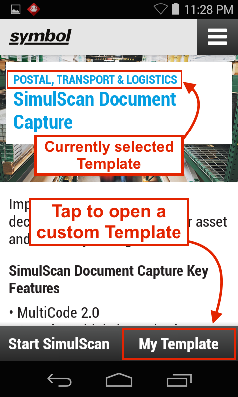

##Overview
A Demo App is included with all [devices that support SimulScan](../about/#supporteddevices) 

**Zebra assumes no responsibility for Templates**. 

### Main Features

* stuff

AIAG B-10 CUSTOMER SEGMENT FOR MASTER LOAD_Q,4S, P.jpg

 

AIAG B-5_P,V,S,K, 1T, 2Q, 1Q, Q.png

 

AIAG B-10 Label File P, Q, K, V, 4S.jpg

 

-----

### Test a Template

The SimulScan Demo App can be used to test any of the Templates downloaded here or those built by an organization. Custom Templates stored on the Template Builder web site can be pulled from within the Demo app. Locally stored Templates must be pushed to the device manually. 

1. Download the Template
2. Push it to the device
3. Open it in Demo App
4. Test-scan the target doc.

Modify a template

1. Upload to Template Builder
2. Open it
3. Change it however
4. Move it to release folder
5. Pull it from inside Demo App
6. Test the heck out of it
7. Boom

####Before You Begin
Before testing a custom Template, complete the following steps: 

* Have on hand a printed version of the target Document(s) for which the Template(s) were created.  
* If pulling from the server, Template(s) must be in:
 * `/<accountID>/templates/release/`
* If pushing to the device, push Template(s) to: 
 * `/<internal storage>/simulscan/templates/`

For more, see [Deploy Templates](../templatebuilder/#deploytemplates). 

**To open a custom Template**: 

**&#49;. Open SimulScan and press Start**. A screen appears similar to the image below. Notice that the most recently used Template (if any) remains selected (shown is the "Postal, Transport & Logistics" Template from the exercise above). 

**To switch Templates, press the "My Template" button**. A screen appears similar to the image in Step 2. 

 

**&#50;. Tap the appropriate drop-down** to open the Template to be tested: 

 

**Browse external storage -** lists Templates in the `/sdcard/simulscan/templates/` folder.

**Default templates -** lists Templates included with SimulScan.

**Select from server -** lists Templates in the `/<accountID>/templates/release/`
folder on the [Template Builder web site](http://simulscan.zebra.com). A login prompt appears. Enter credentials for the Template Builder web site. The copy of the specified Template is placed in the `/<internal storage>/simulscan/templates/` folder on the device. 

**&#51;. Go to [How to Use the Demo App](#howtousethedemoapp) Step 5**.  

-----

Related guides: 

* [Template Builder](../templatebuilder)
* [DataWedge](../../../../datawedge)