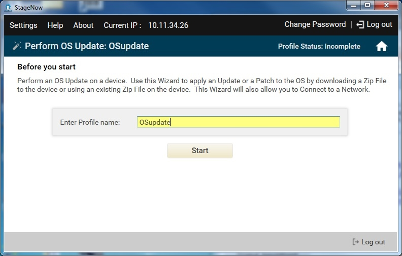
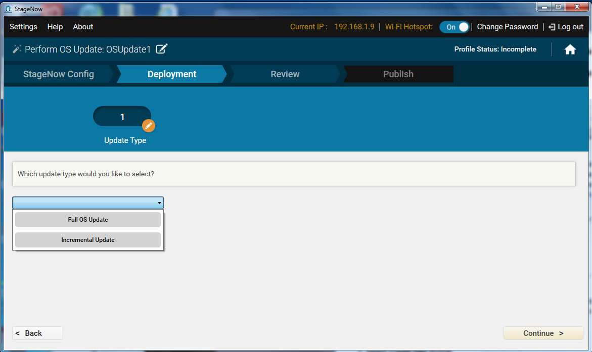
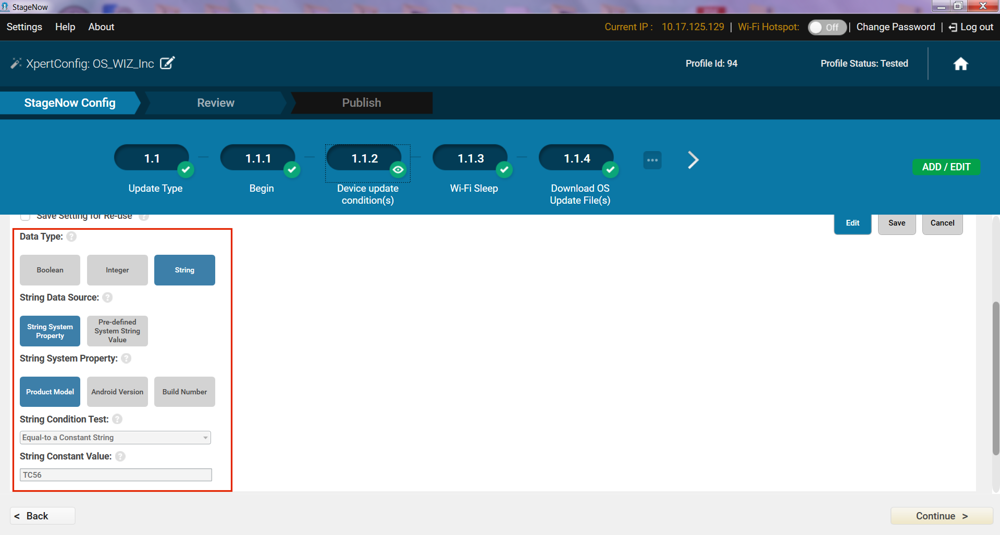
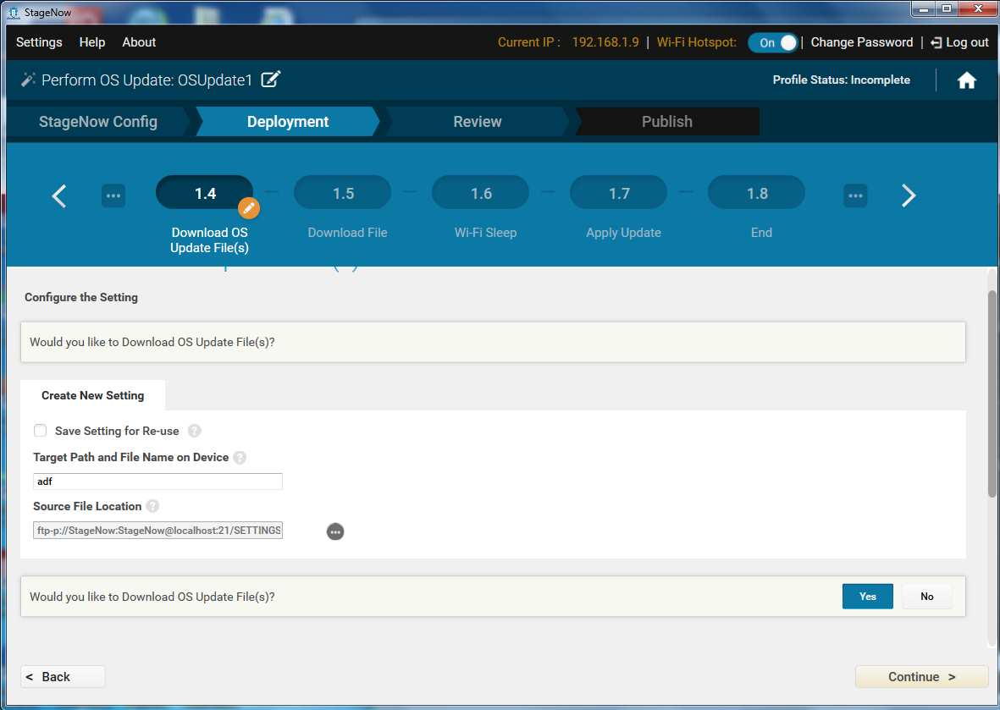

## Overview

Use this Wizard to perform an OS update on a device. The OS Update action applies an update or patch to the OS by downloading a .zip file to the device or using a .zip file that exists on the device. This Wizard allows connection to a network. 

-----

## Perform OS Update

**To create a "Perform OS Update" profile**:

1. Select Create New Profile.

2. Select the MX version from the drop-down menu.

3. Select the Perform OS Update Wizard, and select Create.

    

4. Enter a name for the profile and select Start.

5. To choose to connect to this network using StageNow bar codes, select Yes, and then select Continue. See [Profiles / Connect Network](../../Profiles/ConnectNetwork) for instructions on connecting to a network and populating the settings window. Select Continue when done.

    **Note**: This wizard includes a Deployment section. Deployment requires that the host computer and the device(s) are on the same network. 

6. If offered, select whether to connect to this network using the Rapid Deployment (RD) Client. Note that the RD Config section only appears if you turned on Legacy Mode in the [Settings](../../gettingstarted?Settings) screen. Select Yes for devices that don't include the StageNow Client. See [Rapid Deployment (RD) Client](../../stageclient?Rapid%20Deployment%20Client) for more information.

7. If you selected Yes, choose whether to set up Wi-Fi options and/or Wi-Fi profiles (see [Setting Types > Wifi mgr](../../csp/wifi)):

    

8. Choose a method for performing the OS update, and then select Continue.

    * Select "No, I would like to Download the file" to push an OS update zip file to the device.
    * Select "Yes, I want to Apply the file" to use an OS update zip file that already resides on the device.

9. If selecting No: 

    a. Select whether to prevent Wi-Fi from turning off while downloading (see [Setting Types > Wi-Fi](../../csp/wifi) for more information): 

    

    b. Enter the information for the .zip file (see [Setting Types > File](../../csp/file) for more information):

    

    c. Select whether to allow Wi-Fi to turn off after downloading (see [Setting Types > Wi-Fi](../../csp/wifi) for more information):

    

10. Enter the information for the .zip file (see [Setting Types > Power](../../csp/power) for more information):

   

11. Select "Continue" to apply the update and proceed to the [Review window](../../stagingprofiles?Review).

-----

## Perform Incremental OS Update

The incremental update is used to perform OS updates on multiple devices based on defined conditions present on specific target devices. For example, this is useful for setting an operation to proceed only on devices with "TC51" in the Product Model field. For more information, see the [Condition Manager guide](../../csp/condition/).  

> **Incremental OS Update is supported only on devices with MX 6.0 or higher**.

-----

**To perform an incremental OS update**:

1. Select "Create New Profile."

2. Select the MX version from the drop-down menu (must be MX 6.0 or higher).

3. Select the "Perform OS Update Wizard" and click "Create" to continue. 

4. Enter a name for the profile; select "Start" when done.

5. Select an option for the StageNow network from the drop-down menu:

   * The devices I wish to provision are currently not connected to a network. I will define a network with this profile that will be used for staging.

   * The devices I wish to provision are already connected to a network that will be used for staging. 

   * I wish to use the WiFi Hotspot feature which will automatically create a network for staging using this computer's network card. 

   

   If selecting the second or third option, skip to Step 7. 

6. To choose to connect to this network using StageNow barcodes, select "Yes," then click "Continue." See [Profiles / Connect Network](../../Profiles/ConnectNetwork) for instructions on connecting to a network and populating the settings window. Click "Continue" when done.

    Note: This wizard includes a Deployment section. Deployment requires that the host computer and the device(s) are on the same network. 

7. In the Deployment section, select Incremental Update from the update type drop-down menu.
    **Note**: If selecting Full OS Update, **go to Step 8 of the [previous section](#performosupdate)**.
   

8. Select "Continue" on the "Begin" window to define update conditions for the first device.

   

9. Define the update conditions and click "Continue" (see the [Condition Manager guide](../../csp/condition/) for more information).  
   The boolean data type (highlighted below) checks for true/false conditions such as whether the device has a valid IP address:  
   

   The Integer data type checks for numerical conditions such as battery charge level: 
   

   The String data type checks for constants such as device model number:  
   

10. Select whether to prevent Wi-Fi from turning off while downloading (see [Setting Types > Wi-Fi](../../csp/wifi) for information):

    

11. Enter information for the first OS update file. Select "Yes" to add information for additional files.

    

12. When finished entering file information, select "No" and click Continue.

13. **IMPORTANT**: If applying multiple OS update packages at one time, a `.upl` file must also be downloaded to the device (see [Setting Types > File](../../csp/file) for more information).

14. Select whether to change the Wi-Fi sleep policy after download, and select Continue.

15. On the "Apply Update" screen, enter the information for the `.zip` file(s) (and `.upl` file, if applicable), and select "Continue" (see [Setting Types > File](../../csp/file) for more information).

16. Select Continue on the End Device Update Conditions screen.

    

17. To add another device update package, select "Yes" and repeat Steps 11 - 19:

    

18. Select whether to provide an error message if any conditional update fails:
    

19. Select "Continue" to apply the update and proceed to the [Review window](../../stagingprofiles?Review):

