## Overview

This section provides information for the staging administrator on creating and managing profiles. The StageNow Workstation Tool offers pre-defined Wizards that represent common use cases for deploying information to mobile devices within the enterprise. 

### Welcome Tips
Several screens throughout the Workstation Tool offer helpful pop-up tips. Select the checkbox offered in order to dismiss the tip permanently. Select OK to dismiss the pop-up.

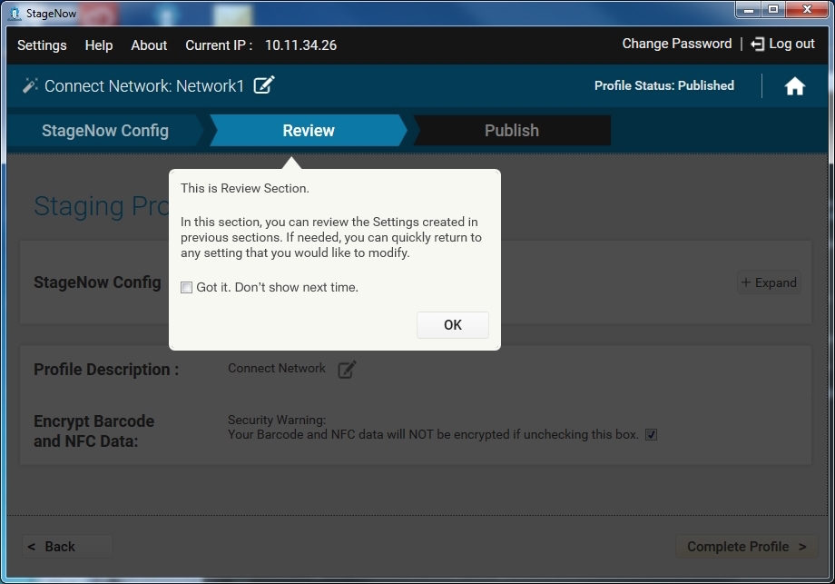

-----

## Creating a Staging Profile
The staging administrator uses the provided StageNow Wizards to configure settings which define software configuration and installation for enterprise devices. When creating a profile for staging the device, the administrator progresses through the following steps in the banner provided in the Workstation Tool:

* [Config](../stagingprofiles?Configure) (StageNow and RD) - The setting information entered in the StageNow Config section is stored within StageNow barcodes, NFC tags, and/or an audio file.  The setting information entered in the RD Config section is stored within RD barcodes.  Note that the RD Config section only appears if you turned on Legacy Mode in the [Settings](../gettingstarted?Settings) screen. The amount of settings created in this section affect the number of barcodes and/or NFC tags that the system generates later.

* [Deployment](../stagingprofiles?Deployment) - This information includes settings that do not reside in StageNow barcodes, NFC tags, or audio file, and is represented as a file on the StageNow deployment server and so requires network connection. Reading the barcode or NFC tag, or playing an audio file created in the Config section connects the client device to the server and points to this file for deployment. Note that this section does NOT appear in the Connect Network, Manage Device Security, and Wipe a Device Wizards.

* [Review](../stagingprofiles?Review) - The Review section presents all setting information entered in the Config and Deployment sections in a single page. The administrator can add comments, complete the profile, or return to any setting to update it.

* [Publish](../stagingprofiles?Publish) - The Publish section allows the administrator to select the method of delivery (linear barcodes, PDF417 barcodes, NFC tags, or Audio file) for the completed profile, as well as test, publish, and stage the profile.

### Profile States
As you progress through the Wizard, the top right corner of the window reflects the state of the profile: 

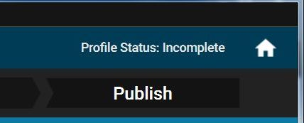

* Incomplete - The profile is not yet complete.

* Complete - All information required by the Wizard is included in the profile, but it is not yet tested to ensure the profile functions as intended.

* Tested - The profile was tested to determine whether it is sufficiently operational for staging. It is not yet visible to the operator.

* Published - The profile is visible to the operator.

* Staged - The operator has acquired the profile, i.e., generated barcodes, exported data to write to an NFC tag, or downloaded the audio file for staging the device.

### Navigating the Wizard
Following are tips for navigating through the Wizard.

Click on the sections of the primary banner (e.g., StageNow Config, RD Config) to view that section. Note that you must complete each section in order before you can click ahead to the next section.

You can also use the Back button to return to the previous section and the Continue button to proceed to the next section.

Similarly, click on the oval buttons in the secondary banner to view that sub-section. You must also complete each sub-section before clicking ahead to the next one. 

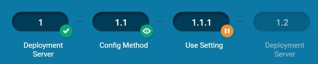

The small round buttons adjacent to each oval button indicate the status of that section:

  *  A green check icon indicates that section is complete.

  *  A green eye icon indicates the section you are viewing.

  *  An orange icon with a pencil indicates the section that is in process.

  *  An orange icon with a pause indicates the section that is in process while you are viewing another section.

  *  A greyed-out oval with no adjacent round button indicates a section not yet started.

You can also use the arrows at the beginning and end of the secondary banner to scroll through these sub-sections. 

When you select Yes for a secondary banner item, additional sub-sections are added to the banner. 

To edit the profile name, click the pencil icon next to the name.

At any point, click the Home button to return to the Home screen. 

When populating a setting template window within a Wizard, to make the setting available for selection when creating other profiles, select the Save Setting for Re-use checkbox, and enter a name for the setting. See [Save for Reuse](../settingconfig?Save%20for%20Reuse) for more information.

-----

## Configure
To create a profile, open the StageNow Workstation Tool and log in.

Select Create New Profile, and then select the device MX version from the drop-down menu. The tool retains the current selection when configuring future profiles.

Initially, a warning appears indicating that selecting an incorrect version can cause staging to fail. If your devices run multiple versions of MX, select the lowest common version. Select the checkbox on this window if you do not need to view it in future profile creations.

Select one of the following Wizards and select Create.

* [Configure a Device](../Profiles/configdevice)

* [Connect Network](../Profiles/ConnectNetwork)

* [Enroll in an MDM](../Profiles/enrollmdm)

* [Manage Applications](../Profiles/manageapps)

* [Manage Device Security](../Profiles/managesecurity)

* [Perform OS Update](../Profiles/osupdate)

* [Wipe a Device](../Profiles/wipedevice)

* [Xpert Mode](../Profiles/xpertmode)

After completing the StageNow Config and RD Config sections of the Wizard, proceed to the next section of the Wizard.  Certain Wizards include a Deployment section, whereas others proceed to the Review section.

### MX Selection

Selecting MX 6.x or higher from the MX version drop-down menu supports a Wi-Fi hotspot option for some Wizards. If selecting MX 6.X for the applicable Wizards, the first Wizard window displays a prompt for selecting one of the following options from the drop-down menu:

* "The devices I wish to provision are currently not connected to a network. I will define a network with this profile that will be used for staging."

* "The devices I wish to provision are already connected to a network that will be used for staging." 

* "I wish to use the WiFi Hotspot feature which will automatically create a network for staging using this computer's network card." 

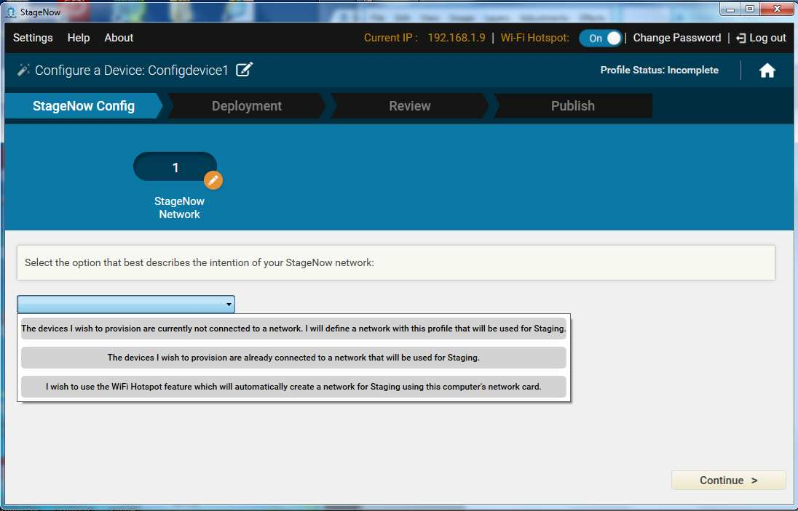

Select an option and proceed to the instructions for the selected Wizard.

### MX Notes
* The second and third options above are supported only by Wizards that use the Deployment section of the tool.
* StageNow 2.9 and higher supports plug-in CSPs, accessed by selecting CSP Library from the StageNow Home screen menu (below). 

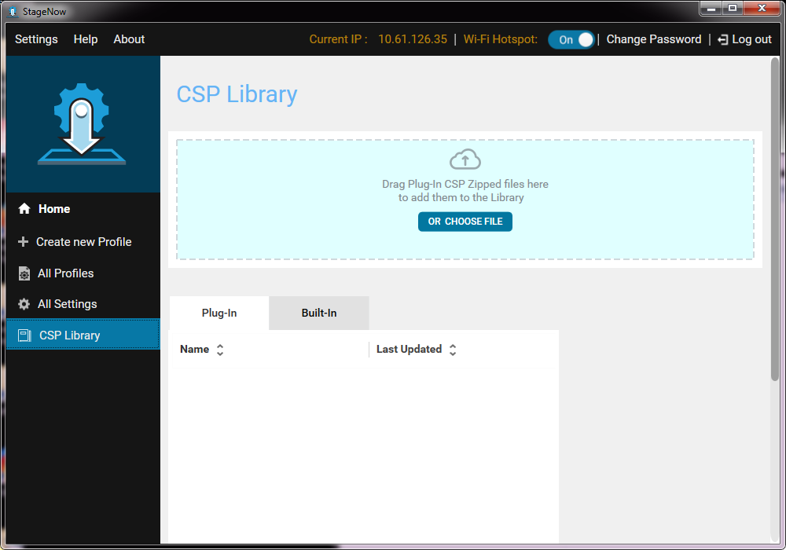

-----

## Deployment
Use the Deployment section of the Wizard to specify the subset of the settings that define what the profile does, and store these settings on a deployment server. See the specific [Profile Wizard](../ProfileWizards) for instructions. 

**Note**: This section is not available on some Wizards. 

Wizards that include the Deployment section require that device(s) access the Deployment Server in order to acquire the information provided there. Specifically, the device and the server should be on the same network, or there should be routing from the device network that allows connection to the Deployment Server. 

-----

## Review
The Review section of the Wizard allows you to verify your selections.

1. Select Expand to view the StageNow configuration and RD configuration settings. This setting list offers the following fields:
    * Step - The section step where the Administrator added the setting.
    * Description - A user-defined "friendly" description of the setting.
    * Last Updated - Last time the profile was updated.
    * View - Click to view/modify the setting.

2. Select Change to make any changes to the settings.

3. Select the icon next to Profile Description to enter a description for the profile.

    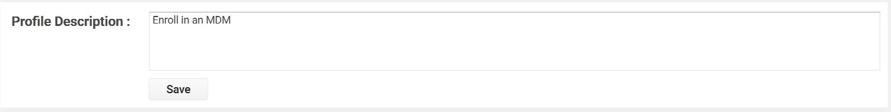

4. Enter the description and select Save.

5. Encryption for staging data is selected by default in order to protect the sensitive data encoded in the profile barcode or NFC tag. See [StageNow Encryption](../gettingstarted?StageNow%20Encryption)  for more information. De-select this checkbox if necessary to save space.

6. Select Complete Profile to proceed to the Publish window. The profile status at the top right of the screen is now Complete.

-----

## Publish
The Publish section of the Wizard permits selection of a staging method, testing of the method for profile functionality, and making the profile available to the staging operator. This window lists the available profile delivery types, and displays dates and times when the profile was Last Tested, Published and Staged.

-----

### Barcode Profile Staging
To stage a barcode profile:

1. Select the Barcode tab: 

    

2. To create a direct connection via hotspot instead of using the configured staging network, check the "Yes, use WiFi Hotspot" checkbox. This allows staging with a single staging barcode without requiring an external Wi-Fi network, and eliminates the need for reprinting barcodes if there is a profile change.

3. To stage devices from content stored on a server, check the "Host the Deployment Package Outside of StageNow FTP Server" and enter the server address and fully qualified file name (including path, see image above) of server-based content using the Source URI syntax. For more information and examples of this syntax, see the [Source URI](../csp/file/#source-uri) and [Examples](../csp/file/#examples) sections of the [File Manager guide](../csp/file). This feature supports HTTP, HTTPS, FTP and FTPS (FTP over TLS or SSL) protocols and basic authentication of URL-embedded credentials (Devices with MX 4.4+ support FTP only; **HTTP/HTTPS requires MX 7.0 or higher on device**; FTPS requires MX 7.1 or higher). 

4. Select the checkbox for PDF417 or Linear to specify the type of barcode for deployment, or choose Select All to select all barcode types.

5. Select Test to test the functionality of the profile before publishing. This generates a PDF of test staging barcode(s). While this step is optional, it is important to determine whether the profile functions as intended before making it available to the operator(s) for staging devices.

    

6. If the staging material functions properly, select "Publish" to publish the material for operator use. Note that the administrator can choose to publish only certain types of barcodes that were successfully tested, and publish the others when they are ready.

7. Enter staging instructions for the operator.

    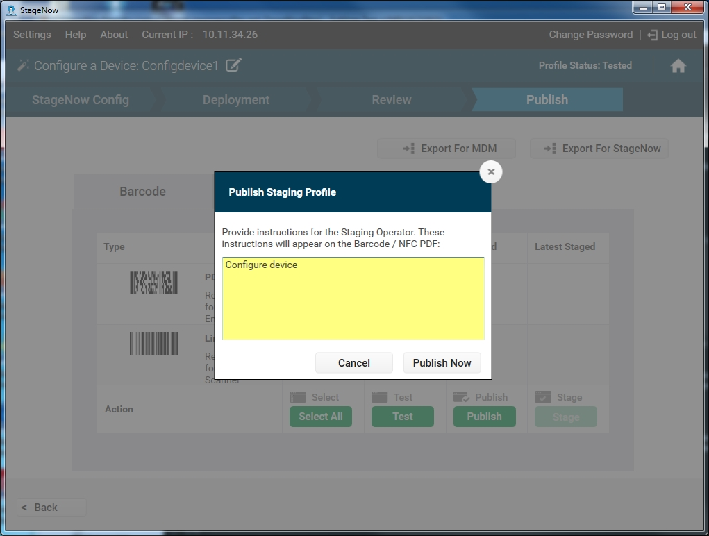

8. Select "Publish Now" to continue.

    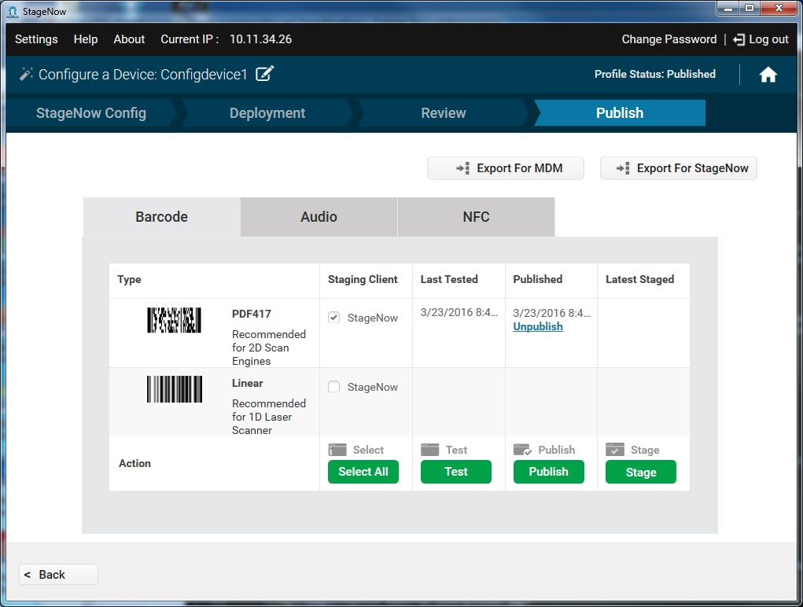

9. To make the profile available for staging, select "Stage" to generate a PDF of staging barcode(s) that devices can scan for staging. See [Device Staging](../stageclient).

10. To export the profile for consumption by StageNow or an MDM, select the "Export For StageNow" or "Export For MDM" button. See [Exporting Staging Profiles](../stagingprofiles?Exporting%20Staging%20Profiles).

**Select "Unpublish" to unpublish a profile** and remove operator access. 

-----

### Audio Profile Staging

**NOTE: Audio staging is NOT supported on Zebra's "SD660-platform" devices, which currently includes**:
* PS20
* TC52
* TC57
* TC72
* TC77

**To stage an audio profile**:

1. Select the Audio tab. If this is the first time using this feature, a tour provides help screens that specify technical and environmental requirements for audio staging. 

    

2. Progress through the instruction screens and select DONE to dismiss the tour.

    

3. To create a direct connection via hotspot instead of using the configured staging network, select the Yes, use Wifi Direct checkbox.

4. Select Test Audio to play the file in order to verify the functionality before publishing, or the Download icon to save the audio file before testing. While this step is optional, it is important to determine whether the profile functions as intended before making it available to the operator(s) for staging devices.

    

5. If the audio file functions properly, select Publish Profile to publish the audio file for operator use. 

6. Enter staging instructions for the operator, and select Publish Now.

7. To stage the clients using the audio file, select Play Audio, or Download to save the audio file for other administrators or operators to use. See [Device Staging](../stageclient).

8. To export the profile for an MDM or for StageNow, select the Export For MDM or Export For StageNow button. See [Exporting Staging Profiles](../stagingprofiles?Exporting%20Staging%20Profiles).

To unpublish a profile to remove operator access, select Unpublish.

-----

### NFC Profile Staging
To stage an NFC profile:

1. Select the NFC tab. 

    

2. To create a direct connection via hotspot instead of using the configured staging network, select the Yes, use Wifi Direct checkbox.

3. Select Test to test the functionality of the profile before publishing. This saves the NFC tag as a .bin file for testing. While this step is optional, it is important to determine whether the profile functions as intended before making it available to the operator(s) for staging devices.

4. If the staging material functions properly, select Publish to publish the material for operator use. 

5. Enter staging instructions for the operator.

    

6. Select Publish Now.

7. To make the profile available for staging, select Stage. This save the NFC tag as a .bin file that devices can read for staging. See [Device Staging](../stageclient).

8. To export the profile for an MDM or for StageNow, select the Export For MDM or Export For StageNow button. See [Exporting Staging Profiles](../stagingprofiles?Exporting%20Staging%20Profiles).

To unpublish a profile to remove operator access, select Unpublish.

-----

### USB and SD Card Profile Staging

StageNow 3.3 (and later) allows the `.bin` file(s) generated during the NFC Staging process to be used for staging a device from a USB drive or SD card.  

**To <u>automatically</u> stage a device from a USB drive or SD card**:

1. **Generate** `.bin` **file(s)** using the [NFC Profile Staging](#nfcprofilestaging) procedures above. 
2. **Create a folder called** `/Stagenow` on a USB drive or SD card.
3. **Copy the** `.bin` **file(s)** to the new folder's root level. 
3. **Attach (or insert) the storage device and boot** the (new or enterprise-reset) device to be staged. 

##### When the `.bin` file is found, the set-up wizard is skipped and staging begins. 

>**Note**: Staging profiles stored on an SD card take precedence over USB.

**To <u>manually</u> stage a device from a file on the device**:

1. **Generate** `.bin` **file(s)** using the [NFC Profile Staging](#nfcprofilestaging) procedures above. 
2. **Copy the** `.bin` **file(s)** to any location on the device. 
3. **Launch the StageNow client** and tap the "Browse" button:
4. **Navigate to and tap the** `.bin` **file** copied in Step 2 to begin staging. 
<!-- 11/8/19- image file discovered to be missing
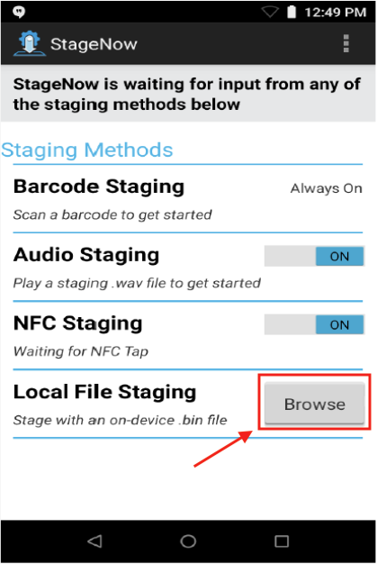
-->

-----

## Copying a Staging Profile

**To create a new Profile by copying an existing one**:

1. Select the Copy icon (shown below) next to the profile. 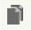

2. Enter a new name for the profile, and select Save. 

    

3. A window indicates the profile was copied successfully. Select OK.

4. See the next section for instructions on editing the new profile.

-----

## Editing a Staging Profile

>Note:  
>In-progress profiles created in StageNow 2.0 may not function after upgrading to the latest StageNow Tool.

To edit a profile:

1. Select the profile from the home screen. 

2. Use the navigation UI in the Wizard to locate the setting to update. See [Navigating the Wizard](../stagingprofiles?Navigating%20the%20Wizard).

    

3. Select Edit to enable the fields for updating.

4. Make the required changes and select Save, or select Cancel to discard the changes.

5. Select Continue and proceed through the Wizard.

6. In the Review section, select Complete Profile to move to the Publish section to generate updated barcodes, NFC tags, or audio files.

-----

## Exporting Staging Profiles

>Note:  
>Incomplete profiles cannot be exported.

To export a single profile for StageNow or for an MDM:

1. Select the Export icon next to the profile. 

    

2. Select whether to export for an MDM or for within the StageNow tool.

    

3. If you select Export For StageNow, to lock the profile so it cannot be changed and hide the details from other administrators, select the check box, and then select OK.

4. Select a location for the profile and select Save. A window indicates that the profile was exported successfully.

5. Select OK.

Note: RD settings are not exported and so cannot be imported.

### Exporting All Profiles

>Note:  
>Incomplete profiles are not exported.

To export all staging profiles:

1. Select All Profiles.

    

2. Select the Export Profile(s) button.

    

3. To lock the profile so it cannot be changed and hide the details from other administrators, select the check box.

4. Select OK.

    

5. The default name for the zip file containing all profiles is MULTI_PROFILES.ZIP. Select a location for the profile and select Save. A window indicates that the profile was exported successfully.

6. Select OK.

-----

## Importing a Staging Profile

To import a profile:

1. **Click "All Profiles"** in the Home screen's left-hand pane:

    

2. **Click "Import Profile(s)"** button. A navigation dialog appears: 

    

3. **Navigate to the file to be imported** and **click "Import"** button. A dialog appears to indicate that the profile was imported successfully.  
**Click OK**. 

4. The imported profile appears in the profiles list. Profiles locked during export appear with a lock icon after import:

> `IMPORTANT:` After importing a staging Profile, its settings counters are reset to zero (see image below).  

_Click image to enlarge; ESC to exit_.

<!-- 2/26/19- removed lines below; obsolete. 

Profiles created in StageNow 2.0 are imported as MX 4.3 profiles.

Note: RD settings are not exported and so cannot be imported.
-->
-----

## Deleting a Staging Profile

To delete a profile:

1. Select the trash icon next to the profile. 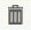

    

2. Select OK to confirm the deletion.

3. A window indicates that the profile was successfully deleted. Select OK.

-----

## Upgrading Profiles

StageNow 2.3 and later allow the administrator to upgrade profiles created in any released or beta StageNow version to the latest version, i.e., StageNow 2.5.

