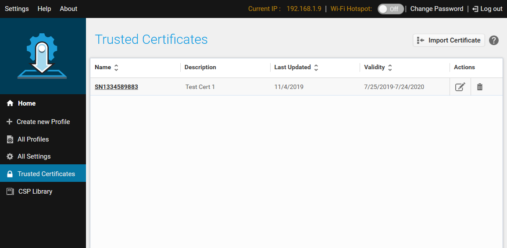

## Overview

**StageNow 4.0 (and higher) supports Trusted Staging**, which can protect devices with MX 9.2 and higher from unauthorized staging. Trusted devices are created from a security certificate. Once a certificate is used to create a trusted device, the device can be staged only from barcodes created using the same security certificate.

#### Requirements: 

* StageNow 4.0 (or higher) installed
* Zebra device(s) with MX 9.2 or higher
* Self-signed security "Trusted Certificate" (`.pfx` file)

#### Process Snapshot:

1. Create a Trusted Certificate `.pfx` file 
2. Import the Trusted Certificate into StageNow
3. Deploy the Trusted Certificate to device(s)  
 `NOTES:` 
 • This activates Trusted Staging on target device(s) 
 • Such device(s) no longer accept standard ("untrusted") Profiles
4. Create Trusted Profile(s) for use on Trusted Device(s)

-----

#### To Create a Trusted Device:

1. From the StageNow Home screen, **click the "Trusted Certificates" button**: 
 
 _Click image to enlarge; ESC to exit_. 
 
2. From the Trusted Certificates page, **select a previously imported certificate** from the list and skip to Step 5.  **To import a new certificate, click the "Import Certificate" button**:  
 
 _Click image to enlarge; ESC to exit_. 
 
3. **Navigate to the** `.pfx` **file being imported**:
  
  _Click image to enlarge; ESC to exit_. 
 
4. **Confirm that the imported file appears** in the list of Trusted Certificates similar to the image below:   
  
  _Click image to enlarge; ESC to exit_. 
 
5. **Create a staging profile that pushes the certificate to the device(s)** to become Trusted.

#### For help with next steps, See the [Staging Profiles Guide](../stagingprofiles/#createaprofile). 

> `IMPORTANT:` Trusted Devices can be staged ONLY with Trusted Profiles. 

<!-- 
  
  _Click image to enlarge; ESC to exit_. 
 
6. 
  
7. 
  
 -->

-----

