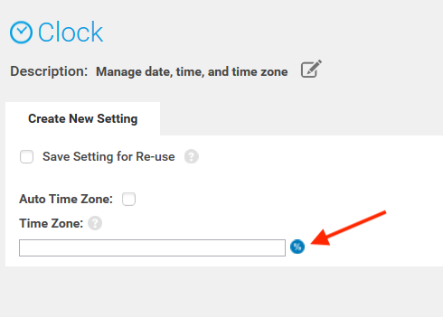
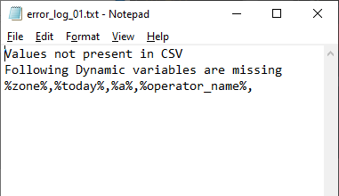

## Overview

**StageNow 4.1 (and higher) supports Dynamic Staging**, which allows certain compatible data-entry fields in a StageNow Profile to be populated with values from a file when staging barcodes (or `.bin` files) are generated. This permits the Staging Administrator to create a **single Profile that can configure devices differently** depending on variations of how and/or where the devices are to be used. 

**Dynamic Staging simplifies staging based on...** 

* Locale
* Language
* Input method
* Wi-Fi setting
* User credentials  
* Other customer variations

### Requirements

* StageNow 4.1 (or later) installed
* Knowledge of which fields to populate dynamically and their corresponding variable names
* A `.csv` file containing variable names and matching data for all dynamic fields&#42;

&#42; The `.csv` file is required to *generate* the staging barcodes, but does not have to be present when setting up a Dynamic Profile. After a Profile with one or more dynamic fields is created, StageNow can generate a `.csv` template file that the administrator can populate with the required data. 

-----

### Usage Scenarios

There are many possible usage scenarios under which Dynamic Staging could help save staging time. Below are a few of the ways Zebra imagines using this feature. 

#### Retail Chain
**A mass retailer that configures devices at a central location** and deploys them to retail locations throughout the United States might maintain **one** `.csv` **file for each store**. Each store might contain a different number of departments, each with its own group of settings. For example, if "Store 1" had 10 departments, the `Store_1.csv` file would contain 10 rows, one for each department. Each column header is labeled for that department's variables, which might include those for `%dept_name%`, `%ssid%`, `%wifi_passphrase%`, `%default_scanner%`, `%app_1%`, `%app_2%` and `%app_3%`. 

If some departments in that store have differing numbers of a given variable, that store's `.csv` file should contain enough columns for the store with the greatest number of that variable. For example, if the department corresponding to "Row 2" of the `Store_1.csv` file used only two apps, the cell for `2:%app_3%` would be blank; it would not cause an error when generating barcodes unless the Profile called cell `2:%app_3%` for a value. 

-----

### Variable Creation

Dynamic Staging variables are created in two primary ways: 

* **Export Variables from a Database -** Companies that maintain user data (locale, network settings, etc.) in databases or spreadsheets can export the relevant data to a `.csv` file and use the file to generate staging Profiles accordingly. **When a StageNow Profile is created for pre-existing variables, the <u>variable names entered in the Profile must exactly match those of the database</u>**.

* **Generate Variables "On the Fly" -** For companies that DO NOT maintain user databases, variable names can be made up as the Dynamic Profile is being created. Once the Profile is finished, StageNow can generate a `.csv` template file that contains all the newly created variables that the administrator can then populate with the required data. **This is the Zebra-recommended method of creating a** `.csv` **file**. 

Both scenarios are fully supported by StageNow and documented in the [Using Dynamic Staging section](#usingdynamicstaging). 

-----

## Using Dynamic Staging

The following directions explain the use of Dynamic Staging whether variables were exported from a database or created "on the fly." 

### Variable Usage Rules
* The <u>`.csv` file **must NOT be open**</u> when Dynamic Staging is performed or errors might result. 
* Variable names used in a StageNow Profile **must match exactly with those in the `.csv` file</u>**.
* Variables can be used alone in a field or in combination with static values and/or other variables. 
* Each row in the `.csv` file represents one set of data for a Dynamic Profile.
* Row numbers within the `.csv` file are used to label barcode printouts for identification purposes. 
* Dynamic Staging supports **plain text files only**. 
* **Each variable MUST be separated by a semi-colon** and each line must end with a semi-colon.  
* Dynamic Variables are supported ONLY in fields for device settings and publish comments.

1. Identify data-entry fields accompanied by a percent icon:  
 
 _Click image to enlarge; ESC to exit_. 
 
2. Enter static text (i.e. "GMT") and/or variables (i.e. %zone%) in any combination as desired:  
 
 _Click image to enlarge; ESC to exit_. 
 
 A warning appears until variables are entered using the correct syntax:  
 
 _Click image to enlarge; ESC to exit_. 
 
3. Enter variables and/or static data as desired for all fields and **click the "Continue" button**:  
 
 _Click image to enlarge; ESC to exit_. 
 
4. To test a Dynamic Profile, **select a barcode type and click the "Test" button**:  
 
 _Click image to enlarge; ESC to exit_. 
 
5. A prompt appears to select **or create** the `.csv` file. 
 **To select an <u>existing</u> `.csv` file Skip to Step 6**. 
 **To create a** `.csv` **file "on the fly" from variables created in the profile**: 
  a. **Click "Save a CSV Template"** in the dialog shown below, **name and save the file** as prompted. 
  b. In the same dialog (as below), **click "Open a CSV file for editing**, navigate to and open the file saved in step a.   
  c. **Enter data for all variables, save and close the file**. The image below shows an example `.csv` file: 
  
 _Click image to enlarge; ESC to exit_. 
6. **Select the `.csv` file that contains variable data for the Dynamic Profile**:   
 
 _Click image to enlarge; ESC to exit_. 
 
 A barcode sheet similar to the image below is produced for each row of the `.csv` file; the profile name is appended with the row number on the printout. 
 
 _Click image to enlarge; ESC to exit_. 
 
7. **Repeat Steps 4 and 5** until all barcode sheets are generated as desired with no errors.  
8. When testing is completed, **click Publish**. A prompt appears for entering Staging Operator instructions. Combine variables and static text as desired. An example is shown below:  
 
 _Click image to enlarge; ESC to exit_. 
 
9. **Click "Publish Now" to complete the process.
 
 _Click image to enlarge; ESC to exit_. 
 
 
 _Click image to enlarge; ESC to exit_. 
 
 
 _Click image to enlarge; ESC to exit_. 
 
 
 _Click image to enlarge; ESC to exit_. 
 
 
 _Click image to enlarge; ESC to exit_. 
 
 
 _Click image to enlarge; ESC to exit_. 
 

 
 _Click image to enlarge; ESC to exit_. 
 

Then the administrator need only populate the file with the required data and select that `.csv` file when generating barcodes. 

Data-entry fields that support Dynamic Staging are indicated by a "percent sign" (%) icon similar to the image below.  

Variables can be used alone in a field or in combination with static values and/or other variables. 

For example, a valid string might read as follows: 

`192.168.%octet3%.%octet4%` to specify two static octets (192 and 168 separated by a "dot") and two variables (%octet3% and %octet4%, also separated by a dot). 

WORKFLOW

Use case- Allan: 

In general, the concept is to produce a staging profile that does different things on different devices. 

In its first iteration, dynamic parts are rendered static when barcodes or .bin files are created. 

One staging profile produces multiple barcode sheets or .bin files. 

STEPS 
1. Decide to have a dynamic profile
2. Determine what has to vary  in each profile
3. Use the "Create a template" feature (Zebra-recommended) 
4. Enter the required variables. it can be done as one master or separate CSVs for different stores.  

ONE FILE
all values, generate once
but has extra barcode sheets that might not be needed every time

One store, 10 department. one profile for each. 
one row per store
each profile references different subsets of the same file
might not have been created from a template

If customer has an access or SQL database with store info. 
output selected sets as csv files
might require referring to the file from within SN 

WORKFLOW 1- without a database of variables

WORKFLOW 2- with a database of variables

FROM POLARION:

Background:

Currently, StageNow supports Barcode and NFC Staging Modalities, but all Staging Profiles are inherently Static, which means that all values must be entered at the time the Staging Profile is created and remain fixed unless/until the Staging Profile is manually edited.
If an Administrator wishes to produce multiple variations of a Staging Profile, he must manually create a copy of the Staging Profile and edit it with the required changes and must repeat that process for each variation required.
This is error-prone and time-consuming and creates a mass of Staging Profiles to manage.
There is a strong request from the field to be able to perform Staging using multiple variations of a single Staging Profile in a more efficient manner.

Assumptions:

This may be the first increment of a larger Dynamic Staging Feature set and hence should be defined and implemented as generically possible so that it can serve as the base for future expansion.
Customers would prefer a simple and standard way to provide Data Sets to be used when generating variations for a Staging Profile (e.g. specify a .CSV file).
Customers may desire a way to manage and organize multiple Data Sets for use with the same or different Staging Profiles (e.g. a library of imported .CSV files).
Customers will likely need a way to organize and manage the multiple Barcode Sheets Sets or collections of NFC tag binaries generated via Dynamic Staging (e.g. name generated files based on variant values).
Customers may desire a way to visually differentiate Static and Dynamic Staging Profiles.
Customers may desire a way to visually differentiate Barcode Sheets Sets or NFC Instructions Sheets when generating variations for a Staging Profile.
Customers may desire a way to customize the Staging Operator instructions produced on the Barcode Sheets or NFC Instruction Sheets when generating variations for a Staging Profile.

Expectations:

The Staging Administrator can optionally choose to include a Variable anywhere the wish within any text-entry field presented within a Staging Profile.
Each Staging Profile can have as many or as few variables as the Staging Administrator wishes to use and can name variables any way he wishes.
A single text-entry field could contain mixtures of static data and variables in any combination.
Any Staging Profile containing at least one variable is a Dynamic Staging Profile and all other Staging Profiles are Static.
When the Staging Administrator or Staging Operator generates using a Dynamic Staging Profile, he will be required to supply a Data Set providing at least one or more values for every variable.
The Staging Administrator will be able to easily manage Dynamic Staging Profiles, Data Sets, and the Barcode Sheets, NFC Binary Files, Audio Files, etc. generated from them.

-----

OLD

can protect devices with MX 9.2 and higher from unauthorized staging. Trusted devices are created from a security certificate. Once a certificate is used to create a trusted device, the device can be staged only from barcodes created using the same security certificate.

#### Requirements: 

* StageNow 4.1 (or higher) installed
* `.csv` file containing variable names and values

OLD OLD

#### Process Snapshot:

1. Create a Trusted Certificate `.pfx` file 
2. Import the Trusted Certificate into StageNow
3. Deploy the Trusted Certificate to device(s) to make them Trusted Device(s)  
 `NOTES:` 
 • This activates Trusted Staging on target device(s) 
 • Such device(s) no longer accept standard ("untrusted") Profiles
4. Create Trusted Profile(s) for use on Trusted Device(s)

-----

## Create a Trusted Device

### I. Import Certificate

> ***This process requires StageNow to be running in admin mode***. 

1. From the StageNow Home screen, **click the "Trusted Certificates" button**: 
 
 _Click image to enlarge; ESC to exit_. 
 

#### Also see: [How to create a self-signed certificate](https://techdocs.zebra.com/enterprise-browser/latest/guide/certificates/)

-----

### II. Deploy Certificate to Device(s)

1. From the Home screen, **click the Create new Profile button**: 
  
  _Click image to enlarge; ESC to exit_. 
 

> `IMPORTANT:` All devices that scan barcodes generated this way become "Trusted Devices" and can no longer be staged with standard "untrusted" staging Profiles; <u>they can be staged ONLY with Trusted Profiles created using the same certificate as was deployed to the device(s)</u>. 

-----

### III. Create Trusted Staging Profile

**Trusted Profiles are the same as standard ("untrusted") Profiles <u>with one important exception</u>**: The final step adds a "Trusted" designation and requires selection of a security certificate. 

#### To Create a Trusted Profile:

1. From the Home screen, **click the "Create new Profile" button**. Before selecting a Wizard, **be sure that MX 9.2 (or higher) is selected from the drop-down menu**: 
  
  _Click image to enlarge; ESC to exit_. 
 

**Trusted Profiles are identified in Profile lists by a green lock icon** as in the sample image below: 
  
  _Click image to enlarge; ESC to exit_. 
 

#### `IMPORTANT:` Trusted Devices can be staged ONLY with a Trusted Profile that contains the same certificate as was deployed to those devices. 

#### See the [Staging Profiles Guide](../stagingprofiles) for further details. 

-----

