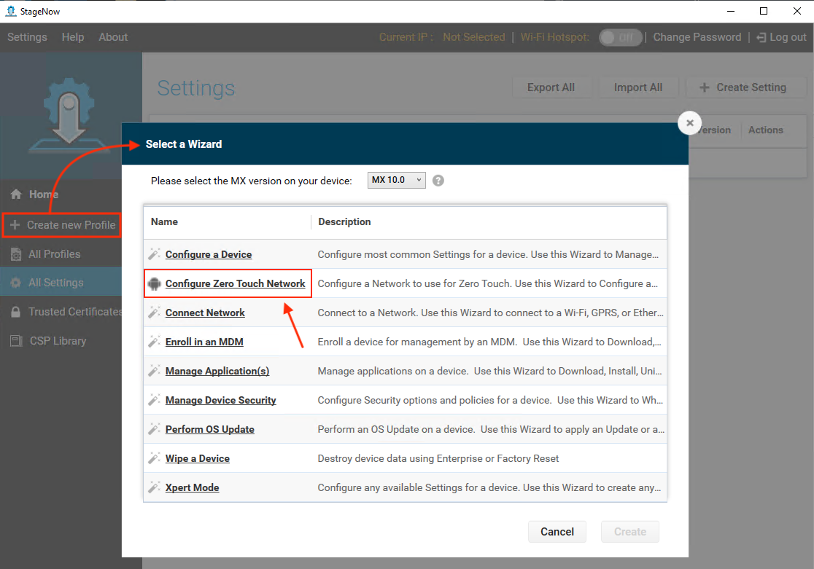
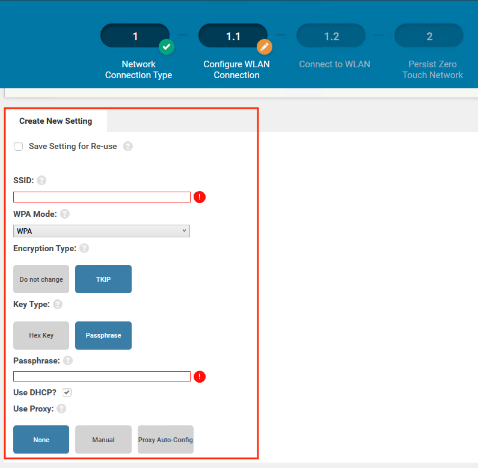

Use this Wizard to configure the network settings of a "factory fresh" or factory-reset device to enable connection to the internet through Ethernet, Wi-Fi or a non-public cellular APN. This enables the device to access internet-based Google Zero Touch servers, which perform Device Owner Enrollment in an Enterprise Mobile Management (EMM) system, rendering the device manageable with no user interaction.

### Requirements

* StageNow 4.2 or later
* Zebra device running Android 10
* EMM with Zero Touch support and credentials

sn42_ztw_06.png
sn42_ztw_05.png
sn42_ztw_04.png
sn42_ztw_03.png
sn42_ztw_02.png
sn42_ztw_01.png
sn42_ztw_00.png

-----

### Using Zero Touch Wizard

**NOTE**: To create a single Profile that can be used to stage multiple devices with different settings, [enable Dynamic Staging](../../dynamicstaging/#usingdynamicstaging).  

1. From the StageNow Home screen, **click "Create new Profile"** to bring up the Wizards list.  
 Then **select "Configure Zero Touch Network"** to start the Wizard:
 
 _Click image to enlarge; ESC to exit_. 
 
2. **Select the network type** for connecting the device to the internet. 
 **NOTE**: Only one network type may be selected:  
 
 _Click image to enlarge; ESC to exit_. 
 
3. **Enter the settings** for configuring the device for internet connectivity:  
 
 _Click image to enlarge; ESC to exit_. 
 
4. **Select Persistence preference**:  
 
 _Click image to enlarge; ESC to exit_. 
 
5. **Click "+ Expand"** to confirm settings, if desired. 
 Then **click "Complete Profiles"** to continue: 
 
 _Click image to enlarge; ESC to exit_. 
 
6. **Select deployment preferences**: 
 
 _Click image to enlarge; ESC to exit_. 
 
7. **Test Profile** to confirm desired behavior. 

#### The Profile is now ready for deployment. 
