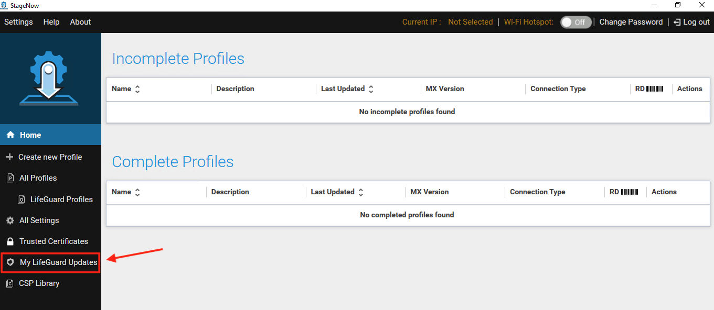
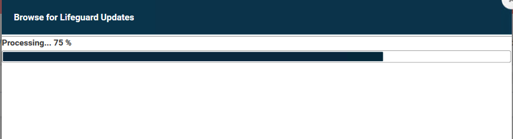
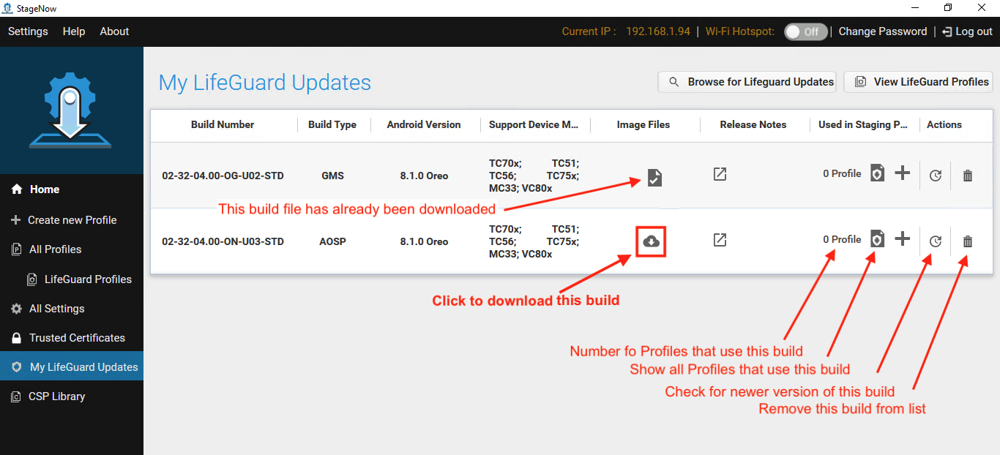

## Overview

**StageNow 5.0 (and later) supports Smart Profiles**, which automatically calculate all required [Setting Types (CSPs)](../settingtypes) and create all necessary Profile steps for upgrading (or downgrading) the OS on device(s) to any other version. 

> **Requires MX 8.1 or later on target device(s)**

> **`IMPORTANT:` If a target device is downgraded to MX 8.0 or earlier** and an upgrade is later required, the upgrade Profile must be created using the previous "non-smart" methods. However, integration with the LifeGuard build database in StageNow 5.0 removes the requirement to manually identify the OS and LifeGuard image(s) required for such upgrade operation(s). 

-----

### Requirements

* StageNow 5.0 (or later) installed
* Target device(s) with MX 8.1 (or later)
* Login credentials for an active [Zebra OneCare](https://www.zebra.com/us/en/services/zebra-onecare-support-services.html) account 

-----

## Working with Smart Profiles

### I. Select LifeGuard Image(s)

**Before creating a Smart Profile**, at least one LifeGuard device image must be selected from the "Browse LifeGuard Images" page. **If LifeGuard images have already been selected, skip to Section II**.   

#### To select LifeGuard image(s):

1. From the "<i class="fa fa-home" aria-hidden="true"></i> Home" screen, **click "My LifeGuard Updates"** in the left-hand pane. 

_Click image to enlarge; ESC to exit_.
 
 
2. **Click the "Browse for LifeGuard Updates" button** at the top of the screen.  

_Click image to enlarge; ESC to exit_.
 
 
3. **Click "confirm"** to accept automatically generated access key to continue: 

_Click image to enlarge; ESC to exit_.
 
 
4. **Enter Zebra OneCare login credentials**: 

_Click image to enlarge; ESC to exit_.
 
 
5. **Click "Allow"** to load the LifeGuard image database:

_Click image to enlarge; ESC to exit_.
 
 
6. **Wait a few moments** for LifeGuard images to load:

_Click image to enlarge; ESC to exit_.
 
 
7. On the "Browse for LifeGuard Updates" (shown below), **check the required boxes to filter search results** to display images of target device(s) as required. **Then click the "Show Results" button** to display the filtered list. Then **click the "plus" icon to display image in "My LifeGuard Updates" list.  
When the image list appears as desired, **[proceed to Section II](#iicreateasmartprofile)**. 

_Click image to enlarge; ESC to exit_.
 
 

<!-- this is the montage image

_Click image to enlarge; ESC to exit_. 
-->

----- 

### II. Create a Smart Profile

When creating a Smart Profile, StageNow examines the selected LifeGuard image, calculates all required Setting Types (CSPs) and creates all Profile steps necessary to deploy the image to the target device(s). 

> **See [Notes section](#notes) below for important rules and restrictions**. 

#### To create a Smart Profile:

1. To bring up the "My LifeGuard Updates" page (if necessary), **click "My LifeGuard Updates"** in the left-hand pane of the StageNow "<i class="fa fa-home" aria-hidden="true"></i> Home" screen:  

_Click image to enlarge; ESC to exit_. 
 
2. From the "My LifeGuard Updates" page, **click the cloud icon of the desired image** to begin a download. **To use a file already downloaded (indcated by a "check mark" in the image files column)**, skip to the next step. 
`IMPORTANT:` Multiple images can be downloaded simultaneously, but **exiting the download screen cancels all current downloads**.
 
 _Click image to enlarge; ESC to exit_. 
 
3. <u>After a file has been downloaded</u>, **click the Plus (+) symbol** to create a new Smart Profile:  
 
 _Click image to enlarge; ESC to exit_. 
 
4. **Enter a name for the Smart Profile**. Then **click the "Start" button**:
 
 _Click image to enlarge; ESC to exit_. 
 

5. **do this**. Then **do that**:

_Click image to enlarge; ESC to exit_.
 

6. **do this**. Then **do that**:

_Click image to enlarge; ESC to exit_.
 

7. **do this**. Then **do that**:

_Click image to enlarge; ESC to exit_.
 

8. **do this**. Then **do that**:

_Click image to enlarge; ESC to exit_.
 

9. **do this**. Then **do that**:

_Click image to enlarge; ESC to exit_.
 

10. **do this**. Then **do that**:

_Click image to enlarge; ESC to exit_.
 

11. **do this**. Then **do that**:

_Click image to enlarge; ESC to exit_.
 

#### Bang, zoom... smart profile is made. 

<!-- 

4. To test a Dynamic Profile, **select a barcode type and click the "Test" button**:  
 
 _Click image to enlarge; ESC to exit_. 
 
5. A prompt appears for selecting (**or *creating***) the `.csv` file similar to the image below: 
  
  **To select an <i><u>existing</u></i> `.csv` file skip to Step 6**. 
 **To create a** `.csv` **file "on the fly"** from variables created in the Profile: 
  &nbsp;&nbsp;&nbsp;&nbsp;a. **Click "Save a CSV Template"** in the dialog shown below, **name and save the file** as prompted. 
  &nbsp;&nbsp;&nbsp;&nbsp;b. In the same dialog (as below), **click "Open a CSV file for editing**, navigate to and open the file saved in Step a. 
  &nbsp;&nbsp;&nbsp;&nbsp;c. **Enter data for all variables (separated by semi-colons)**, save and close the file.  
  `IMPORTANT:` **Use semi-colons to separate variable names and data, and at the end of each line** (see Notepad image, below).  
  
  The image below shows a correctly formatted `.csv` file: 
  
 _Click image to enlarge; ESC to exit_. 
 
6. **Select the** `.csv` **file that contains variable data for the Dynamic Profile**:   
 
 _Click image to enlarge; ESC to exit_. 
 
 **On success, a barcode sheet is produced for each row of the** `.csv` **file** similar to the image below.  
 **The Profile name is appended with the row number** on the printout for identification. 
 
 _Click image to enlarge; ESC to exit_. 
 
7. **`If errors occur`** refer to the [Troubleshooting section](#troubleshooting) below for instructions.  
8. When testing is completed, **click Publish**. A prompt appears for entering Staging Operator instructions.  
Combine variables and static text as desired. An example is shown below. 
 
 _Click image to enlarge; ESC to exit_. 
 
9. **Click "Publish Now"** to complete the process; distribute staging materials as normal.  

-->

### Notes

* Multiple simultaneous downloads are possible.
* Leaving the download screen cancels all downloads.   
* more, yo

-----

<!-- ## Troubleshooting

Dynamic Staging errors occur when StageNow is unable to acquire data from a `.csv` file for generating staging media. 

#### Typical causes: 

* The `.csv` file is missing data for one or more variables
* One or more variables were entered incorrectly in StageNow
* The `.csv` file is not present on the host workstation
* The `.csv` file is open or otherwise locked on the host workstation

> **NOTE**: The "Host the Deployment Package Outside of StageNow FTP Server" option is not available when using Dynamic Staging.

#### Error Diagnosis:  

1. If StageNow displays a "CSV Issues" message like the one below, **click "Save the log"** to generate a list of issues. 
 
 _Click image to enlarge; ESC to exit_. 
 
2. **Name and save the file** in the desired location: 
 
 _Click image to enlarge; ESC to exit_. 
 
3. **Click the "Open a log file for viewing" button**, navigate to and open the log file saved in the previous step. 
 A sample log file is shown below: 
 
 _Click image to enlarge; ESC to exit_. 
 
4. **Open the log in a text editor, make corrections to the** `.csv` **file as needed**.  
 Then **return to StageNow and click "Start Over"** button:  
 
 _Click image to enlarge; ESC to exit_. 
 
5. **Return to <a href="#step6">Step 6</a>** in the previous section and try Dynamic Staging again. 

-->

-----

