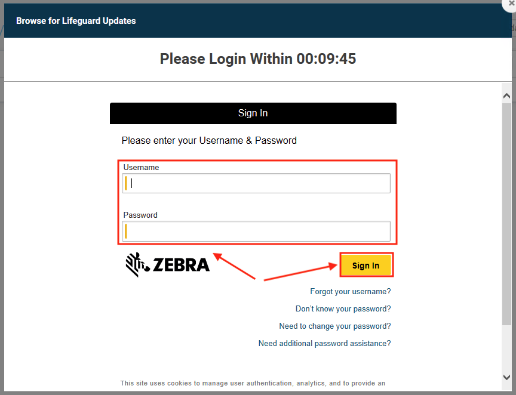
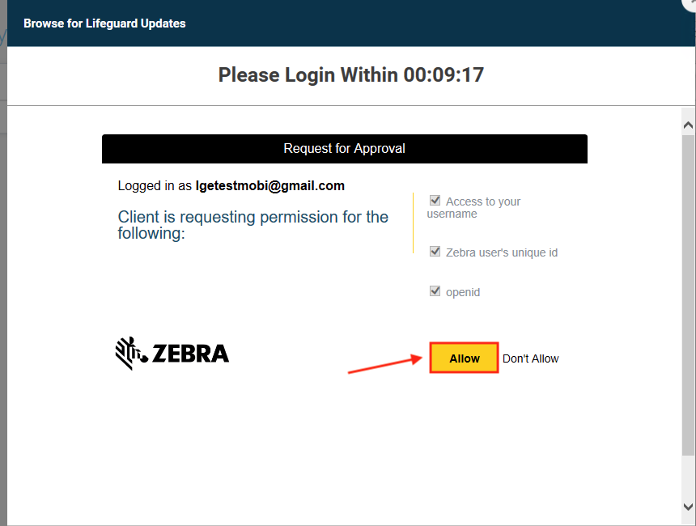
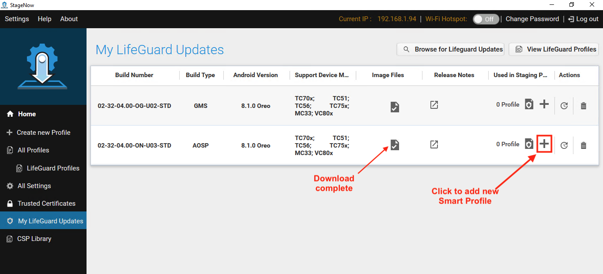

## Overview

**StageNow 5.0 (and later) supports Smart Profiles**, which automatically calculate all required [Setting Types (CSPs)](../settingtypes) and create all necessary Profile steps for upgrading (or downgrading) the OS on device(s) to any other version. 

> **Requires MX 8.1 or later on target device(s)**

> **`IMPORTANT:` If a target device is downgraded to MX 8.0 or earlier** and an upgrade is later required, the upgrade Profile must be created using the previous "non-smart" methods. However, integration with the LifeGuard build database in StageNow 5.0 removes the requirement to manually identify the OS and LifeGuard image(s) required for such upgrade operation(s). 

-----

### Requirements

* StageNow 5.0 (or later) installed
* Target device(s) with MX 8.1 (or later)
* Login credentials for an active [Zebra OneCare](https://www.zebra.com/us/en/services/zebra-onecare-support-services.html) account 

-----

## Working with Smart Profiles

### I. Select LifeGuard Image(s)

**Before creating a Smart Profile**, at least one LifeGuard device image must be selected from the "Browse LifeGuard Images" page. **If LifeGuard images have already been selected, skip to Section II**.   

#### To select LifeGuard image(s):

1. From the "<i class="fa fa-home" aria-hidden="true"></i> Home" screen, **click "My LifeGuard Updates"** in the left-hand pane. 

_Click image to enlarge; ESC to exit_.
 
 
2. **Click the "Browse for LifeGuard Updates" button** at the top of the screen.  

_Click image to enlarge; ESC to exit_.
 
 
3. **Click "confirm"** to accept automatically generated access key to continue: 

_Click image to enlarge; ESC to exit_.
 
 
4. **Enter Zebra OneCare login credentials**: 

_Click image to enlarge; ESC to exit_.
 
 
5. **Click "Allow"** to load the LifeGuard image database:

_Click image to enlarge; ESC to exit_.
 
 
6. **Wait a few moments** for LifeGuard images to load:

_Click image to enlarge; ESC to exit_.
 
 
7. **Check the required boxes to filter search results**. 
**Click the "Show Results" button** to display the filtered list. 
Then **click the "plus" icon to display image in "My LifeGuard Updates" list.  
When the image list appears as desired, **[proceed to Section II](#iicreateasmartprofile)**. 

_Click image to enlarge; ESC to exit_.
 
 

<!-- this is the montage image

_Click image to enlarge; ESC to exit_. 
-->

----- 

### II. Create a Smart Profile

When creating a Smart Profile, StageNow examines the selected LifeGuard image, calculates all required Setting Types (CSPs) and creates all Profile steps necessary to deploy the image to the target device(s). 

> **See [Notes section](#notes) below for important rules and restrictions**. 

#### To create a Smart Profile:

1. To bring up the "My LifeGuard Updates" page (if necessary), **click "My LifeGuard Updates"** in the left-hand pane of the StageNow "<i class="fa fa-home" aria-hidden="true"></i> Home" screen:  

_Click image to enlarge; ESC to exit_. 
 
2. From the "My LifeGuard Updates" page, **click the cloud icon(s) of the desired image(s)** to begin a download.  
**`IMPORTANT:` Multiple images can be downloaded simultaneously, but exiting the download screen cancels all current downloads**. 
**NOTE**: To create a Smart Profile using a file already downloaded (indicated by a "check mark" in the image files column), skip to the next step.
 
 _Click image to enlarge; ESC to exit_. 
 
3. <u>After a file has been downloaded</u>, **click the Plus (+) symbol** to create a new Smart Profile:  
 
 _Click image to enlarge; ESC to exit_. 
 
4. **Enter a name for the Smart Profile**. Then **click the "Start" button**:
 
 _Click image to enlarge; ESC to exit_. 
 
5. If a network is required, **click "Yes" to create network over which to download images to devices** and enter network settings on subsequent screens (not shown). 

_Click image to enlarge; ESC to exit_. 
 
6. **Click "Continue" button** to confirm Build batch file download steps for automatic Profile:

_Click image to enlarge; ESC to exit_. 
 
7. **Click "Continue" button** to confirm Build batch file execution steps for automatic Profile:

_Click image to enlarge; ESC to exit_. 
 
8. On Review screen, **click "View" to see the steps created** (if desired). Then **click "Create Profile" button**:

_Click image to enlarge; ESC to exit_. 
 
9. **Select the desired publishing medium and click the "Test" or Publish" button**: 
 * **<u>Barcode</u>** generates one or more barcodes that execute the Smart Profile on any device that scans it. 
 * **<u>NFC/SD/USB</u>** generates a `.bin` file to be consumed on devices by the StageNow app. 
 [See more about publishing StageNow Profiles](../stageclient/#iiselectstagingmedium) 

_Click image to enlarge; ESC to exit_. 
 
10. **Select the desired options to test or publish the Smart Profile**:

_Click image to enlarge; ESC to exit_. 
 

#### Smart Profile creation is complete. After testing, deploy published staging media as required. 

-----

## Notes

* **<u>Zebra strongly recommends testing ALL Profiles before deployment</u> in production environments**.  
* StageNow supports multiple simultaneous downloads from the "My LifeGuard Updates" screen **<u>only while the screen is visible</u>**. 
* **Exiting the My LifeGuard Updates screen cancels all downloads in progress**.

-----

