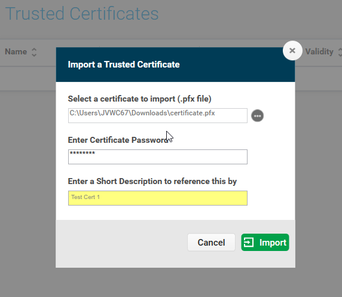
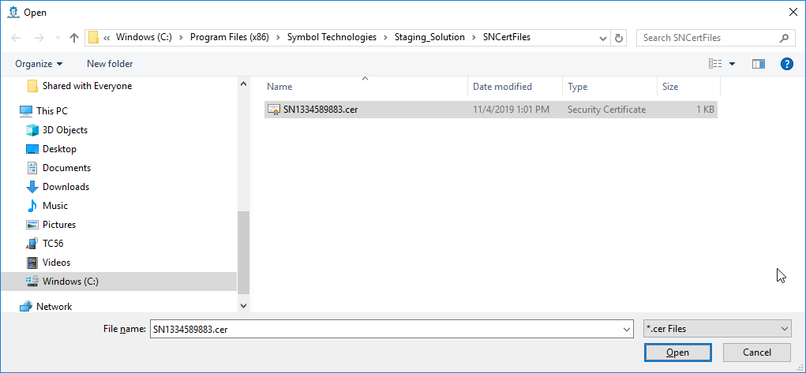
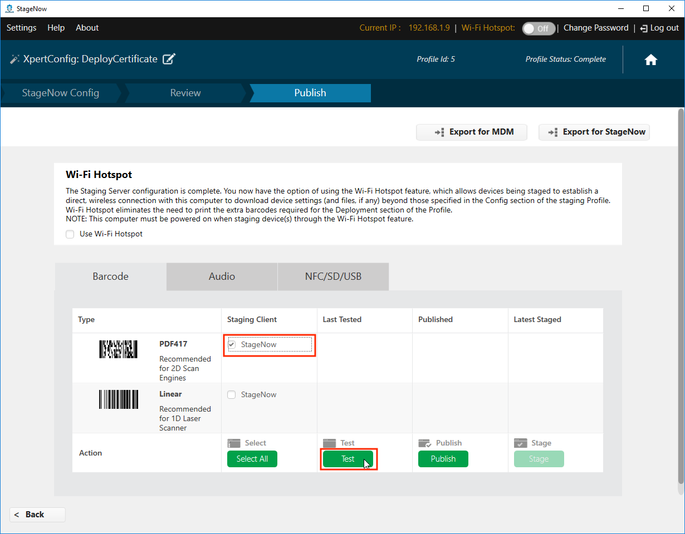
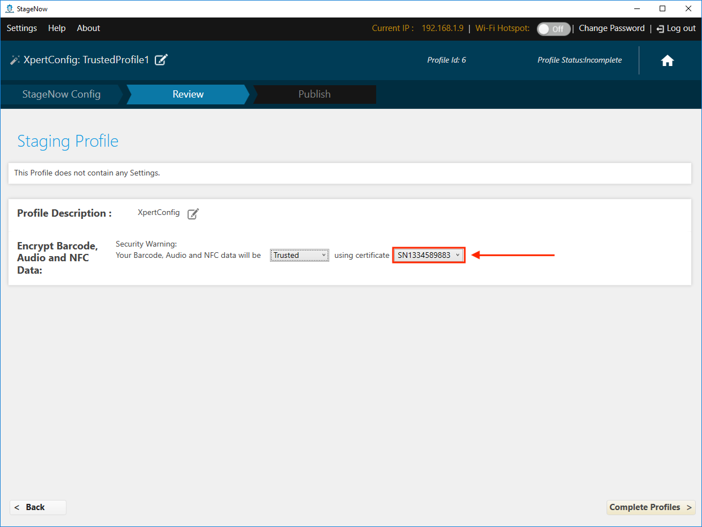
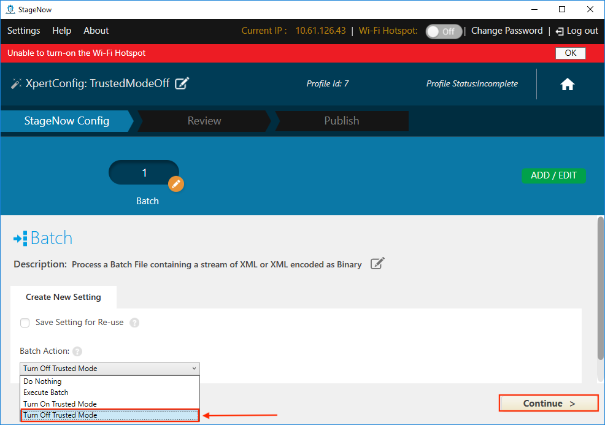
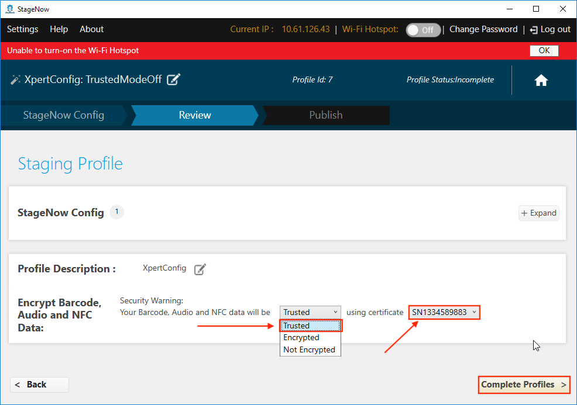

## Overview

**StageNow 4.0 (and later) supports Trusted Staging**, which can protect devices with MX 9.2 and later from unauthorized staging. Trusted devices are created from a security certificate. Once a certificate is used to create a trusted device, the device can be staged only from barcodes created using the same security certificate.

> **`IMPORTANT:`** Access to Trusted Staging and Trusted Devices is possible only by Windows users with administrative privileges.

#### Requirements: 

* StageNow 4.0 (or later) installed
* Zebra device(s) with MX 9.2 or later
* Self-signed security "Trusted Certificate" (`.pfx` file of exactly 1024 bytes)

#### Process Snapshot:

1. Create a Trusted Certificate `.pfx` file (**must be <u>exactly</u> 1024 bytes**)
2. Import the Trusted Certificate into StageNow
3. Deploy the Trusted Certificate to device(s) to make them Trusted Device(s)  
 `NOTES:` 
 • This activates Trusted Staging on target device(s) 
 • Such device(s) no longer accept standard ("untrusted") Profiles
4. Create Trusted Profile(s) for use on Trusted Device(s)

**How to [create a `.pfx` file](#createatrustedcertificate)**

-----

## Create a Trusted Device

### I. Import Certificate

> ***This process requires StageNow to be running in admin mode***. 

1. From the StageNow Home screen, **click the "Trusted Certificates" button**: 
 
 _Click image to enlarge; ESC to exit_. 
 
2. From the Trusted Certificates page, **select a previously imported certificate** from the list and skip to Step 5.  **To import a new certificate, click the "Import Certificate" button**: 
 
 _Click image to enlarge; ESC to exit_. 
 
 `CAUTION:` **Certificate files must be exactly 1024 bytes in size**. 
3. **Navigate to the** `.pfx` **file being imported**:
  
  _Click image to enlarge; ESC to exit_. 
 
4. **Confirm that the imported file appears** in the list of Trusted Certificates similar to the image below. 
 **NOTE**: When imported, the `.pfx` file is encrypted and given a `.cer` file extension.
   
  _Click image to enlarge; ESC to exit_. 
 
5. **Create a staging profile that pushes the certificate to the device(s)** to become Trusted (next section).
 

#### Also see: [How to create a self-signed certificate](https://techdocs.zebra.com/enterprise-browser/latest/guide/certificates/)

-----

### II. Deploy Certificate to Device(s)

1. From the Home screen, **click the Create new Profile button**: 
  
  _Click image to enlarge; ESC to exit_. 
 
2. **Select "Xpert Mode" and the click "Create" button**: 
  
  _Click image to enlarge; ESC to exit_. 
 
3. **Enter a name** for the deployment profile and **click the "Start" button**:  
  
  _Click image to enlarge; ESC to exit_. 
 
4. **Click the plus (+) sign** on the "Batch" CSP line and **click the "Add" button**: 
  
  _Click image to enlarge; ESC to exit_. 
 
5. **Select "Turn On Trusted Mode"** from the drop-down menu:
  
  _Click image to enlarge; ESC to exit_. 
 
6. **Click the Navigation button** to bring up an "Open" dialog (shown in Step 7):
  
  _Click image to enlarge; ESC to exit_. 
 
7. **Navigate to and select the certificate file** (imported in Section I, Step 4) and **click the "Open" button**: 
 **NOTE**: When imported, the `.pfx` file is encrypted and given a `.cer` file extension.
  
  _Click image to enlarge; ESC to exit_. 
 
8. Confirm that the `.cer` file appears and **click the "Continue" button**: 
  
  _Click image to enlarge; ESC to exit_. 
 
9. **Select "Encrypted" from the drop-down menu** as shown and **click the "Complete Profiles" button**: 
  
  _Click image to enlarge; ESC to exit_. 
 
10. **Select the desired barcode type** for the staging client and **click the "Test" button** to generate barcodes: 
  
  _Click image to enlarge; ESC to exit_. 
 
11. **<u>Use the device(s) to be made Trusted</u> to scan the barcodes and deploy the certificate**: 
  
  _Click image to enlarge; ESC to exit_. 
 

> `IMPORTANT:` All devices that scan barcodes generated this way become "Trusted Devices" and can no longer be staged with standard "untrusted" staging Profiles; <u>they can be staged ONLY with Trusted Profiles created using the same certificate as was deployed to the device(s)</u>. 

-----

### III. Create Trusted Staging Profile

**Trusted Profiles are the same as standard ("untrusted") Profiles <u>with one important exception</u>**: The final step adds a "Trusted" designation and requires selection of a security certificate. 

#### To Create a Trusted Profile:

1. From the Home screen, **click the "Create new Profile" button**. Before selecting a Wizard, **be sure that MX 9.2 (or higher) is selected from the drop-down menu**: 
  
  _Click image to enlarge; ESC to exit_. 
 
1. When naming, **Zebra recommends selecting names that make the Profile easy to identify later**: 
  
  _Click image to enlarge; ESC to exit_. 
 
2. In the final step of Profile creation, **select "Trusted" from the drop-down menu**: 
  
  _Click image to enlarge; ESC to exit_. 
 
3. **From the the drop-down menu of certificates previously imported, <u>select the certificate that matches the one deployed to target device(s)</u>**: 
  
  _Click image to enlarge; ESC to exit_. 
 

**Trusted Profiles are identified in Profile lists by a green lock icon** as in the sample image below: 
  
  _Click image to enlarge; ESC to exit_. 
 

#### `IMPORTANT:` Trusted Devices can be staged ONLY with a Trusted Profile that contains the same certificate as was deployed to those devices. 

#### See the [Staging Profiles Guide](../stagingprofiles) for further details. 

-----

## Turn Off Trusted Mode

If it becomes necessary to remove a device from Trusted Mode, simply create a Trusted Profile and select "Turn Off Trusted Mode" using the Batch CSP. Details are below. 

#### To create a Trusted Profile turning off Trusted Mode: 

1. From the Home screen, **click the Create new Profile button**: 
  
  _Click image to enlarge; ESC to exit_. 
 
2. **Select "Xpert Mode" and the click "Create" button**: 
  
  _Click image to enlarge; ESC to exit_. 
 
3. **Enter a name** for the deployment profile and **click the "Start" button**:  
  
  _Click image to enlarge; ESC to exit_. 
 
4. **Click the plus (+) sign** on the "Batch" CSP line and **click the "Add" button**: 
  
  _Click image to enlarge; ESC to exit_. 
 
5. **Select "Turn Off Trusted Mode"** from the drop-down menu and **click the "Continue" button**:
  
  _Click image to enlarge; ESC to exit_. 
 
5. **Select "Trusted"** from the drop-down menu,   select the same certificate file used to put the device into Trusted Mode from its drop-down menu and  **click the "Complete Profiles" button**:
  
  _Click image to enlarge; ESC to exit_. 
 
6. **Select the desired barcode type** for the staging client and **click the "Test" button** to generate barcodes:
  
  _Click image to enlarge; ESC to exit_. 
 
11. **<u>Use the device(s) to be removed from Trusted Mode</u> to scan the barcodes**:
  
  _Click image to enlarge; ESC to exit_. 
 

**The device is now removed from Trusted Mode and can be staged using ordinary staging Profiles**. 

-----

## Create a Trusted Certificate

### `UNDER CONSTRUCTION`

This section describes how to generate a trusted certificate (`.pfx` file) for importing into StageNow to facilitate Trusted Staging. The importing process is described in the sections above. 

### Requirements
* Computer running Windows 
* The latest version of OpenSSL [Download OpenSSL](https://www.openssl.org/source/) 
* Path to OpenSSL directory added to system environment variables

-----

### I. Generate a private key  

Before beginning, open a command-prompt window and navigate to the folder containing OpenSSL. 

1. At a command prompt, enter the following command to instruct OpenSSL to generate an RSA Private Key:

        :::terminal
        genrsa -des3 -out server.key 1024 

2. A prompt appears asking for a pass phrase. Create and **enter a pass phrase** (and record it for later reference). 

3. The server.key is generated; this is required later in the procedure. ( type “start .” from the command prompt to go to default location where server.key is generated) 

 and Certificate Signing Request (CSR)

-----

### II. Generate a CSR

After the private key is generated, you can generate a Certificate Signing Request.
The CSR is sent to a Certificate Authority, such as Verisign, that verifies the identity of the requester and issues a signed certificate.

During the generation of the CSR, you are prompted for several pieces of information.

These are the X.509 attributes of the certificate.

SHA-2 for Certificates has to be generated. 

1. At the command prompt, enter the following command:

        :::terminal
        req –new –key private_key_file_name.key -sha256 –out csr_file_name.csr

2. Enter the following command at the prompt:

        :::terminal
        req -new -key server.key -sha256  -out server.csr

3. This command prompts for the following X.509 attributes of the certificate.

Enter appropriate information based on the environment; 

You can leave all these options empty by clicking on enter button

* Country Name (2 letter code) [GB]: For example: US or CA.
* State or Province Name (full name) [Berkshire]: For example: California
* Locality Name (eg, city) [Newbury]: For example: Berkeley
* Organization Name (eg, company) [My Company Ltd]: For example: BlueCoat
* Organizational Unit Name (eg, section) []:For example: IT
* Common Name (eg, your name or your server's hostname) []:For example: bluecoat.com
* Email Address []:For example: martin.John@bluecoat.com

Enter the following "extra" attributes to be sent with the certificate request:
* A challenge password []:
* An optional company name []:
 
3. The server.csr is generated in the OpenSSL default and can be used to submit to a certificate authority (CA) for signing.

-----

### III. Generate a Self-Signed Certificate

As mentioned above, you must send the CSR to Certificate Authority, such as Verisign, that verifies the identity of the requester and issues a signed certificate.
Or you can use self-sign the CSR if you either do not plan to have your certificate signed by a CA or you want to just test it only while the CA is signing your certificate.

This example uses a self-signed certificate method by using the OpenSSL tool to generate a temporary certificate that generates an error in the client browser to the effect that the signing certificate authority is unknown and not trusted.
 
1. To generate a temporary certificate, which is good for 365 days, issue the following command:

        :::terminal
        x509 -req -days 365 -in server.csr -signkey server.key -sha256 -out server.crt

Signature ok

subject=/C=US/ST=California/L=Berkeley/O=BlueCoat/OU=IT/CN=bluecoat.com/em

ailAddress = martin.john@bluecoat.com

Getting Private key

Enter pass phrase for server.key:

2. You must enter the pass phrase for the server.key that you entered in the step 1 above.
3. The server.crt generates in your default location  and you need to use this CRT to convert it to PEM format, which can be readable by Reporter.

-----

### IV. Convert the CRT to PEM format

Now you should have generated .key and .crt file handy. These two files are used to generate pfx certificate
  
Give following command in command prompt :

    :::terminal
    pkcs12 -export -out filename.pfx -inkey filename.key -in filename.crt

`filename.pfx` is the name of `.pfx` certificate you want to generate, `filename.key` is the name of the `.key` file generated in earlier steps and `filename.crt` is the name of the `.crt` file generated in earlier steps. 

#### The certificate is ready to be used in StageNow. 

