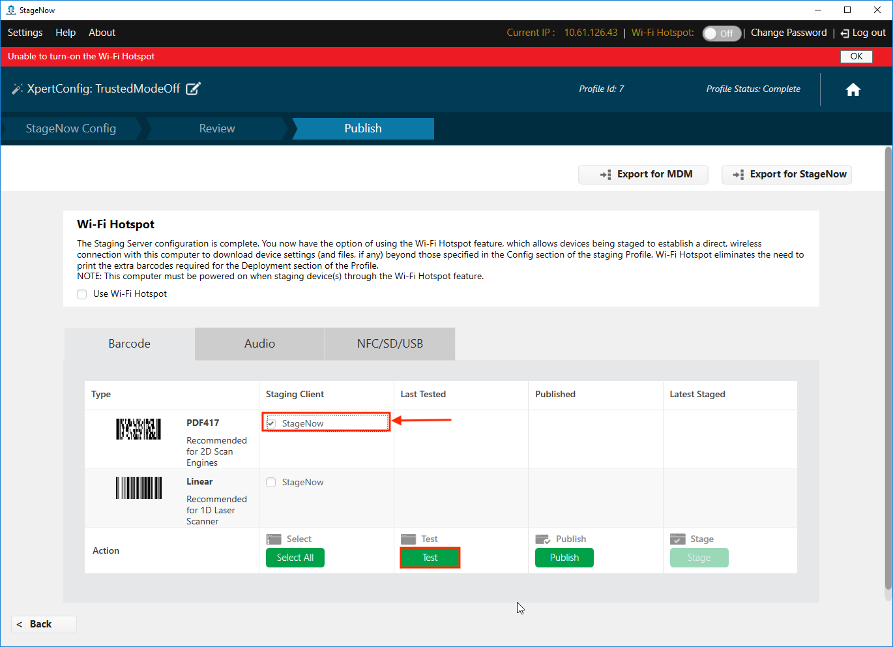

## Overview

**StageNow 4.0 (and later) supports Trusted Staging**, which can protect devices with MX 9.2 and later from unauthorized staging. Trusted devices are created from a security certificate. Once a certificate is used to create a trusted device, the device can be staged only from barcodes created using the same security certificate.

This guide describes the process of importing an existing certificate into StageNow for use in Trusted Staging, and explains [how to create a certificate](#createatrustedcertificate) if needed. 

> **`IMPORTANT:`** Access to Trusted Staging and Trusted Devices is possible only by Windows users with administrative privileges.

#### Requirements: 

* **Computer running Windows** 
* **StageNow 4.0** (or later) installed
* **Zebra device(s)** with MX 9.2 or later
* **Self-signed security "Trusted Certificate"** (`.pfx` file of exactly 1024 bytes)
* OpenSSL installed (**if creating a Trusted Certificate&#42;**)

#### Process Snapshot:

1. Import a Trusted Certificate&#42; (`.pfx` file) into StageNow
2. Deploy the Trusted Certificate to device(s) to create Trusted Device(s)  
 `NOTE:` Such device(s) no longer accept standard ("untrusted") Profiles 
3. Create Trusted Profile(s) for use on Trusted Device(s)

&#42;If no Trusted Certificate exists, start with instructions for **[creating a Trusted Certificate](#createatrustedcertificate)** at the end of this guide. 

-----

## Create a Trusted Device

### I. Import Certificate

> ***This process requires StageNow to be running in admin mode***. 

1. From the StageNow Home screen, **click the "Trusted Certificates" button**: 
 
 _Click image to enlarge; ESC to exit_. 
 
2. From the Trusted Certificates page, **select a previously imported certificate** from the list and skip to Step 5.  **To import a new certificate, click the "Import Certificate" button**: 
 
 _Click image to enlarge; ESC to exit_. 
 
 `CAUTION:` **Certificate files <u>must be exactly 1024 bytes</u> in size**. 
3. **Navigate to the** `.pfx` **file being imported**:
  
  _Click image to enlarge; ESC to exit_. 
 
4. **Confirm that the imported file appears** in the list of Trusted Certificates similar to the image below. 
 **NOTE**: When imported, the `.pfx` file is encrypted and given a `.cer` file extension.
   
  _Click image to enlarge; ESC to exit_. 
 
5. **Create a staging profile that pushes the certificate to the device(s)** to become Trusted (next section).
 

#### Also see: [How to create a self-signed certificate](https://techdocs.zebra.com/enterprise-browser/latest/guide/certificates/)

-----

### II. Deploy Certificate to Device(s)

1. From the Home screen, **click the Create new Profile button**: 
  
  _Click image to enlarge; ESC to exit_. 
 
2. **Select "Xpert Mode" and the click "Create" button**: 
  
  _Click image to enlarge; ESC to exit_. 
 
3. **Enter a name** for the deployment profile and **click the "Start" button**:  
  
  _Click image to enlarge; ESC to exit_. 
 
4. **Click the plus (+) sign** on the "Batch" CSP line and **click the "Add" button**: 
  
  _Click image to enlarge; ESC to exit_. 
 
5. **Select "Turn On Trusted Mode"** from the drop-down menu:
  
  _Click image to enlarge; ESC to exit_. 
 
6. **Click the Navigation button** to bring up an "Open" dialog (shown in Step 7):
  
  _Click image to enlarge; ESC to exit_. 
 
7. **Navigate to and select the certificate file** (imported in Section I, Step 4) and **click the "Open" button**: 
 **NOTE**: When imported, the `.pfx` file is encrypted and given a `.cer` file extension.
  
  _Click image to enlarge; ESC to exit_. 
 
8. Confirm that the `.cer` file appears and **click the "Continue" button**: 
  
  _Click image to enlarge; ESC to exit_. 
 
9. **Select "Encrypted" from the drop-down menu** as shown and **click the "Complete Profiles" button**: 
  
  _Click image to enlarge; ESC to exit_. 
 
10. **Select the desired barcode type** for the staging client and **click the "Test" button** to generate barcodes: 
  
  _Click image to enlarge; ESC to exit_. 
 
11. **<u>Use the device(s) to be made Trusted</u> to scan the barcodes and deploy the certificate**: 
  
  _Click image to enlarge; ESC to exit_. 
 

> `IMPORTANT:` All devices that scan barcodes generated this way become "Trusted Devices" and can no longer be staged with standard "untrusted" staging Profiles; <u>they can be staged ONLY with Trusted Profiles created using the same certificate as was deployed to the device(s)</u>. 

-----

### III. Create Trusted Staging Profile

**Trusted Profiles are the same as standard ("untrusted") Profiles <u>with one important exception</u>**: The final step adds a "Trusted" designation and requires selection of a security certificate. 

#### To Create a Trusted Profile:

1. From the Home screen, **click the "Create new Profile" button**. Before selecting a Wizard, **be sure that MX 9.2 (or higher) is selected from the drop-down menu**: 
  
  _Click image to enlarge; ESC to exit_. 
 
1. When naming, **Zebra recommends selecting names that make the Profile easy to identify later**: 
  
  _Click image to enlarge; ESC to exit_. 
 
2. In the final step of Profile creation, **select "Trusted" from the drop-down menu**: 
  
  _Click image to enlarge; ESC to exit_. 
 
3. **From the the drop-down menu of certificates previously imported, <u>select the certificate that matches the one deployed to target device(s)</u>**: 
  
  _Click image to enlarge; ESC to exit_. 
 

**Trusted Profiles are identified in Profile lists by a green lock icon** as in the sample image below: 
  
  _Click image to enlarge; ESC to exit_. 
 

#### `IMPORTANT:` Trusted Devices can be staged ONLY with a Trusted Profile that contains the same certificate as was deployed to those devices. 

#### See the [Staging Profiles Guide](../stagingprofiles) for further details. 

-----

## Turn Off Trusted Mode

If it becomes necessary to remove a device from Trusted Mode, simply create a Trusted Profile and select "Turn Off Trusted Mode" using the Batch CSP. Details are below. 

#### To create a Trusted Profile turning off Trusted Mode: 

1. From the Home screen, **click the Create new Profile button**: 
  
  _Click image to enlarge; ESC to exit_. 
 
2. **Select "Xpert Mode" and the click "Create" button**: 
  
  _Click image to enlarge; ESC to exit_. 
 
3. **Enter a name** for the deployment profile and **click the "Start" button**:  
  
  _Click image to enlarge; ESC to exit_. 
 
4. **Click the plus (+) sign** on the "Batch" CSP line and **click the "Add" button**: 
  
  _Click image to enlarge; ESC to exit_. 
 
5. **Select "Turn Off Trusted Mode"** from the drop-down menu and **click the "Continue" button**:
  
  _Click image to enlarge; ESC to exit_. 
 
5. **Select "Trusted"** from the drop-down menu,   select the same certificate file used to put the device into Trusted Mode from its drop-down menu and  **click the "Complete Profiles" button**:
  
  _Click image to enlarge; ESC to exit_. 
 
6. **Select the desired barcode type** for the staging client and **click the "Test" button** to generate barcodes:
  
  _Click image to enlarge; ESC to exit_. 
 
11. **<u>Use the device(s) to be removed from Trusted Mode</u> to scan the barcodes**:
  
  _Click image to enlarge; ESC to exit_. 
 

**The device is now removed from Trusted Mode and can be staged using ordinary staging Profiles**. 

-----

## Create a Trusted Certificate

This section describes how to generate a trusted certificate (`.pfx` file) for [importing into StageNow](#createatrusteddevice) to facilitate Trusted Staging. This processes uses [OpenSSL](https://www.openssl.org/docs/faq.html) and its command-line interface (CLI) to create the certificate and Certificate Signing Request (CSR) for submission to a certificate authority for signing. 

> **Before beginning, [download OpenSSL](https://www.openssl.org/source/)** and install it.

**A familiarity with command-line tools is helpful for this section**. Learn more about [OpenSSL CLI commands](https://www.sslshopper.com/article-most-common-openssl-commands.html).

-----

#### I. Generate a private key and CSR  

**NOTE: To prepare a CSR from an *<u>existing</u>* private key**, skip to Step 4. 

**&#49;. Open a command-prompt window** (`cmd.exe`) and navigate to the folder containing OpenSSL. 

**&#50;. Generate a private key** with the desired file name (i.e. `myPrivate.key`) using the following command:

        :::terminal
        genrsa -des3 -out myPrivate.key 1024 

* This RSA key can be protected with 1024-bit (shown) or 2048-bit Triple DES encryption.
* A prompt appears asking for a pass phrase. 

**&#51;. Create and enter a pass phrase** and <u>record it for later reference</u>. 

* A file called `myPrivate.key` is created in the current directory. 

**&#52;. Generate a CSR file** from the `.key` file created in the previous step using the following command: 

        :::terminal
        req –new –key myPrivate.key -sha256 –out myPrivate.csr

* Several prompts appear for entering <u>optional</u> X.509 attributes of the certificate.  

**&#53;. Enter optional information based on the environment** or leave blank by hitting the ENTER key. 

**The Certificate Signing Request** `myPrivate.csr` **is ready** to be submitted to a certificate authority. **Proceed to Section III when signed file is received**. 

-----

#### II. Generate a self-signed certificate
**Perform steps in this section ONLY if a self-signed certificate is desired**. Such certificates can be used for testing and other internal purposes, or as an interim solution while waiting for signing from a certificate authority. Self-signed certificates cause display of "signing certificate authority is unknown and not trusted" or a similar message on browsers. Use the following steps to create a self-signed certificate using OpenSSL.

> **To complete preparation of a certificate already signed by a certificate authority**, proceed to Section III. 

**&#54;. Generate a temporary (one-year) certificate** using the following command: 

        :::terminal
        x509 -req -days 365 -in server.csr -signkey myPrivate.key -sha256 -out mySigned.crt

**&#55;. When prompted, enter the pass phrase for** `myPrivate.key` created in the Step 3, above.

**The** `mySigned.crt` **file is generated in the current folder**. Go to Section III to complete the process.

-----

#### III. Convert CRT to PEM

The final steps use the `.key` and `.crt` files to generate a `.pfx` certificate to import into StageNow. 
  
**&#56;. At the command prompt, enter the following command**:

    :::terminal
    pkcs12 -export -out trustedCert.pfx -inkey myPrivate.key -in mySigned.crt

**The certificate** `trustedCert.pfx` **is ready to be imported** into StageNow for use with Trusted Staging. 

