## Overview

Use this Wizard to perform an OS update on a device. The OS Update action applies an update or patch to the OS by downloading a `.zip` file to the device or using a `.zip` file that exists on the device. This Wizard allows connection to a network. 

-----

## Perform OS Update

**To create a "Perform OS Update" profile**:

1. Select "Create New Profile."

2. Select the MX version from the drop-down menu.

3. Select the "Perform OS Update" Wizard, and click "Create" to continue. 

    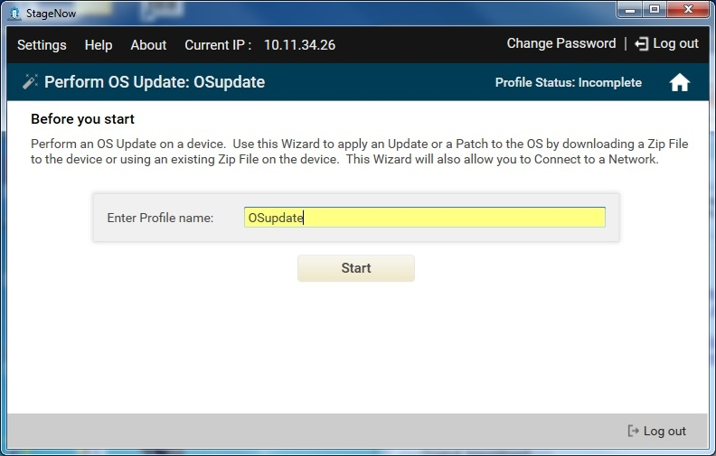
 

4. Enter a name for the profile and click "Start" to continue.

5. If connecting to this network using StageNow barcodes, click "Yes" and click "Continue" to proceed (see [Profiles / Connect Network](../../Profiles/ConnectNetwork) for instructions on connecting to a network and populating the settings window).

    **Note**: This wizard includes a Deployment section. Deployment requires that the host computer and the device(s) are on the same network. 

6. If offered, select whether to connect to this network using the Rapid Deployment (RD) Client. Note that the RD Config section appears only if Legacy Mode is enabled in the [Settings](../../gettingstarted?Settings) screen. Click "Yes" for devices that don't include the StageNow Client (see [Rapid Deployment (RD) Client](../../stageclient?Rapid%20Deployment%20Client) for more information).

7. If selecting "Yes," choose whether to set up Wi-Fi options and/or Wi-Fi profiles (see [Setting Types > Wifi mgr](../../csp/wifi)):

    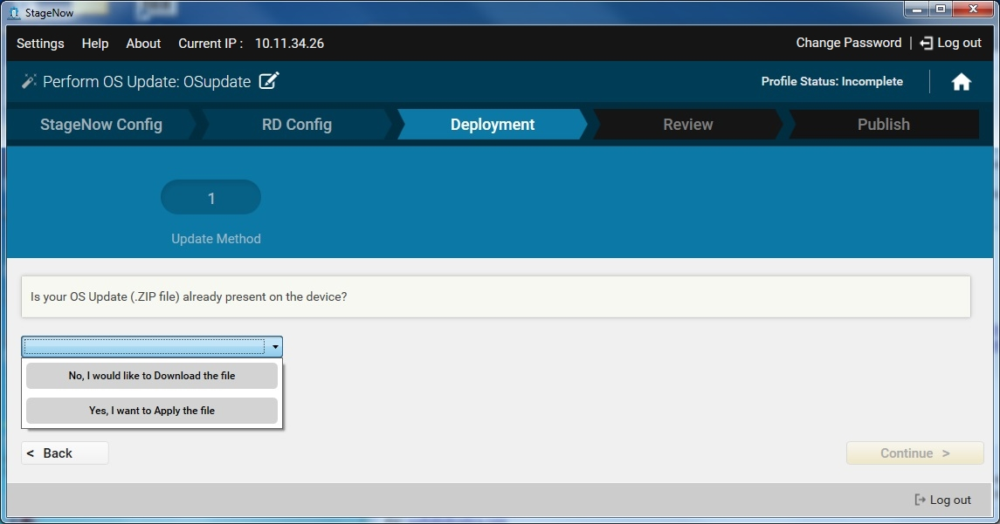
 

8. Choose a method for performing the OS update, and then click "Continue" to proceed:

    * **To push an OS update** `.zip` **file to the device**, select "No, I would like to Download the file."
    * **To use an OS update** `.zip` **file that already resides on the device**, select "Yes, I want to Apply the file."

9. **If selecting "No..."** 

    a. Select whether to prevent Wi-Fi from turning off while downloading (see [Setting Types > Wi-Fi](../../csp/wifi) for more information): 

    
 

    b. Enter the information for the `.zip` file (see [Setting Types > File](../../csp/file) for more information):

    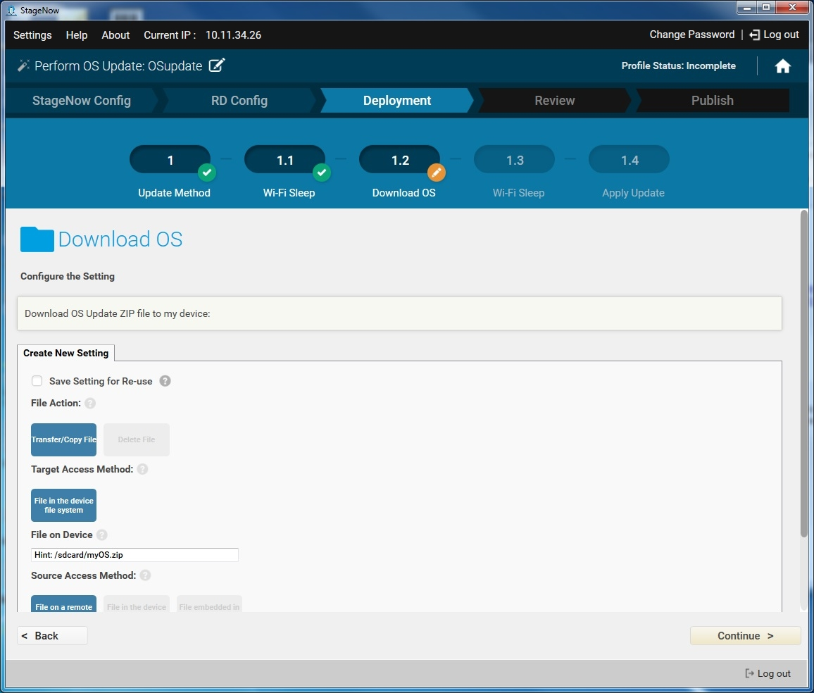
 

    c. Select whether to allow Wi-Fi to turn off after downloading (see [Setting Types > Wi-Fi](../../csp/wifi) for more information):

    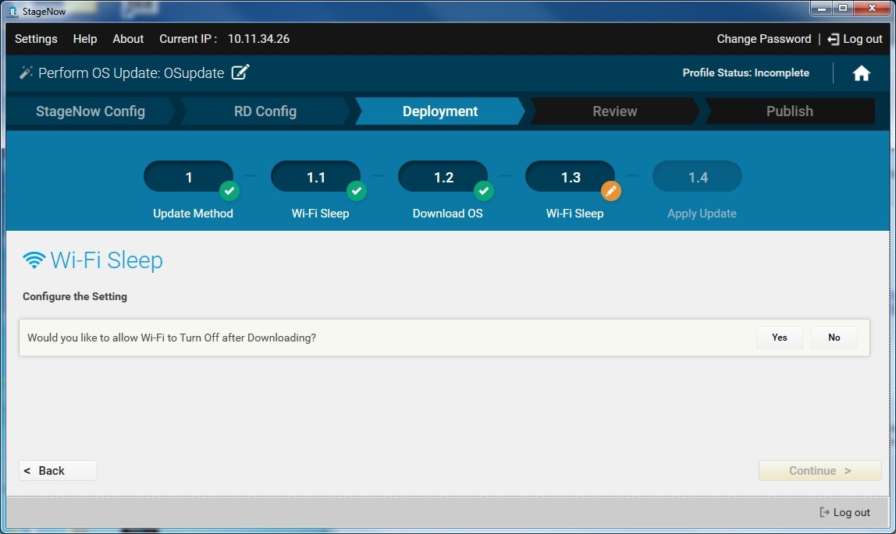
 

10. Enter information for the `.zip` file (see [Setting Types > Power](../../csp/power) for more information):

   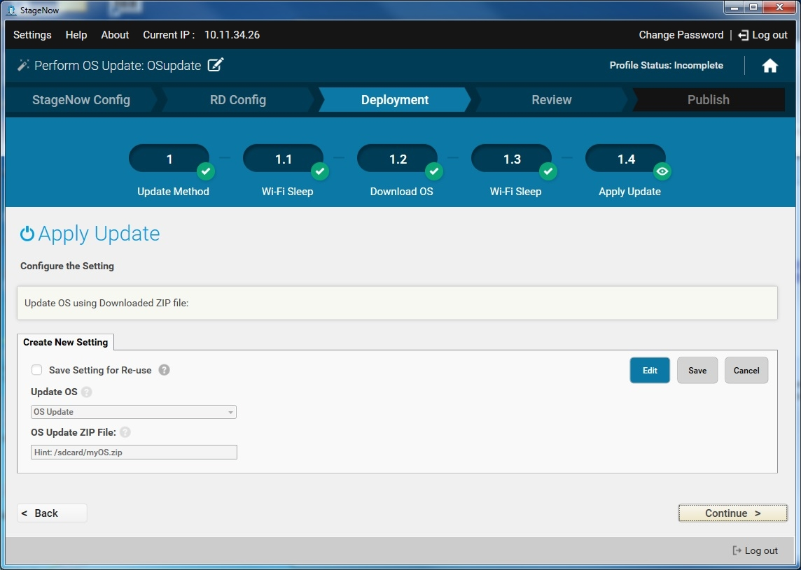
 

11. Select "Continue" to apply the update and proceed to the [Review window](../../stagingprofiles?Review).

-----

## Perform Incremental OS Update

The incremental update is used to perform OS updates on multiple devices based on defined conditions present on specific target devices. For example, if seeking to perform an operation only on TC51 devices, a condition could be defined that checks for the string "TC51" in the Product Model field. For more information, see the [Condition Manager guide](../../csp/condition/).  

> **Incremental OS Update is supported only on devices with MX 6.0 or higher**.

-----

**To perform an incremental OS update**:

1. Select "Create New Profile."

2. Select the MX version from the drop-down menu (must be MX 6.0 or higher).

3. Select the "Perform OS Update Wizard" and click "Create" to continue. 

4. Enter a name for the profile; click "Start" when done.

5. Select an option for the StageNow network from the drop-down menu:

   * The devices I wish to provision are currently not connected to a network. I will define a network with this profile that will be used for staging.

   * The devices I wish to provision are already connected to a network that will be used for staging. 

   * I wish to use the WiFi Hotspot feature which will automatically create a network for staging using this computer's network card:

   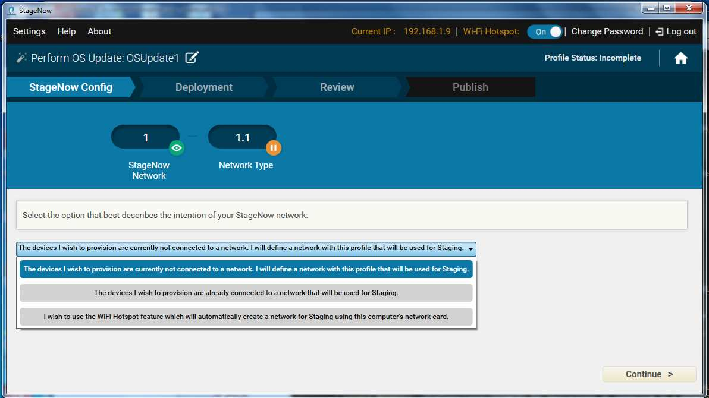

   **If selecting the second or third option, skip to Step 7**. 

6. If connecting to this network using StageNow barcodes, click "Yes" and click "Continue" (see [Profiles / Connect Network](../../Profiles/ConnectNetwork) for instructions on connecting to a network and populating the settings window). 

    Note: This wizard includes a Deployment section. Deployment requires that the host computer and the device(s) are on the same network. 

7. In the Deployment section, select "Incremental Update" from the update type drop-down menu.
    **Note**: If selecting Full OS Update, **go to Step 8 of the [previous section](#performosupdate)**.
   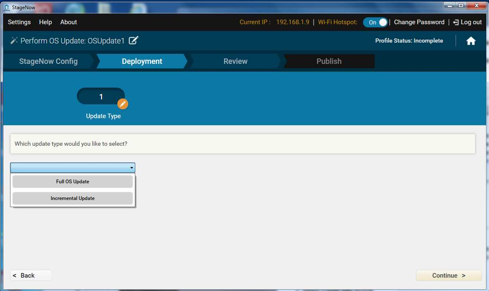
 

8. Select "Continue" on the "Begin" window to define update conditions for the first device:

   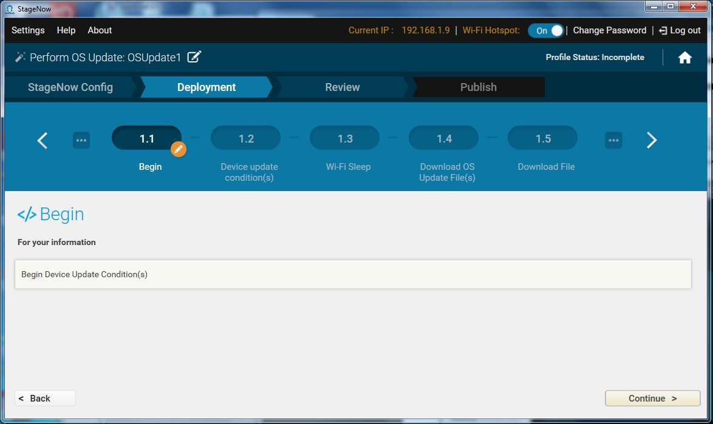
 

9. Define the update conditions and click "Continue" (see the [Condition Manager guide](../../csp/condition/) for more information).  
   **The boolean data type** (highlighted below) checks for true/false conditions such as whether the device has a valid IP address:  
   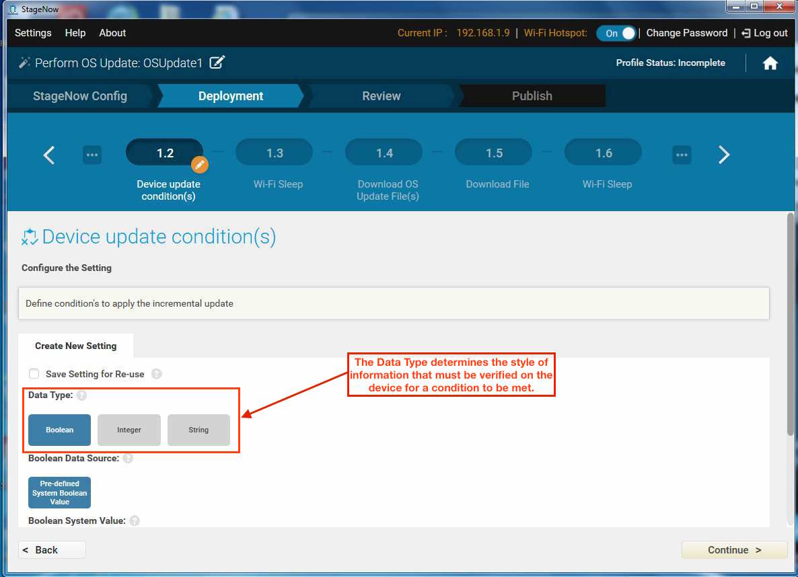
 

   **The Integer data type** checks for numerical conditions such as battery charge level: 
   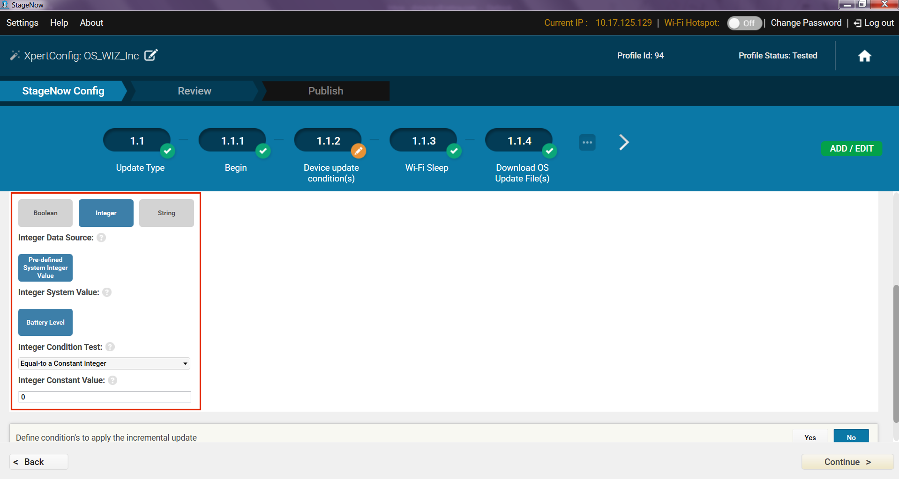
 

   **The String data type** checks for constants such as device model number:  
   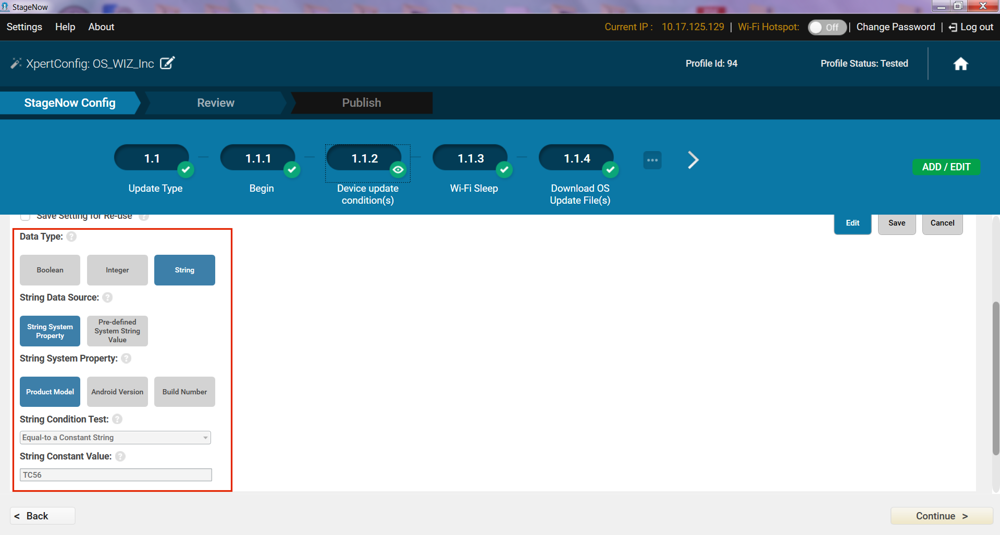
 

10. Select whether to prevent Wi-Fi from turning off while downloading (see [Setting Types > Wi-Fi](../../csp/wifi) for information):

    
 

11. Enter information for the first OS update file. Select "Yes" to add information for additional files:

    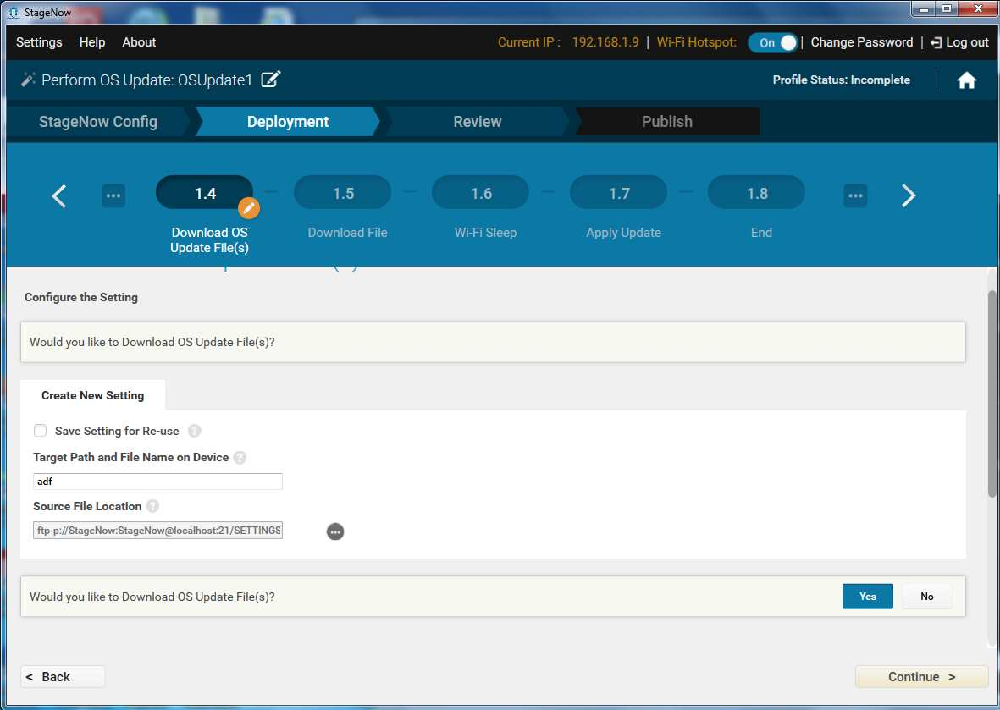
 

12. When finished entering file information, select "No" and click "Continue" to proceed.

13. **IMPORTANT**: If applying multiple OS update packages at one time, a `.upl` file must also be downloaded to the device (see [Setting Types > File](../../csp/file) for more information).

14. Select whether to change the Wi-Fi sleep policy after download, and click "Continue" to proceed.

15. On the "Apply Update" screen, enter the information for the `.zip` file(s) (and `.upl` file, if applicable), and click "Continue" (see [Setting Types > File](../../csp/file) for more information).

16. Select "Continue" on the "End Device Update Conditions" screen:

    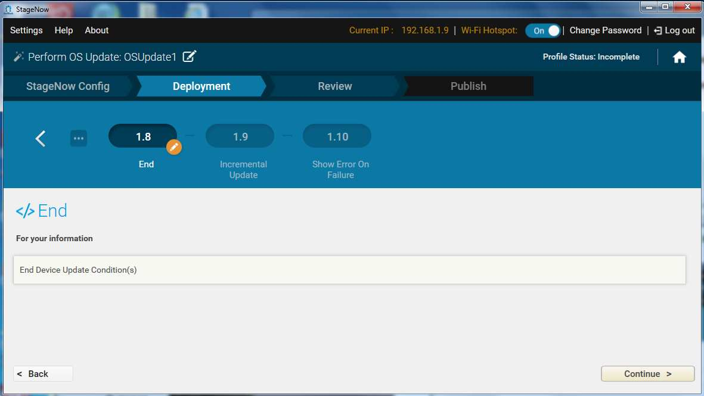
 

17. To add another device update package, click "Yes" and repeat Steps 11 - 16:

    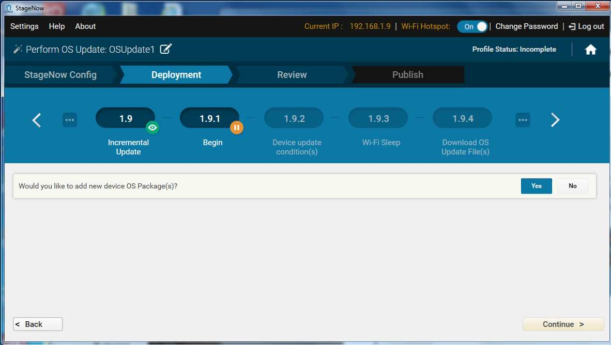
 

18. Select whether to provide an error message if any conditional update fails:
    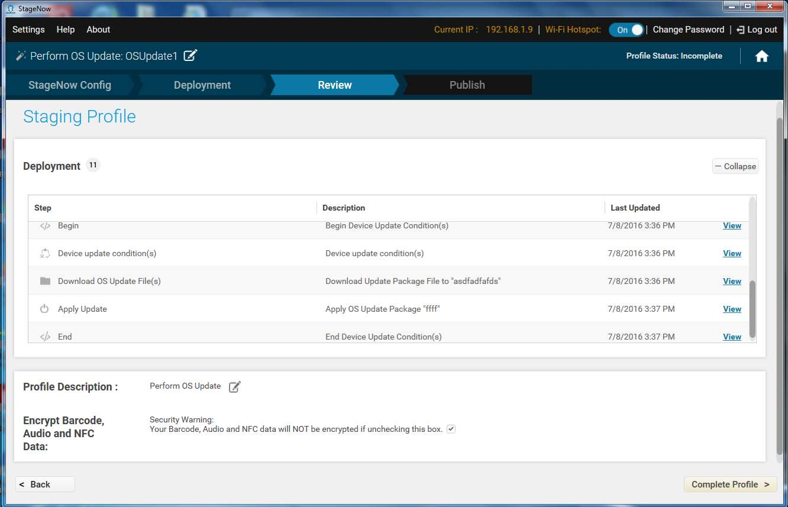
 

19. Select "Complete Profile" to apply the update and proceed to the [Review window](../../stagingprofiles?Review). 

