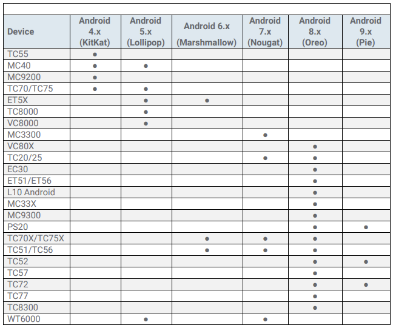

## Overview

Zebra Data Service (ZDS) agent software is a continuous background service running on all supported Zebra devices and is responsible for collecting and uploading analytics data coming from ZDS plug-ins and Zebra-authorized third-party apps. Data is uploaded to the Zebra analytics database every 24 hours by default with transport secured with HTTPS. ZDS updates itself and the ZDS Plug-ins, and can accept configuration changes such as to the upload interval and data-collection events using a barcode scanned by the device. 

#### Data collected from device(s)

* General device information
* Device utilization data 
* BSP, LifeGuard and security patch levels
* Available RAM
* Flash information and health 
* Battery information and health
* Data traffic statistics for 
 * Bluetooth
 * Cellular (if applicable)
 * Ethernet
 * Wi-Fi
* WLAN connectivity
* WWAN connectivity (if applicable)
* Information about installed apps and their usage
* Additional Apps Info (value-adds): MX STATS, SimulScan, EMDK, Data Wedge, EHS, StageNow
* Scanner information and usage statistics
* Reboots caused by the system or apps
* Application Not Responding (ANR) events
* Location data (as applicable) for: 
 * Cellular 
 * GPS
 * WLAN

**Participating Zebra customers and partners can access collected data in the form of [Zebra Foresight](https://www.zebra.com/us/en/services/visibilityiq/foresight.html) reports if <u>ALL FOUR</u> of the following requirements are met on all desired Zebra Android devices**:

* **ELIGIBILITY -** Device(s) must support ZDS agent software. Most Zebra Android devices with
KitKat (or later) come with ZDS preinstalled. See all [supported devices](#devicesupport).
* **ENABLEMENT -** ZDS agent software must be enabled on the device. Eligible devices are
shipped with ZDS enabled by default. See the [Setup guide](../setup) for more info.
* **CONNECTIVITY -** Device(s) must be connected to the internet.
* **PERMISSION -** The organization's firewall must allow communication with the Zebra’s server at [analytics.zebra.com](http://analytics.zebra.com) using server port 443.

**NOTE**: If Foresight reports appear blank or devices are missing from the reports, please confirm that ***ALL***
of the above requirements are met.

-----

## What's New in v2.0

### Device Support

### New Features

-----

## Version History

### Added in v1.0

-----

## Device Support

ZDS comes preinstalled on the following supported devices with the Android versions indicated. **Devices and/or Android versions not shown here are NOT compatible with ZDS**. Some devices running KitKat require ZDS to be installed manually. Contact [Zebra Support](https://www.zebra.com/us/en/about-zebra/contact-zebra/contact-tech-support.html) for more information.

_Click image to enlarge; ESC to exit_. 
 

-----

## See Also

* **[FAQ](../faq)** | Frequently asked questions about ZDS

<!-- 
menu:
  items:
    - title: About
      url: /oemconfig/9-3/about
    - title: Setup
      url: /oemconfig/9-3/setup
    - title: FAQs
      url: /oemconfig/9-3/faq
    - title: Managed Configurations
      url: /oemconfig/9-3/mc
    - icon: fa fa-search
      url: /oemconfig/9-3/search -->