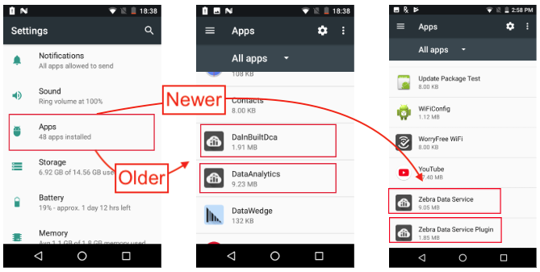

## Overview

ZDS comes preinstalled on [supported devices and Android versions](../about/supporteddevices). Some devices running KitKat require ZDS to be installed manually. To confirm installation and activation, use the instructions below. Contact [Zebra Support](https://www.zebra.com/us/en/about-zebra/contact-zebra/contact-tech-support.html) for information about manual ZDS installation.

### Data Access

Data is collected and **participating Zebra customers and partners can access the collected data in the form of [Zebra Foresight](https://www.zebra.com/us/en/services/visibilityiq/foresight.html) reports if <u>ALL FOUR</u> of the following requirements are met on all desired Zebra Android devices**:

* **ELIGIBILITY -** Device(s) must support ZDS agent software. Most Zebra Android devices with
KitKat (or later) come with ZDS preinstalled. See [all supported devices](#supporteddevices).
* **ENABLEMENT -** ZDS agent software must be enabled on the device. Eligible devices are
shipped with ZDS enabled by default. See the [Setup guide](../setup) for more info.
* **CONNECTIVITY -** Device(s) must be connected to the internet at least once every 24 hours to allow data upload.
* **PERMISSION -** The organization's firewall must allow communication with the Zebra data collection server at [analytics.zebra.com](http://analytics.zebra.com) using server port 443.

**NOTE**: If Foresight reports appear blank or devices are missing from the reports, please confirm that ***ALL***
of the above requirements are met.

-----

### Confirm Activation 

**Zebra Data Service agent software is enabled by default** on all devices on which it is preinstalled. There are two ways to confirm that it's present and running: 

1. Display a list of all running apps and services
2. View the ZDS toggle (On/Off) switch

#### Access the ZDS toggle switch 

1. In the Settings panel, locate and tap the "Zebra" button.  
This brings up the ZDS toggle switch: 

_Click image to enlarge; ESC to exit_. 
 
2. Set the switch as desired. 
3. To see a list of the radio-related data being collected and when data was last uploaded, scroll down in the screen: 

_Click image to enlarge; ESC to exit_. 
 
4. Exit the panel. 

> **NOTE**: On some devices, including the TC20 and TC25, **<u>ZDS cannot be turned off</u>**. 

-----

### List all running services 

1. In the Settings panel, locate and tap the "Apps" button.  
This brings up the ZDS toggle switch: 

_Zebra Data Services as they appear in Settings > Apps > on older (center) and newer devices_.  
_Click image to enlarge; ESC to exit_. 
 
2. Scroll to the list entries as shown above. 
3. Tap on a service to see its status. 

See what's being collected and when last sent: 

