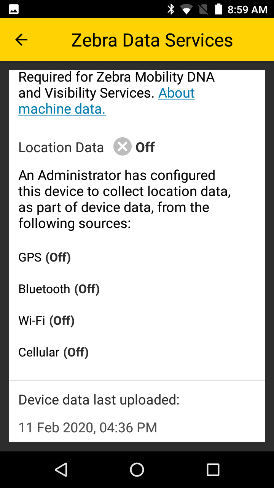

## Overview

ZDS comes preinstalled on ***most*** [supported devices and Android versions](../about/#supporteddevices) (some devices running KitKat require ZDS to be installed manually). On factory-fresh devices (or immediately following a [Factory Reset](https://techdocs.zebra.com/mx/powermgr/#enterprisereset)), the Zebra Data Service (ZDA) End-user License Agreement (EULA) wizard appears after the Android Setup Wizard, and in most cases allows ZDS to be turned off (see [Check ZDS Status](#checkzdsstatus) below). To confirm installation and activation, use the instructions below. Contact [Zebra Support](https://www.zebra.com/us/en/about-zebra/contact-zebra/contact-tech-support.html) for information about manual ZDS installation. 

> `IMPORTANT:` **[Bypassing the Android Setup Wizard](https://techdocs.zebra.com/stagenow/latest/Profiles/wipedevice/#setupwizardmanualbypass) also bypasses the EULA Setup Wizard**.

### Data Access

Data is collected and can be viewed by **participating Zebra customers and partners in the form of [Zebra Foresight](https://www.zebra.com/us/en/services/visibilityiq/foresight.html) reports if <u>ALL FOUR</u> of the following requirements are met on all relevant Zebra Android devices**:

* **ELIGIBILITY -** Device(s) must support ZDS agent software. Most Zebra Android devices with
KitKat (or later) come with ZDS preinstalled. See [all supported devices](../about/#supporteddevices).
* **ENABLEMENT -** ZDS agent software must be enabled on the device. Eligible devices are
shipped with ZDS enabled by default. See the [Setup guide](../setup) for more info.
* **CONNECTIVITY -** Device(s) must be connected to the internet at least once every 24 hours to allow data upload.
* **PERMISSION -** The organization's firewall must allow communication with the Zebra data collection server at [analytics.zebra.com](http://analytics.zebra.com) using only `104.198.59.61` on server port 443.

**NOTE**: If Foresight reports appear blank or devices are missing from the reports, confirm that ***ALL***
of the above requirements are met.

-----

## Check ZDS Status 

**Zebra Data Service agent software is enabled by default** on all devices on which it is preinstalled. To confirm that the agent is present and running on a device, display the ZDS toggle (On/Off) switch or display a list of all running apps and services and select the agent to view its status. Instructions for both methods are below. 

### Access ZDS toggle switch 

1. In the Settings panel, **locate and tap the "Zebra" button**.  
This brings up the ZDS info screen: 

_Click image to enlarge; ESC to exit_. 
 
2. **Set the toggle switch as desired** ("On" is shown at right, above). 
 **NOTE**: Data collection cannot be disabled on some devices, including the TC20 and TC25. 
3. If desired, **scroll down to see the last upload event** and a partial list of the data being collected: 

_Click image to enlarge; ESC to exit_. 
 
4. **Tap the left-pointing arrow** to exit the panel. 

> **NOTE**: **<u>Data collection cannot be disabled on some devices</u>**, including the TC20 and TC25. 

-----

### List all running services 

1. In the Settings panel, **locate and tap the "Apps" button**.  
 This displays a list of all apps and services on the device: 
 
 _Zebra Data Services as they appear in Settings > Apps > on older (center) and newer devices_.  
 _Click image to enlarge; ESC to exit_. 
  
2. **Scroll the list until the ZDS components are shown** (as shown above). 
3. **Tap on a service** to view its status and options:  
 
 _Click image to enlarge; ESC to exit_. 
  
4. **Tap on an option to view (or change, if supported) settings** as described below: 
 * **Storage -** Display current usage of agent and device data. **Options**: Clear data, Clear cache.
 * **Data Usage -** Display total, foreground and background data usage. **Options**: Enable/disable: background usage of cellular data, unrestricted data usage when Data Saver is enabled. 
 * **Permissions - Options**: Enable/disable use of device storage. **Plug-in options**: Enable use of Camera, Location, Phone, Storage 
 * **Notifications - Options**: Enable/disable agent notifications; Show notifications without sound and vibration; Override Do Not Disturb setting. 
 * **Open by default -** Reserved for future use. 
 * **Battery -** Display usage statistics. 
 * **Memory -** Display average and current memory usage. 
 * **App details -** Display app origin.  

##### To exit panel, tap left-facing arrow. 

-----