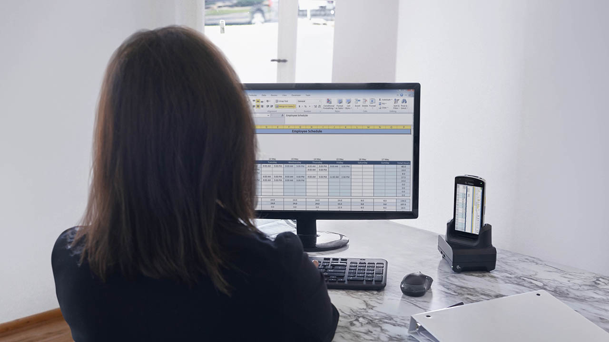
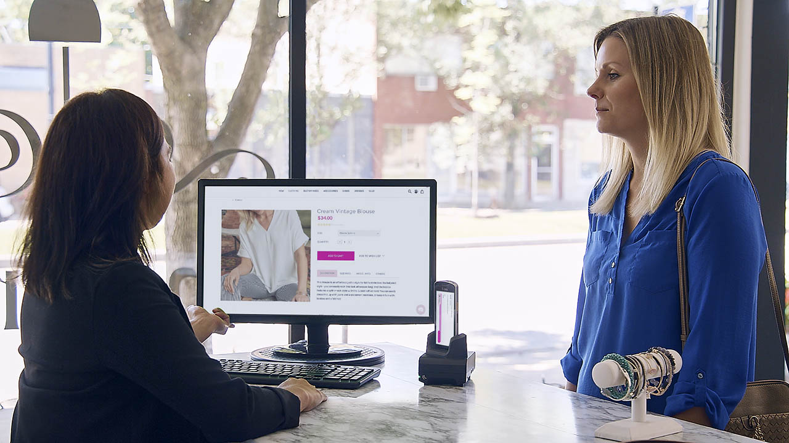

## Overview

_Click images to enlarge._

FIXXXXXXXXXXXXX

Zebra Workstation Connect is a hardware and software solution for Zebra devices running Android that allows a mobile device to provide a desktop-like experience. The solution centers on the ZWC dock, which provides four USB 3.0 ports for connections to keyboard and mouse, plus gigabit Ethernet and for a full-sized monitor via HDMI. 

ZWC leverages Android Desktop Mode to present the user with a “desktop-like” interface when connecting a mobile device to an external monitor via a workstation cradle. This guide describes the necessary steps to enable Desktop Mode and the features included.  

Default Mirror Mode: 

After installing the RC1 Android OS (11-11-03.00-RG-U00-PRD-HEL-04), the device will use “Mirror Mode” as default when the device is docked in a workstation cradle and connected to a HDMI monitor; if “Mirror Mode” is the required view mode for this set-up, no further actions are required. To evaluate “Desktop Mode”, follow the steps on the section below.  

OemConfig support isn’t so much “for ZWC” as for the system environment in which ZWC runs.  In order for ZWC to run, it must be deployed to the device.  ZWC has its own managed configurations that can be used to configure its behavior, but that behavior will only occur when the device docks and the secondary display is created for which ZWC is the secondary launcher.  Before that can ever happen, OemConfig must be used to change the device from mirror mode to desktop mode.  Further, there may be other system level configurations that OemConfig might be used to set, such as USB external storage, keyboard layouts, etc.  OemConfig doesn’t configure ZWC, but it CAN be used to configure things that effect the system environment and hence will have an impact on ZWC when it runs.  Since getting a new version of OemConfig that has these features into the Play Store is problematic for Beta, and since those things can be done via StageNow (which configuring ZWC cannot), we have decided to focus on getting ZWC into the Play Store and accessible to EMMs and defer dealing with OemConfig until later.

_Click image to enlarge; ESC to exit_. 
 

-----

## Supported Devices

#### Support Notes

-----

## Also See

* **[FAQ](../faq)** | Frequently asked questions about ZDS
* **[ZDS Setup Guide](../setup)** | How to check whether ZDS is installed and/or enabled.
* **[Visibility IQ info page](https://www.zebra.com/us/en/blog/posts/2019/zebra-operational-visibility-services-is-now-visibilityiq-foresight.html)** | Sign up for regular updates

