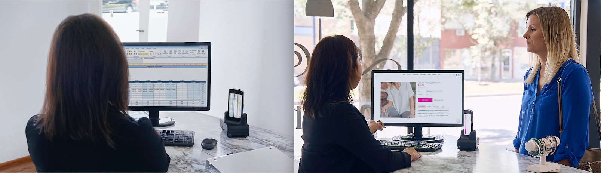

## Overview
**Zebra Workstation Connect is a hardware and software solution for select Zebra devices running Android** that allows a mobile device to provide a desktop-like experience. The solution centers on the Zebra Workstation Docking Cradle, which provides ports for connection to USB keyboard and mouse, wired Ethernet and HDMI for an external monitor. 

_Click images to enlarge; ESC to exit._

<!-- 

_Click images to enlarge; ESC to exit._

 -->

**Key applications for ZWC** include retail, healthcare, warehousing, transportation and many others. 

ZWC leverages Android Desktop Mode to mirror the device screen on the monitor or present a different set of apps and content. This guide describes Zera Workstation Connect features the necessary steps to enable them through an app running on the device.  

<!-- 

_Click images to enlarge._
 -->

###Device Support
The Zebra Workstation Connect utility current;y supports these devices:

* TC51
* TC52
* TC56
* TC57

-----

## Supported Devices

#### Support Notes

-----

## Also See

* **[FAQ](../faq)** | Frequently asked questions about ZDS
* **[ZDS Setup Guide](../setup)** | How to check whether ZDS is installed and/or enabled.
* **[Visibility IQ info page](https://www.zebra.com/us/en/blog/posts/2019/zebra-operational-visibility-services-is-now-visibilityiq-foresight.html)** | Sign up for regular updates

