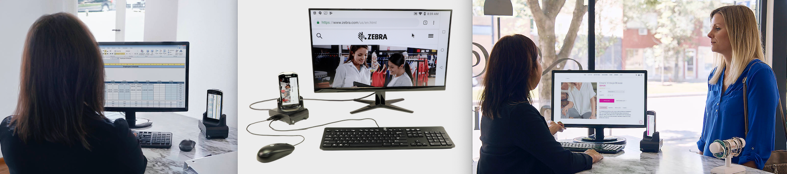

## Overview
**Zebra Workstation Connect is a hardware and software solution for select Zebra devices running Android** that allows a mobile device to provide a desktop-like experience. The solution includes [Zebra TC5X Workstation Docking Cradle](https://www.zebra.com/content/dam/zebra_new_ia/en-us/solutions-verticals/product/Mobile_Computers/Hand-Held%20Computers/tc5x-tc7x-series/guides/tc5x-guide-configuration-and-accessories-en-us.pdf), which provides USB ports for connection to a keyboard and mouse, a wired Ethernet port and HDMI for connecting an external monitor. 

_Click images to enlarge; ESC to exit._
 

**Key applications for ZWC** include retail, healthcare, warehousing, transportation and many others. ZWC software leverages Android Desktop Mode either to mirror the device screen on an external monitor or to present a different set of apps and content. **This guide describes ZWC features and the steps to control them through an app running on the device**.  

### Supported Devices

* TC51
* TC52
* TC56
* TC57

-----

## Also See

* **[ZWC Setup Guide](../setup)** | How to configure a device for ZWC
* **[EMM Support](../EMM)** | Deploying ZWC software to devices and configuring features
* **[APIs for Developers](../api)** | How to control and configure ZWC programmatically 
* **[FAQ](../faq)** | Frequently asked questions about ZWC

